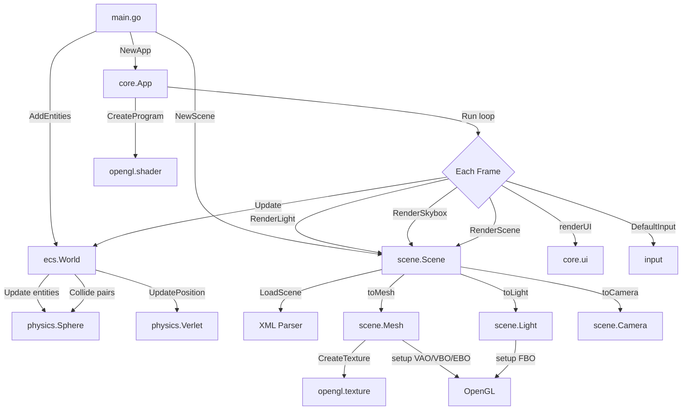
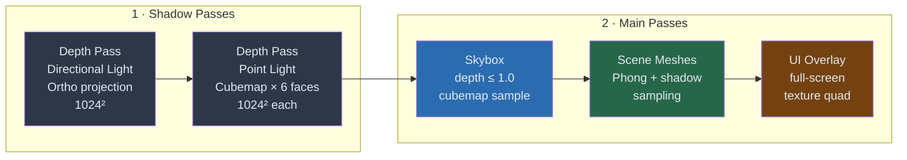
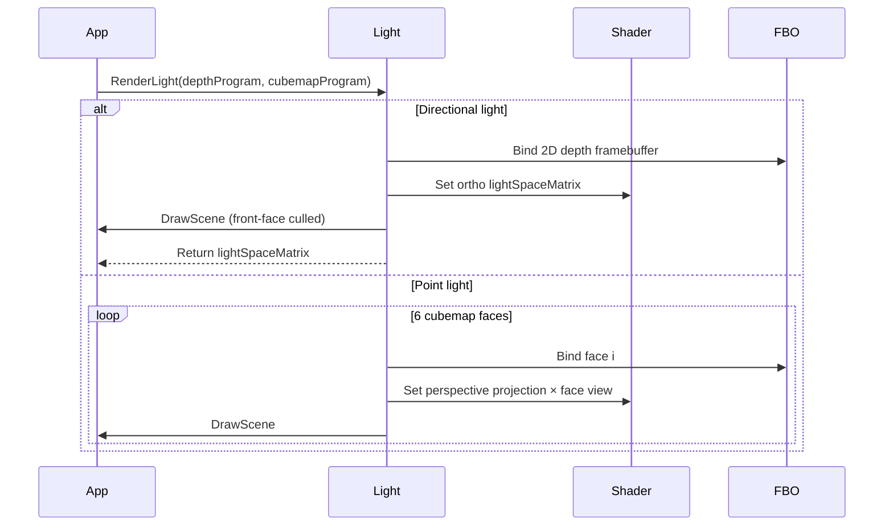
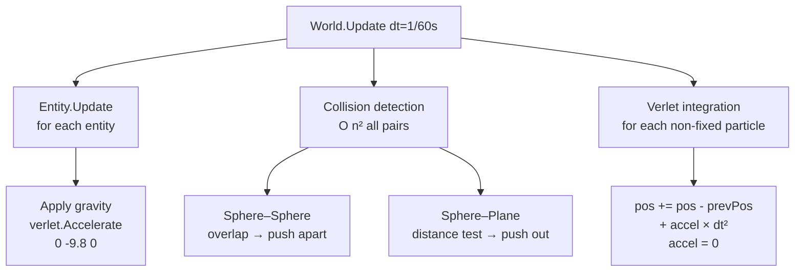
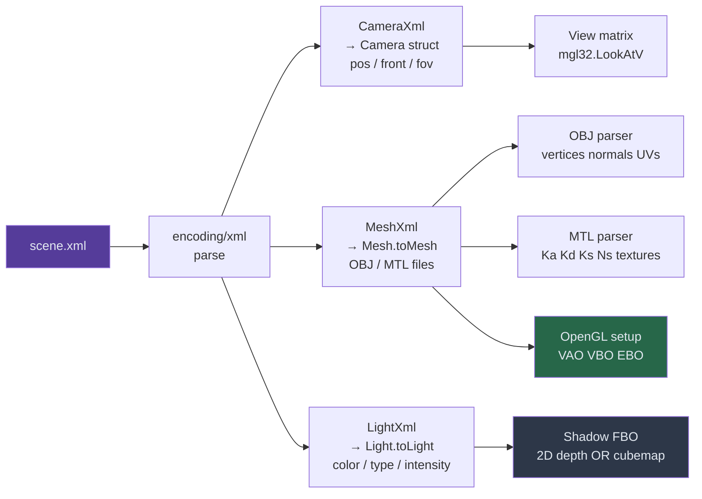
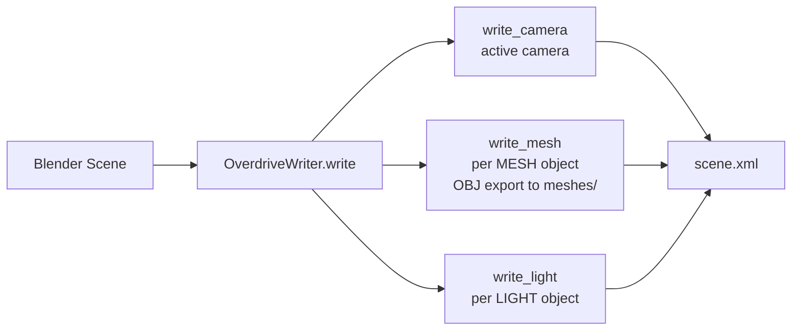

# Overdrive Engine — Architecture Documentation

> Real-time 3D rendering engine written in Go with OpenGL 4.1, featuring shadow mapping, a Verlet physics simulation, procedural cloud raymarching, and a Blender export plugin.

---

## Table of Contents

1. [Directory Structure](#directory-structure)
2. [High-Level Architecture](#high-level-architecture)
3. [Rendering Pipeline](#rendering-pipeline)
4. [Physics Pipeline](#physics-pipeline)
5. [Scene Loading Pipeline](#scene-loading-pipeline)
6. [Module Reference](#module-reference)
   - [main.go](#maingo)
   - [core/](#core)
   - [scene/](#scene)
   - [physics/](#physics)
   - [input/](#input)
   - [opengl/](#opengl)
   - [settings/ & utils/](#settings--utils)
   - [plugin/](#plugin)
7. [Shader Programs](#shader-programs)
8. [Asset & Scene Format](#asset--scene-format)

---

## Directory Structure

```
overdrive/
├── main.go                  # Entry point, demo world setup
├── go.mod / go.sum          # Go module dependencies
│
├── core/                    # Application lifecycle and UI
│   ├── app.go               # Window init, main render loop
│   └── ui.go                # Off-screen UI rendering
│
├── scene/                   # Scene graph and rendering
│   ├── scene.go             # XML loading, render dispatch
│   ├── mesh.go              # OBJ/MTL parsing, VAO/VBO/EBO
│   ├── camera.go            # View/projection matrices
│   ├── light.go             # Light types, shadow framebuffers
│   ├── material.go          # Material (colors, textures)
│   └── skybox.go            # Cubemap skybox
│
├── physics/                 # Verlet-based simulation
│   ├── verlet.go            # Position integration
│   ├── sphere.go            # Sphere collider + collision response
│   └── plane.go             # Plane collider
│
├── ecs/                     # Entity Component System
│   ├── ecs.go               # World: init, update, collision loop
│   └── entity.go            # Entity interface
│
├── input/                   # GLFW input callbacks
│   ├── input.go             # Keyboard (WASD camera)
│   └── callback.go          # Mouse look, scroll FOV, resize
│
├── opengl/                  # OpenGL abstraction
│   ├── shader.go            # Shader compilation & program linking
│   └── texture.go           # 2D texture & cubemap loading
│
├── settings/
│   └── settings.go          # Window/shadow resolution globals
│
├── utils/
│   └── utils.go             # Vec3 parsing, error handling, quad VAO
│
├── algorithms/
│   └── wfc.go               # Wave Function Collapse (stub)
│
├── shaders/                 # GLSL shader sources
│   ├── clouds.{vert,frag}   # Procedural cloud raymarching
│   ├── light.{vert,frag}    # Phong lighting with shadows
│   ├── depth.{vert,frag}    # Directional shadow depth pass
│   ├── depth_cube.{vert,geo,frag}  # Point light cubemap depth pass
│   ├── depth_debug.{vert,frag}     # Shadow map debug view
│   ├── skybox.{vert,frag}   # Cubemap skybox rendering
│   ├── ui.{vert,frag}       # Full-screen UI quad
│   └── water.{vert,frag}    # Water (unused)
│
├── assets/                  # Scene XML files and OBJ meshes
│   └── meshes/              # Exported OBJ/MTL files
│
├── textures/                # PNG/JPEG textures and cubemaps
│   ├── skybox/              # 6 skybox faces
│   └── cubemap/             # 6 cubemap faces
│
└── plugin/
    └── xml_export.py        # Blender 4.0+ export addon
```

---

## High-Level Architecture



---

## Rendering Pipeline

Every frame follows a strict multi-pass sequence:



### Texture Units per Mesh Draw Call

| Unit | Content |
|------|---------|
| `TEXTURE0` | Directional shadow depth map (2D) |
| `TEXTURE1` | Material diffuse texture |
| `TEXTURE2` | Point light shadow cubemap |
| `TEXTURE3` | Skybox cubemap (reflections) |

### Shadow Map Generation



---

## Physics Pipeline



**Verlet integration** stores the previous position instead of velocity, giving unconditional stability at the cost of no built-in damping.

---

## Scene Loading Pipeline



### Coordinate System Conversion

Blender uses a **Y-up** system; Overdrive uses **Z-up** with Y inverted. The conversion is applied on import:

```
Blender  (X,  Y,  Z)
           ↓
Overdrive (X, -Z,  Y)
```

---

## Module Reference

### `main.go`

Entry point and demo scene setup.

| Symbol | Kind | Description |
|--------|------|-------------|
| `main()` | func | Creates `App`, loads `assets/sphere.xml`, builds ECS world, starts loop |
| `createWorld()` | func | Instantiates ground plane + falling sphere physics entities |
| `StaticCollider` | type | Embedded `physics.Collider` for fixed (non-simulated) objects |
| `Sphere` | type | Physics sphere that also owns a renderable `scene.Mesh` |

---

### `core/`

#### `app.go` — Application lifecycle

| Symbol | Kind | Description |
|--------|------|-------------|
| `App` | struct | Holds GLFW window, dimensions, debug flag |
| `NewApp()` | func | Init GLFW, OpenGL 4.1 core, register callbacks, compile all 6 shader programs |
| `App.Run()` | func | 60 FPS render loop: ECS update → shadow passes → skybox → scene → UI |

`NewApp()` compiles these programs on startup:

```
clouds · depth · depth_cube · ui · skybox · (cubes — disabled)
```

#### `ui.go` — Off-screen UI overlay

| Symbol | Kind | Description |
|--------|------|-------------|
| `renderUI()` | func | Draws widget tree to RGBA8 texture → full-screen quad via `ui` shader |

Only redraws when the UI state changes. Mouse click and hover detection runs here.

---

### `scene/`

#### `scene.go` — Scene root

| Symbol | Kind | Description |
|--------|------|-------------|
| `Scene` | struct | Meshes `[]Mesh`, Lights `[]Light`, Skybox, Camera |
| `NewScene()` | func | Parse XML → build all sub-objects |
| `LoadScene()` | func | `encoding/xml` deserialisation |
| `Scene.RenderScene()` | func | Set view/proj uniforms → per-mesh draw with light+material uniforms |

#### `mesh.go` — Geometry

| Symbol | Kind | Description |
|--------|------|-------------|
| `Mesh` | struct | Vertices, normals, UVs, materials, VAO/VBO/EBO |
| `toMesh()` | func | OBJ + MTL parsing → fill vertex buffer |
| `fillVertices()` | func | Expand indexed OBJ faces to interleaved 8-float vertex layout |
| `setup()` | func | Upload to GPU (VAO/VBO/EBO per face group) |
| `draw()` | func | Bind shadow maps + textures → set uniforms → `glDrawElements` |
| `MoveTo()` / `MoveBy()` | func | Update world position, set `needsUpdate` flag |

**Vertex layout (32 bytes):**

```
[ X  Y  Z | NX NY NZ | U  V ]
  12 bytes   12 bytes  8 bytes
```

#### `camera.go` — View/projection

| Symbol | Kind | Description |
|--------|------|-------------|
| `Camera` | struct | Position, front, up, yaw, pitch, FOV |
| `toCamera()` | func | XML → Camera, Euler angle reconstruction |
| `Camera.Move()` | func | Translate camera |
| `Camera.LookAt()` | func | Recompute front vector |
| `NewCamera()` | func | Default at `(0, 20, 15)` looking at origin |

#### `light.go` — Lighting & shadows

| Symbol | Kind | Description |
|--------|------|-------------|
| `Light` | struct | Position, direction, color, intensity, type (`0`=sun / `1`=point) |
| `toLight()` | func | XML → Light, coordinate conversion |
| `Light.setup()` | func | Allocate shadow FBO + depth texture (2D or cubemap) |
| `Light.RenderLight()` | func | Render depth pass from light's perspective |

Shadow framebuffer types:

| Light type | FBO texture | Projection |
|-----------|-------------|------------|
| Sun / directional | 2D depth `1024²` | Orthographic |
| Point | Cubemap depth `1024²×6` | Perspective 90° FOV |

#### `material.go`

| Symbol | Kind | Description |
|--------|------|-------------|
| `Material` | struct | `Ambient`, `Diffuse`, `Specular` (Vec3), `Shininess` (f32), `TextureID`, `NormalMapID` |

#### `skybox.go`

| Symbol | Kind | Description |
|--------|------|-------------|
| `Skybox` | struct | VAO/VBO, cubemap texture ID |
| `Skybox.setup()` | func | Create unit cube (36 vertices), load 6 face images |
| `Skybox.RenderSkybox()` | func | Render with depth func `LEQUAL`, view matrix with translation stripped |

Face load order: `right left top bottom front back`

---

### `physics/`

#### `verlet.go`

| Symbol | Kind | Description |
|--------|------|-------------|
| `Verlet` | struct | `Pos`, `PrevPos`, `Accel`, `Fixed` bool |
| `NewVerlet()` | func | Create particle at position |
| `UpdatePosition()` | func | `vel = pos - prevPos; pos += vel + accel×dt²; accel = 0` |
| `Accelerate()` | func | Accumulate acceleration (gravity, forces) |

#### `sphere.go`

| Symbol | Kind | Description |
|--------|------|-------------|
| `Sphere` | struct | Embeds `Verlet`, `Radius` float32 |
| `NewSphereFromMesh()` | func | Compute bounding radius from mesh vertices |
| `Sphere.Collide()` | func | Dispatch to sphere–sphere or sphere–plane |
| `sphereCollide()` | func | Push overlapping spheres apart (position correction) |
| `planeCollide()` | func | Clamp sphere above plane within plane bounds |

#### `plane.go`

| Symbol | Kind | Description |
|--------|------|-------------|
| `Plane` | struct | Embeds `Verlet`, normal, axes, half-sizes |
| `NewPlaneFromMesh()` | func | Derive plane geometry from 4 corner vertices |

---

### `ecs/`

| Symbol | Kind | Description |
|--------|------|-------------|
| `Entity` | interface | `Init()`, `Update()`, `GetType()`, `GetCollider()` |
| `World` | struct | Slice of `Entity` |
| `World.Update()` | func | Entity updates → collision O(n²) → Verlet integration |

---

### `input/`

#### `input.go`

| Symbol | Kind | Description |
|--------|------|-------------|
| `DefaultInput()` | func | WASD movement, Q/E up-down, Shift sprint, Tab cursor toggle, Esc quit |

Camera speed: `10 units/s × deltaTime` (40 with Shift).

#### `callback.go`

| Symbol | Kind | Description |
|--------|------|-------------|
| `FramebufferSizeCallback()` | func | Update viewport + `settings.WindowWidth/Height` on resize |
| `DefaultMouseCallback()` | func | FPS look: yaw/pitch from mouse delta, clamp pitch ±89°, sensitivity 0.1 |
| `ScrollCallback()` | func | Adjust FOV (clamped 1°–90°) |

---

### `opengl/`

#### `shader.go`

| Symbol | Kind | Description |
|--------|------|-------------|
| `CreateProgram()` | func | Load `.vert.glsl` + `.frag.glsl` (+ optional `.geo.glsl`) → compile → link |
| `createShader()` | func | Compile single stage, print info log on error |

#### `texture.go`

| Symbol | Kind | Description |
|--------|------|-------------|
| `CreateTexture()` | func | Load PNG/JPEG → `GL_TEXTURE_2D`, LINEAR filter, REPEAT wrap |
| `CreateCubemap()` | func | Load 6 images → `GL_TEXTURE_CUBE_MAP`, CLAMP_TO_EDGE wrap |

---

### `settings/` & `utils/`

#### `settings/settings.go`

| Variable | Default | Description |
|----------|---------|-------------|
| `WindowWidth` | 1920 | Updated on resize |
| `WindowHeight` | 1080 | Updated on resize |
| `ShadowWidth` | 1024 | Shadow map resolution |
| `ShadowHeight` | 1024 | Shadow map resolution |
| `AspectRatio()` | — | `Width / Height` |

#### `utils/utils.go`

| Symbol | Kind | Description |
|--------|------|-------------|
| `ParseVec3()` | func | `"x,y,z"` string → `mgl32.Vec3` |
| `EulerToDirection()` | func | Pitch/yaw/roll → direction `Vec3` |
| `HandleError()` | func | Panic with message on non-nil error |
| `RenderQuad()` | func | Lazy-init fullscreen quad VAO, then draw (used by UI + debug) |

---

### `plugin/`

#### `xml_export.py` — Blender 4.0+ Addon

Registers under **File → Export → Export Overdrive scene…**

| Symbol | Kind | Description |
|--------|------|-------------|
| `OverdriveWriter` | class | Stateful XML builder |
| `OverdriveWriter.write()` | method | Main export: camera → meshes (OBJ) → lights → write `.xml` |
| `write_camera()` | method | Position, front/up vectors, yaw, pitch, FOV |
| `write_mesh()` | method | `bpy.ops.wm.obj_export` → record position, rotation, obj/mtl filenames |
| `write_light()` | method | Type, position, direction, color, diffuse, specular, intensity |
| `OverdriveExporter` | class | `bpy.types.Operator` + `ExportHelper` for menu integration |

**Export flow:**



---

## Shader Programs

| Program | Files | Active | Description |
|---------|-------|--------|-------------|
| `clouds` | `clouds.vert/frag` | **Yes** | Sphere SDF + Perlin FBM raymarching, 100 steps |
| `light` | `light.vert/frag` | No | Phong lighting with PCF shadow sampling |
| `depth` | `depth.vert/frag` | Yes | Directional light shadow depth pass |
| `depth_cube` | `depth_cube.vert/geo/frag` | Yes | Point light cubemap depth (geometry shader fan) |
| `depth_debug` | `depth_debug.vert/frag` | No | Visualise shadow map on screen quad |
| `skybox` | `skybox.vert/frag` | Yes | Cubemap skybox, depth `LEQUAL` |
| `ui` | `ui.vert/frag` | Yes | Full-screen RGBA texture quad |
| `water` | `water.vert/frag` | No | Water surface (stub) |

### Cloud Shader Detail (`clouds.frag.glsl`)

```
Ray origin  ──► March 100 steps (size 0.08)
                    │
                    ▼
              Sphere SDF hit?
                    │ yes
                    ▼
              Sample Perlin FBM noise
                    │
                    ▼
              Per-step diffuse lighting
                    │
                    ▼
              Accumulate colour + alpha
                    │
                    ▼
              Early exit when alpha ≈ 1
```

---

## Asset & Scene Format

Scene files live in `assets/` as XML:

```xml
<scene>
  <camera name="Camera">
    <type>persp</type>
    <position>0,20,15</position>
    <front>0,-0.57,-0.82</front>
    <up>0,0.82,-0.57</up>
    <yaw>-90</yaw>
    <pitch>-35</pitch>
    <fov>45</fov>
  </camera>

  <mesh name="Sphere">
    <position>0,0,2</position>
    <rotation>0,0,0</rotation>
    <obj>Sphere.obj</obj>
    <mtl>Sphere.mtl</mtl>
  </mesh>

  <light name="Sun">
    <type>sun</type>
    <position>10,10,10</position>
    <direction>-1,-1,-1</direction>
    <color>1,1,1</color>
    <diffuse>1.0</diffuse>
    <specular>0.5</specular>
    <intensity>5</intensity>
  </light>
</scene>
```

Meshes reference OBJ files under `assets/meshes/`. The Blender plugin exports directly into this layout.
