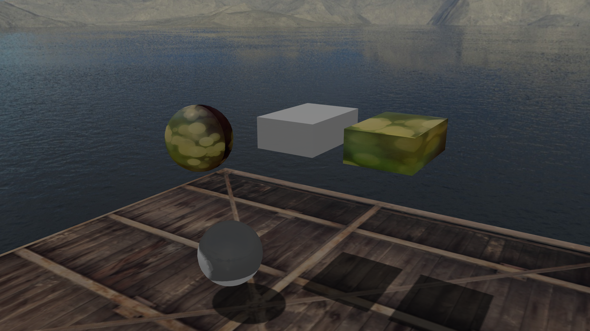

# Overdrive :speedboat:

An OpenGL game engine written in Go.

Overdrive uses a custom Blender add-on to convert a full Blender scene to a game ready scene including meshes, camera, lights and full material properties.

 

Currently implemented:
- Directional lights and shadows
- Point lights and shadows
- Skybox and environment mapping
- In game and menu UI based on [Gutter](https://github.com/zephyr75/gutter)
- Entity system
- Particle-based physics system based on Verlet integration

## Getting started

```go
package main

import (...)

type Player struct {
  name string
}
func (p *Player) Init(world *ecs.World) { }
func (p *Player) Update(world *ecs.World) { }
func (p *Player) GetType() string { return "Player" }

func main() {
    app := core.NewApp("Gutter", 1920, 1080)
    scene := scene.NewScene("assets/sphere.xml")
    world = runWorld(&scene)
    app.Run(&scene, exitUI, world)
}

func runWorld(scene *scene.Scene) *ecs.World {
    player := Player{
        "Bob",
    }
    world := ecs.World{}
    world.AddEntities(&player)
    world.Init()
    world.Update(time.Second / 60)
    return &world
}

func exitUI(app core.App) ui.UIElement {
    return ui.Button{
        Properties: ui.Properties{...},
        Function: func() {
            app.Quit()
        },
        Style: ui.Style{...},
    }
}
```


