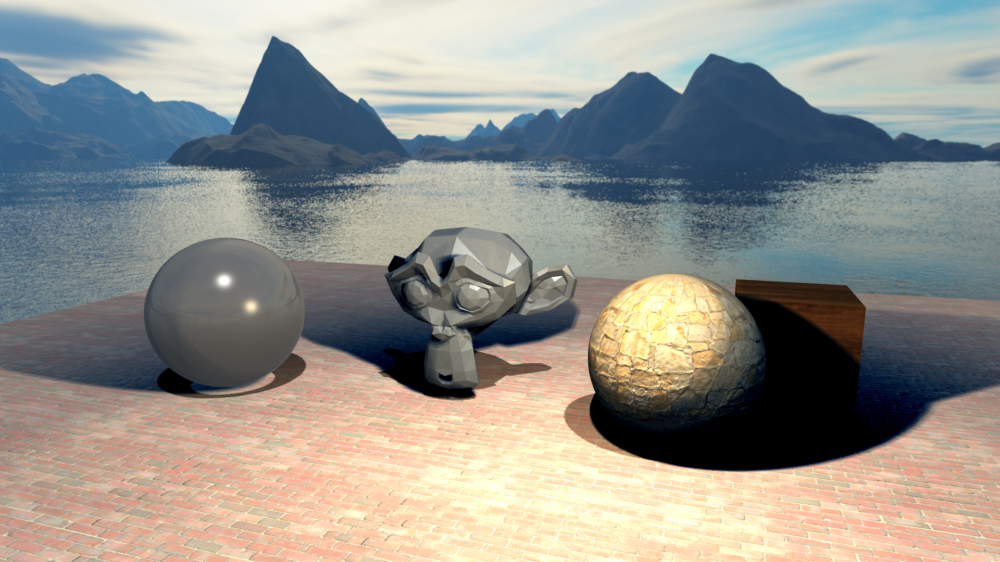

# Overdrive :speedboat:

Overdrive is a game engine, not just a renderer. It is written in modern C++17
and its graphics layer runs on both OpenGL and Vulkan. The project started as a
Go prototype (now in `go_deprecated/`) and active work happens in the C++ rewrite
(`cpp/`).

You build scenes in Blender and export them to the engine's XML format with a
custom add-on. The export covers meshes, camera, lights and materials.



## Features

### Rendering (OpenGL and Vulkan)

* Two backends from one set of shaders. Shaders are written once in
  [Slang](https://github.com/shader-slang/slang) and compiled per backend, GLSL
  4.10 for OpenGL and SPIR-V for Vulkan. The scene code never calls a graphics API
  directly. It talks to an abstract `Backend` interface.
* Modern Vulkan setup. Vulkan 1.3 dynamic rendering, buffer device address with
  scalar layout uniforms, bindless descriptors, synchronization2, VMA, and 2
  frames in flight.
* Lighting with Blinn-Phong shading, directional and point lights, each with its
  own colour, intensity and falloff.
* Shadows for both light types. Directional lights use a 2D shadow map and point
  lights use a cube map for shadows in all directions. Both are softened with PCF.
* Normal mapping in tangent space, worked out per pixel so meshes need no extra
  tangent data.
* Materials and textures, with colour and normal maps, bindless texture arrays
  and portable asset paths.
* Skybox with reflections of the environment.
* OBJ and MTL mesh loading with XML scene files.

### Engine and tools

* A Blender add-on that turns a full Blender scene into a ready to use XML scene
  with meshes, camera, lights and materials.

The Go prototype in `go_deprecated/` also had an entity component system, Verlet
particle physics and a game and menu UI built on
[Gutter](https://github.com/zephyr75/gutter). The C++ rewrite builds the renderer
first and these gameplay systems are being redone on top of it. See the roadmap.

## Roadmap

* Basic ray tracing on Vulkan. Hardware ray traced shadows then ambient occlusion and reflections. Vulkan only, the OpenGL backend keeps shadow maps. See
  [`notes/RAYTRACING_PLAN.md`](notes/RAYTRACING_PLAN.md).
* PBR materials. A metallic and roughness workflow with a Cook-Torrance BRDF and
  lighting from a prefiltered skybox.
* A physics engine with rigid bodies and collisions, built out from the existing
  Verlet base.
* HDR, tone mapping and bloom, plus support for many dynamic lights. See
  [`notes/FEATURES.md`](notes/FEATURES.md).

## Build and run (C++)

### Requirements

Tested on Arch Linux. Install the packages you need:

```sh
# core
sudo pacman -S base-devel cmake glfw glm pugixml gum
# OpenGL backend comes from your GPU's Mesa or driver stack (libglvnd)
# Vulkan backend:
sudo pacman -S vulkan-headers vulkan-icd-loader vulkan-memory-allocator
sudo pacman -S vulkan-validation-layers   # optional, turns on by itself if present
```

The Slang shader compiler (`slangc`) is used from your `PATH` if it is there. If
not, the Slang SDK is downloaded for you when you configure the build.

### Quick start (helper scripts)

```sh
./overdrive_build.sh   # builds both backends into cpp/build-gl and cpp/build-vk
./overdrive.sh         # pick a scene and a backend then launch
```

### Manual build

```sh
cd cpp
cmake -B build-gl -DUSE_VULKAN=OFF      # OpenGL backend
cmake --build build-gl -j
cmake -B build-vk -DUSE_VULKAN=ON       # Vulkan backend
cmake --build build-vk -j

# Run from cpp/ because asset and shader paths are relative.
./build-gl/overdrive                    # default scene (assets/showcase.xml)
./build-vk/overdrive assets/showcase.xml
```

Each build tree holds one backend. Rebuild after you edit a shader, because
neither backend reads the `.slang` files at runtime.

## Repository layout

| Path | Contents |
|------|----------|
| `cpp/` | C++17 engine (active). See [`cpp/BACKEND.md`](cpp/BACKEND.md). |
| `go_deprecated/` | Original Go and OpenGL prototype. See [`ARCHITECTURE.md`](ARCHITECTURE.md). |
| `notes/` | Design notes. [`VULKAN.md`](notes/VULKAN.md), [`FEATURES.md`](notes/FEATURES.md), [`RAYTRACING_PLAN.md`](notes/RAYTRACING_PLAN.md). |
