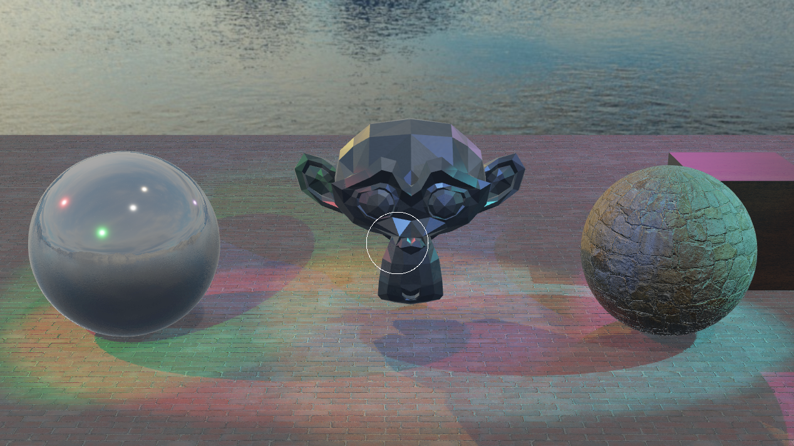

# Overdrive :speedboat:

Overdrive is a game engine, not just a renderer. It is written in Go and its
graphics layer runs on both OpenGL and Vulkan, picked at startup, one binary
carries both backends.

You build scenes in Blender and export them to the engine's XML format with a
custom add-on. The export covers meshes, camera, lights and materials.



## Features

### Rendering (OpenGL and Vulkan)

* Two backends from one set of shaders. Shaders are written once in
  [Slang](https://github.com/shader-slang/slang) and compiled per backend, GLSL
  4.10 for OpenGL and SPIR-V for Vulkan. The scene code never calls a graphics
  API directly. It talks to an abstract `Backend` interface, and the backend is
  chosen at runtime with `OVERDRIVE_BACKEND`.
* Modern Vulkan setup. Vulkan 1.3 dynamic rendering, buffer device address with
  scalar layout uniforms, bindless descriptors, synchronization2, and 2 frames
  in flight.
* Physically based shading. A metallic-roughness Cook-Torrance BRDF with
  GGX distribution, Smith geometry and Fresnel-Schlick, energy conserving, with
  Reinhard tone mapping.
* Directional and point lights, up to 8 at once, each with its own colour,
  intensity and falloff.
* Shadows for both light types. Directional lights use a 2D shadow map and point
  lights use a cube map for shadows in all directions. Both are softened with
  PCF and use a normal-offset bias so contact shadows stay attached.
* Normal mapping in tangent space, worked out per pixel so meshes need no extra
  tangent data.
* Materials and textures, with colour and normal maps and bindless texture
  arrays on the Vulkan backend.
* Skybox that doubles as the ambient environment, so metals reflect it and
  dielectrics pick up a soft tint.
* OBJ and MTL mesh loading with XML scene files.

### Engine and tools

* An entity component system for game objects.
* Verlet particle physics.
* Game and menu UI built on [Gutter](https://github.com/zephyr75/gutter),
  composited over the scene as a fullscreen pass.
* A Blender add-on that turns a full Blender scene into a ready to use XML scene
  with meshes, camera, lights and materials.

## Roadmap

* Basic ray tracing on Vulkan. Hardware ray traced shadows then ambient
  occlusion and reflections. Vulkan only, the OpenGL backend keeps shadow maps.
  See [`notes/FEATURES.md`](notes/FEATURES.md).
* Texture driven PBR. Metallic, roughness and AO maps so the values vary per
  texel instead of per material.
* Real image based lighting. Prefilter the skybox into an irradiance map, a
  roughness mip chain and a BRDF lookup table, replacing today's single sample
  approximation.
* A physics engine with rigid bodies and collisions, built out from the existing
  Verlet base.
* HDR, tone mapping and bloom, plus support for many dynamic lights. See
  [`notes/FEATURES.md`](notes/FEATURES.md).

## Build and run

### Requirements

Tested on Arch Linux. You need Go 1.26 or newer, plus:

```sh
# windowing and OpenGL come from your GPU's Mesa or driver stack
sudo pacman -S base-devel glfw
# Vulkan backend:
sudo pacman -S vulkan-icd-loader
sudo pacman -S vulkan-validation-layers   # optional, for OVERDRIVE_VK_VALIDATION=1
```

You also need the Slang shader compiler (`slangc`) to build the shaders. It is
taken from `$SLANGC`, then your `PATH`. On Arch it is the AUR package
`shader-slang-bin`, which installs to `/opt/shader-slang-bin/bin/slangc` and does
**not** put it on `PATH` — so either add that directory to `PATH` or pass
`SLANGC=` as below. Arch's `slang` package is the unrelated S-Lang library.
Prebuilt SDKs for other systems are on the
[Slang releases page](https://github.com/shader-slang/slang/releases).

### Quick start

```sh
cd src                    # the Go module
SLANGC=/opt/shader-slang-bin/bin/slangc ./build_shaders.sh   # or just ./build_shaders.sh if slangc is on PATH
go build ./...
go run .                  # OpenGL by default
```

Run from the module root, because asset and shader paths are relative.

### Picking a backend

```sh
OVERDRIVE_BACKEND=gl     go run .   # OpenGL 4.1 core (default)
OVERDRIVE_BACKEND=vulkan go run .   # Vulkan 1.3

OVERDRIVE_VK_VALIDATION=1 OVERDRIVE_BACKEND=vulkan go run .   # + validation layers
```

### Shaders

Shader sources live in `shaders/slang/`. The generated `shaders/gl/` and
`shaders/vk/` directories are not checked in, so run `./build_shaders.sh` before
your first build and after every shader edit — neither backend reads the
`.slang` files at runtime.

### Tests

```sh
go test ./...
```

No GPU needed. The tests check the std140 uniform layout derived from the
generated GLSL against the Go structs the backends upload, which is the one
place the two backends could silently drift apart.

## Repository layout

| Path | Contents |
|------|----------|
| `src/` | The engine, and the Go module root. |
| `src/renderer/` | The backend abstraction: one interface, opaque handles, one typed uniform struct. |
| `src/opengl/`, `src/vulkan/` | The two backend implementations. Every graphics call lives in these. |
| `src/shaders/slang/` | Shader sources, compiled to both backends by `build_shaders.sh`. |
| `src/scene/`, `src/ecs/`, `src/physics/` | Scene graph, entity component system, Verlet physics. No graphics calls. |
| `src/plugin/` | The Blender add-on that exports a scene to XML. |
| `notes/` | Engine documentation and graphics cheatsheets — see [`notes/README.md`](notes/README.md). |

## Documentation

| Document | What it covers |
|----------|----------------|
| [`ENGINE_FLOW.md`](notes/ENGINE_FLOW.md) | **Start here for the renderer.** One frame from `main()` to the GPU, then the `Backend` contract method by method with what each backend does. §0 indexes all 25 methods by how often they run. |
| [`ARCHITECTURE.md`](notes/ARCHITECTURE.md) | The code map: repository layout, the dependency rule, scene loading, the package-by-package symbol reference, the scene format. |
| [`FEATURES.md`](notes/FEATURES.md) | What is implemented and why it is built that way, the roadmap, and the performance history of the two backends. |
| [`TODO.md`](notes/TODO.md) | The working list. |
| [`cheatsheets/`](notes/README.md) | Reference notes on PBR, ray tracing, OpenGL, Vulkan, linear algebra and real-time technique in general. |
