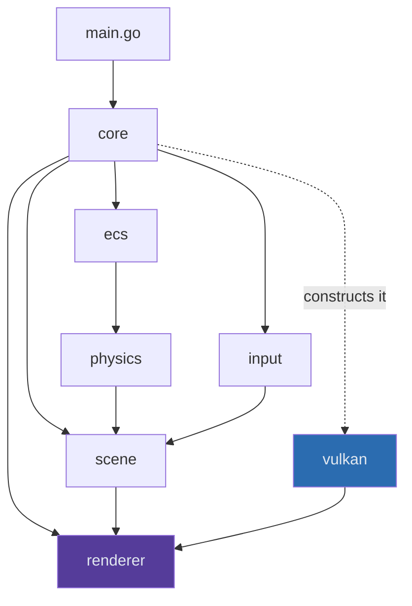
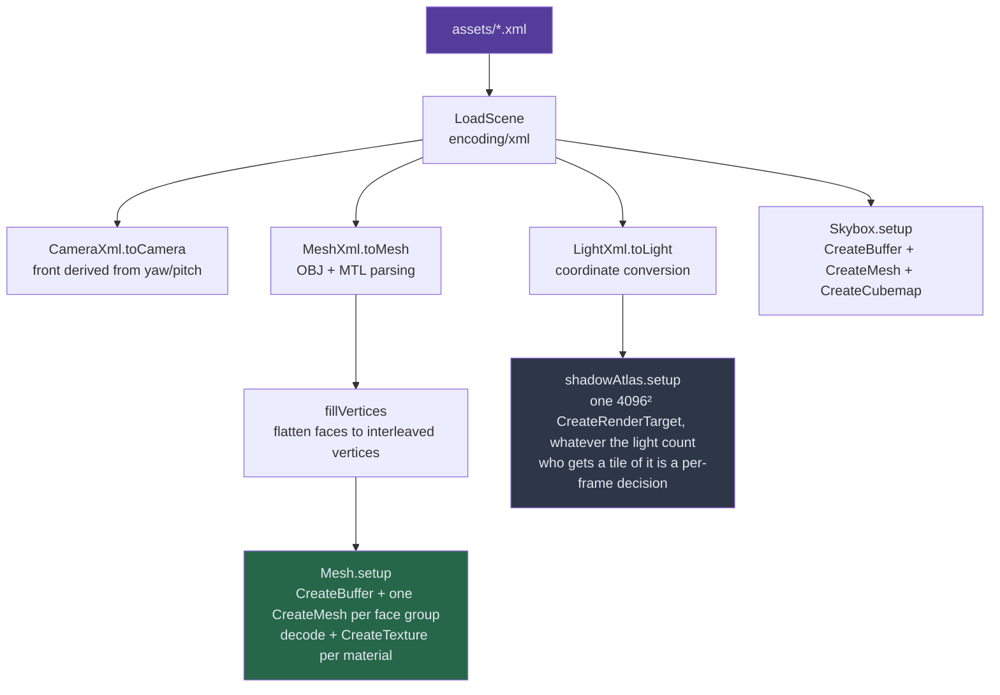
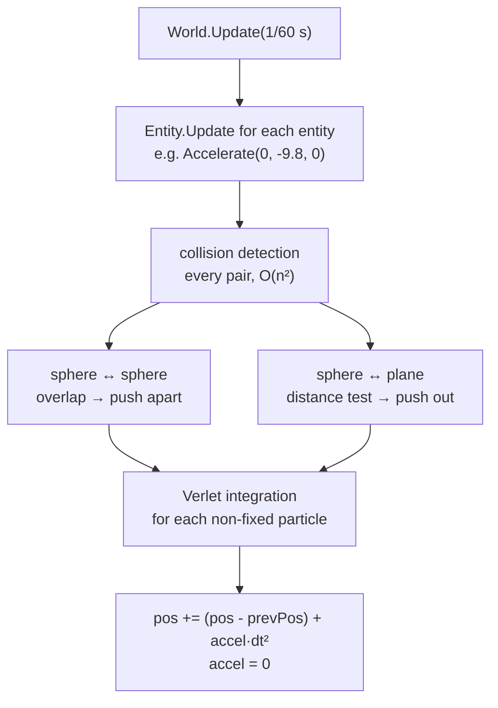

# ARCHITECTURE.md — the code map

Where everything lives and what calls what, package by package. This is the
**navigation** document: use it to find the file you need.

`ENGINE_FLOW.md` is the other half — it takes the same tree and follows _one
frame_ through it, then walks the `renderer.Backend` contract method by method.
Nothing about backend internals is repeated here.

---

## Contents

1. [Repository layout](#1-repository-layout)
2. [The dependency rule](#2-the-dependency-rule)
3. [Scene loading](#3-scene-loading)
4. [Physics and the ECS](#4-physics-and-the-ecs)
5. [Package reference](#5-package-reference)
6. [Scene and asset format](#6-scene-and-asset-format)
7. [Shaders](#7-shaders)
8. [Dead code](#8-dead-code)

---

## 1. Repository layout

The Go module root is **`src/`** (module `github.com/Zephyr75/overdrive`), so
`go` commands run from there. Runtime files are _not_ found relative to the
working directory: `paths` (§2.1) resolves them against the project root, the
directory holding both `assets/` and `src/`.

```
overdrive/
├── README.md              public overview, build and run
├── CLAUDE.md              working rules for this repo
├── notes/                 this documentation, see notes/README.md
├── configs/               the settings files: vulkan.toml is the default
├── assets/                scene XML, Comfortaa.ttf, meshes/ (OBJ+MTL), textures/
│   └── _unused/           moved out of the build, not referenced by any scene
└── src/                   the engine, and the Go module root
    ├── main.go            builds an App, loads a Scene, builds an ECS World
    ├── paths/             the one place a runtime path is spelled out
    ├── build_shaders.sh   Slang → SPIR-V, must run before first build
    │
    ├── core/              app lifecycle and the frame loop
    │   ├── app.go         NewApp (window + backend), App.Run (the frame loop)
    │   └── ui.go          renderUI: rasterise widgets → texture → fullscreen quad
    │
    ├── renderer/          the abstraction, imports no graphics API
    │   ├── backend.go     Backend interface, opaque handles, RenderTargetSpec
    │   └── uniforms.go    FrameUniforms, DrawUniforms, the init() size guard
    │
    ├── vulkan/            Vulkan 1.3 backend — the only package that may import vk.*
    │   ├── backend.go     device, swapchain, passes, lifetimes
    │   ├── buffer.go      VMA allocations
    │   ├── draw.go        the uniform arena, push constants, Draw
    │   ├── shader.go      modules and lazy pipeline construction
    │   ├── swapchain.go   creation and resize
    │   └── texture.go     images, staging, bindless descriptors, render targets
    │
    ├── scene/             what is in the world
    │   ├── scene.go       XML loading, shadow-caster budget, render dispatch
    │   ├── mesh.go        OBJ/MTL parsing, vertex data, per-face-group draws
    │   ├── material.go    material fields and texture handles
    │   ├── light.go       light types, shadow targets, the depth passes
    │   ├── camera.go      position, yaw/pitch, field of view
    │   ├── skybox.go      the cube and its cubemap
    │   └── showcase_test.go  loads assets/showcase.xml, no GPU needed
    │
    ├── ecs/               entity component system
    │   └── entity.go      World and the Entity interface
    │
    ├── physics/           plain Go, zero graphics calls
    │   ├── verlet.go      position integration
    │   ├── sphere.go      sphere collider and responses
    │   └── plane.go       plane collider
    │
    ├── input/             GLFW callbacks
    │   ├── input.go       keyboard, camera movement
    │   └── callback.go    mouse look, scroll FOV, framebuffer resize
    │
    ├── settings/          resolution and anti-aliasing globals + their TOML loader
    ├── utils/             vector parsing, Euler conversion, error handling
    │
    └── shaders/
        ├── slang/         the source of truth, authored once
        └── vk/            generated SPIR-V — git-ignored
```

`xml_export.py`, the Blender add-on that writes the scene XML, sits at the
repository root beside the assets it produces.

### 1.1 Runtime paths

No package outside `paths/` may write a relative path literal. `paths` finds the
project root once — walking up from the working directory for a directory
containing both `assets/` and `src/` — and every runtime file is resolved
against it:

| call                               | resolves to                              |
| ---------------------------------- | ---------------------------------------- |
| `paths.Asset("showcase.xml")`      | `<root>/assets/showcase.xml`             |
| `paths.Mesh("Cube.obj")`           | `<root>/assets/meshes/Cube.obj`          |
| `paths.Texture("skybox/top.png")`  | `<root>/assets/textures/skybox/top.png`  |
| `paths.Shader("forward.vert.spv")` | `<root>/src/shaders/vk/forward.vert.spv` |
| `paths.Config("vulkan.toml")`      | `<root>/configs/vulkan.toml`             |

`paths.Config` is the exception: a bare name resolves under `configs/`, anything
carrying a separator is a path the user typed and is used as given, so
`-config /tmp/try.toml` works. `OVERDRIVE_ROOT` overrides discovery for a build
whose layout is not the repository's.

Why it exists: the literals it replaced (`assets/…` in `scene/mesh.go`,
`./textures/skybox/…` in `scene/skybox.go`, `shaders/vk/…` in
`vulkan/shader.go`) each assumed the process had started from one specific
directory. A test run sets the working directory to the package's own — `go test
./scene/` runs in `src/scene/` — which is how the since-deleted
`TestShowcaseLoads` came to skip rather than run, silently, for as long as it
existed. The `paths` package is what stops that recurring when tests come back.

---

## 2. The dependency rule

**Nothing above `renderer/` imports a graphics API.** Scene, core, ecs, input and
physics own opaque handles (`renderer.MeshHandle`, `TextureHandle`,
`RenderTargetHandle`, `ShaderHandle`, `BufferHandle`) that the backend
interprets in its own table. This is what makes everything above `renderer/` testable without
a GPU, and it is why the abstraction is kept with a single backend
(`tmp/BACKEND_DECISION.md` §4).



The dotted edge is the only place `vulkan` is named above `renderer/`:
`core.NewApp` calls `vulkan.New()` and immediately holds the result as a
`renderer.Backend`. `settings.Backend` still exists, but only so a config naming
another backend is rejected rather than ignored.

Two further invariants, both enforced by convention rather than by the compiler:

- **Clears and viewports exist only inside `Backend.BeginPass`.** No free-floating clear anywhere in scene or core code
- **Uniforms are three typed structs split by update frequency**, mirroring `shaders/slang/common.slang` field for field. See `ENGINE_FLOW.md` §4.5

---

## 3. Scene loading

`scene.NewScene(path, backend)` is the only entry point. It parses, uploads and
resolves the shadow budget, in that order.



**One vertex buffer, several meshes.** An OBJ with three materials becomes one
`BufferHandle` plus three `MeshHandle`s, each owning only its index list. That is
why `Mesh.gpu` is a slice.

**The atlas partition is fixed at load; who occupies it is decided per frame.**
`buildLayout` (`scene/shadowatlas.go`) carves the one 4096 atlas into the slot
counts `slotLayout` declares, once, and those rects never move again.
`Scene.UpdateShadows` then scores every light by `Radius / distance to camera`,
sorts by score, and hands each the best free slot no larger than the ceiling its
score earns — one slot for a sun or a spot, six for a point light's faces, which
need not be adjacent — writing one `ShadowRecord` per tile as it goes. A light
that fits nowhere degrades a pool at a time and finally lights unshadowed. Load
time allocates the atlas image and its slot table, nothing else.

**Texture paths are made portable.** Blender bakes the absolute path of the
machine that exported the scene into the MTL, so `texturePath` keeps only the
basename and resolves it against the engine's own `textures/` directory.

---

## 4. Physics and the ECS

Both are plain Go with no graphics calls. `World.Update(dt)` runs three phases
in a fixed order:



**Verlet stores the previous position instead of a velocity**, which makes the
integrator unconditionally stable and constraints trivial to apply, at the cost
of no built-in damping. See `cheatsheets/GRAPHICS.md` §3 for how it compares to
Euler and RK4.

An entity that owns both a collider and a `scene.Mesh` (the demo's `Sphere` in
`main.go`) calls `Mesh.MoveTo` in its `Update`, which rebuilds the mesh's vertex
data and flags it dirty. `Scene.UpdateMeshes` reuploads exactly those at the top
of the next frame.

---

## 5. Package reference

Only what exists. Unexported symbols are marked _(pkg)_.

### `main.go`

| Symbol              | Kind | Description                                                                    |
| ------------------- | ---- | ------------------------------------------------------------------------------ |
| `main`              | func | Creates the `App`, loads `assets/showcase.xml`, builds the ECS world, runs     |
| `createWorld`       | func | Wires the demo's physics bodies, skipping meshes the scene lacks               |
| `StaticCollider`    | type | An immovable body wrapping a `physics.Collider`                                |
| `Sphere`, `Sphere2` | type | A falling and a static ball, each pairing a collider with a `scene.Mesh`       |
| `MainWindow`        | func | The demo widget tree. Currently unused — `App.Run` is called with a nil widget |

### `core/`

| Symbol             | Kind | Description                                                                                                                                              |
| ------------------ | ---- | -------------------------------------------------------------------------------------------------------------------------------------------------------- |
| `App`              | type | Window, backend, dimensions, debug flag, input callbacks                                                                                                 |
| `NewApp`           | func | Constructs the backend (`vulkan.New()`, the only place it is named), hints and creates the window, wires input, then `Backend.Init`                      |
| `App.Run`          | func | Loads the five shader sets, builds the UI quad, then loops until the window closes. The frame shape is hardcoded here — see `tmp/BACKEND_DECISION.md` §6 |
| `App.Quit`         | func | Asks the window to close                                                                                                                                 |
| `renderUI` _(pkg)_ | func | Rasterises the widget tree to RGBA, uploads it, draws the quad. Redraws only when the tree or hover state changed                                        |

### `renderer/`

| Symbol                                                                              | Kind         | Description                                                                                                                                                       |
| ----------------------------------------------------------------------------------- | ------------ | ----------------------------------------------------------------------------------------------------------------------------------------------------------------- |
| `Backend`                                                                           | interface    | 28 methods, the whole contract. Grouped in `ENGINE_FLOW.md` §0 by call frequency; `tmp/INTERFACE_PLAN.md` is what replaces it                                                                                  |
| `TextureHandle`, `BufferHandle`, `MeshHandle`, `RenderTargetHandle`, `ShaderHandle` | type         | Opaque `uint32`. Texture 0 is the white pixel, render target 0 the backbuffer                                                                                     |
| `VertexLayout`                                                                      | type         | `LayoutMesh`, `LayoutPosition`, `LayoutPositionUV` — how a mesh's vertex buffer is read. Recorded at creation, which is what lets one `Draw` serve every drawable |
| `RenderTargetSpec`, `TargetFormat`                                                  | type         | Describes an offscreen target by what it _is_ — size, depth or colour, cube or not                                                                                |
| `Feature`, `Supports`                                                               | type, method | The seam for ray tracing and compute; returns `false` today and has never been wired                                                                              |
| `FrameUniforms`                                                                     | type         | 4844 B: camera, lights, the bake tile, the two atlas handles. Published once per pass, and once per tile inside the atlas pass                                    |
| `DrawUniforms`                                                                      | type         | 128 B: model matrix and material. Sent per draw                                                                                                                   |
| `ShadowRecord`                                                                      | type         | 96 B: one shadow tile — its light-space matrix, atlas rect, texel size, far plane, face and flags. A variable-length array, published once per frame              |
| `LightData`                                                                         | type         | 72 B, mirrors the `LightData` struct in `common.slang`                                                                                                            |
| `MaxLights`                                                                         | const        | 64, must match `common.slang`                                                                                                                                     |

### `scene/`

| Symbol                            | Kind | Description                                                                                                                                               |
| --------------------------------- | ---- | --------------------------------------------------------------------------------------------------------------------------------------------------------- |
| `Scene`                           | type | Meshes, lights, skybox, camera, the two shadow-caster indices, and the shadow atlas with this frame's tiles and records                                   |
| `NewScene`                        | func | Parse then upload everything through the backend                                                                                                          |
| `LoadScene`                       | func | Pure XML deserialisation, no GPU work — what the tests use                                                                                                |
| `EmptyScene`                      | func | Nothing in it, for running the app as a UI shell                                                                                                          |
| `Scene.FillFrameUniforms`         | func | Camera matrices, the light array, scene-wide texture handles, shadow indices                                                                              |
| `Scene.RenderScene`               | func | Rebinds the frame block, then draws every mesh with the forward shader                                                                                    |
| `Scene.RenderSkybox`              | func | Binds a _copy_ of the frame block with the view translation stripped                                                                                      |
| `Scene.UpdateMeshes`              | func | Reuploads the vertex buffers physics moved this frame                                                                                                     |
| `Scene.UpdateShadows`             | func | Scores every light, allocates its tiles and builds this frame's `ShadowRecord` array. Must run before `FillFrameUniforms`, which copies each light's record index out |
| `Scene.ShadowRecords`             | func | This frame's records, for `Backend.BindShadowRecords`                                                                                                     |
| `Mesh.CastsShadow`                | field | Whether the shadow bake draws this mesh. `<castsShadow>` in the XML, default true; false for a plane that can only occlude itself |
| `Scene.BakeShadows`               | func | One pass over the atlas: per tile a `SetViewportScissor`, a `BakeMatrix` and every mesh                                                                   |
| `Scene.Mesh` / `Light` / `Camera` | func | Lookup by name                                                                                                                                            |
| `Mesh`                            | type | Vertices, normals, UVs, faces, materials, plus the GPU handles                                                                                            |
| `Mesh.MoveTo` / `MoveBy`          | func | Rebuild vertex data and flag it for reupload                                                                                                              |
| `Mesh.draw` _(pkg)_               | func | One `Backend.Draw` per face group, rewriting the material fields of `u`                                                                                   |
| `Light`                           | type | Position, direction, colour, intensity, type, cone cosines, radius, and its record index into the atlas. Owns **no** GPU resource                         |
| `Light.shadowRecord` _(pkg)_      | func | Builds one tile's record: ortho for a sun, one widened 90° face for a point                                                                               |
| `shadowAtlas` _(pkg)_             | type | The one depth target, its fixed slot pools and who holds them this frame, in `shadowatlas.go`                                                              |
| `slotLayout` _(pkg)_              | var  | How many slots exist at each size, as divisions of `atlasSize`. The light budget lives here; the atlas size only sets sharpness                            |
| `buildLayout` _(pkg)_             | func | Carves the slot rects out of the atlas once at load, largest size first, then discards the quadtree that placed them                                       |
| `Material`                        | type | Ambient, diffuse (= albedo), specular, shininess, alpha, metallic, roughness, ao, plus diffuse and normal-map handles                                     |
| `Camera`                          | type | Position, front, up, yaw, pitch, FOV                                                                                                                      |
| `Skybox`                          | type | The cube mesh handle and the cubemap texture                                                                                                              |

### `ecs/`

| Symbol                                  | Kind      | Description                          |
| --------------------------------------- | --------- | ------------------------------------ |
| `Entity`                                | interface | `Init`, `Update`, `Type`, `Collider` |
| `World`                                 | type      | A slice of entities                  |
| `World.AddEntities` / `Init` / `Update` | func      | Build and step the world             |
| `World.Entities` / `FirstEntity`        | func      | Lookup by type string                |

### `physics/`

| Symbol                                 | Kind      | Description                                                                                       |
| -------------------------------------- | --------- | ------------------------------------------------------------------------------------------------- |
| `Collider`                             | interface | Anything that can `Collide` and expose its `Verlet`                                               |
| `Verlet`                               | type      | `Pos`, `PrevPos`, `Accel`, `Fixed`                                                                |
| `Verlet.UpdatePosition` / `Accelerate` | func      | Integrate; accumulate a force                                                                     |
| `Sphere`                               | type      | A `Verlet` plus a radius                                                                          |
| `NewSphere` / `NewSphereFromMesh`      | func      | Explicit, or bounding radius derived from a mesh                                                  |
| `Sphere.Collide`                       | func      | Dispatches to sphere-sphere or sphere-plane                                                       |
| `Collider.Body`                        | method    | The `Verlet` the integrator steps. Named `Body` because every implementer embeds a `Verlet` field |
| `Plane`                                | type      | A `Verlet` plus a normal, axes and half-sizes                                                     |
| `NewPlane` / `NewPlaneFromMesh`        | func      | From four corners, or derived from a mesh                                                         |

### `input/`

| Symbol                    | Kind | Description                                                                    |
| ------------------------- | ---- | ------------------------------------------------------------------------------ |
| `DefaultInput`            | func | WASD, Q/E for up and down, Shift to sprint, Tab toggles the cursor, Esc quits  |
| `DefaultMouseCallback`    | func | FPS look: yaw and pitch from mouse delta, pitch clamped to ±89°                |
| `ScrollCallback`          | func | Field of view, clamped                                                         |
| `FramebufferSizeCallback` | func | Records the new size in `settings`. The viewport itself is a per-pass decision |
| `SetScene`                | func | Gives the input package the camera to drive                                    |

### `settings/` and `utils/`

| Symbol                              | Kind      | Description                                                                                                                                                        |
| ----------------------------------- | --------- | ------------------------------------------------------------------------------------------------------------------------------------------------------------------ |
| `WindowWidth` / `WindowHeight`      | var       | 1920×1080, updated on resize                                                                                                                                       |
| `ShadowWidth` / `ShadowHeight`      | var       | 1024², fixed. Now the _tile_ size inside the 4096² atlas, not a whole map                                                                                          |
| `Backend`                           | var       | `"vulkan"`, the only accepted value. Kept so a config naming another backend is rejected rather than ignored                                                       |
| `AntiAliasing` / `MSAASamples`      | var       | `AAMSAA` ×4 by default; both read once at `Backend.Init`                                                                                                           |
| `Anisotropy` / `AnisotropyEnabled`  | var, func | Anisotropic filtering on material textures, 8 by default, 1 meaning off. Read once in `createSamplers`, which clamps it to the device limit                        |
| `AAMode`                            | type      | `AANone` or `AAMSAA`                                                                                                                                               |
| `MSAAEnabled`                       | func      | Mode is MSAA _and_ the count actually multisamples                                                                                                                 |
| `Config`                            | type      | The TOML file's shape: `[window]`, `[shadows]`, `[renderer]`, `[antialiasing]`, `[textures]`                                                                       |
| `Load`                              | func      | Decodes a settings file over the defaults and validates it — the engine's only configuration input. Rejects unknown keys and values, changing nothing when it does |
| `AspectRatio` / `ShadowAspectRatio` | func      | For the camera and cube-shadow projections                                                                                                                         |
| `ParseVec3`                         | func      | `"x,y,z"` → `mgl32.Vec3`                                                                                                                                           |
| `EulerToDirection`                  | func      | Pitch/yaw/roll → direction vector                                                                                                                                  |
| `HandleError`                       | func      | Panic on a non-nil error                                                                                                                                           |

---

## 6. Scene and asset format

Scenes are XML in `src/assets/`, referencing OBJ and MTL files in
`assets/meshes/`. The Blender add-on writes exactly this layout.

```xml
<scene>
  <camera name="Camera">
    <type>persp</type>
    <position>0.0,-9.5,3.5</position>
    <yaw>0.0</yaw>
    <pitch>14.0</pitch>
    <fov>45.0</fov>
  </camera>

  <mesh name="Ground">
    <position>0.0,0.0,0.0</position>
    <obj>DemoGround.obj</obj>
    <!-- <mtl> is optional: it defaults to the .obj basename -->
    <!-- <castsShadow> is optional and defaults to true. False keeps the mesh
         out of the shadow bake, which a single-sided ground plane wants: with
         the whole scene above it, it can only occlude itself -->
    <castsShadow>false</castsShadow>
  </mesh>

  <light name="Sun">
    <type>sun</type>
    <position>10,10,10</position>
    <direction>-1,-1,-1</direction>
    <color>1,1,1</color>
    <diffuse>1.0</diffuse>
    <specular>0.5</specular>
    <intensity>5</intensity>
  </light>
</scene>
```

**Coordinates.** Blender and OBJ disagree about which axis is up, so import
converts:

```
Blender (x, y, z)  →  Overdrive (x, z, -y)
```

applied to mesh positions, light positions, and — with sign flips — light
directions. The camera's `front` is _not_ read from the XML: it is rebuilt from
`yaw` and `pitch`, and `up` is forced to world up.

**Static geometry is baked.** The demo OBJs are exported already in world space
and the engine renders them with an identity model matrix, so `<position>` is
unused for static meshes. It matters only for meshes a physics body moves.

**Materials** come from the MTL, including the PBR extension keys `Pm`
(metalness) and `Pr` (roughness), plus `map_Kd` for albedo and `map_Bump` /
`bump` for the normal map.

**Point-light intensity is divided by 1000 on import**, because Blender's watt
units and the shader's inverse-square falloff are not on the same scale.

### The Blender add-on

`src/plugin/xml_export.py`, registered under **File → Export → Export Overdrive
scene…**

| Symbol              | Description                                                                             |
| ------------------- | --------------------------------------------------------------------------------------- |
| `OverdriveWriter`   | Stateful XML builder                                                                    |
| `.write`            | Camera → meshes (each exported via `bpy.ops.wm.obj_export`) → lights → write the `.xml` |
| `.write_camera`     | Position, front and up vectors, yaw, pitch, FOV                                         |
| `.write_mesh`       | Position, rotation, and the OBJ/MTL filenames                                           |
| `.write_light`      | Type, position, direction, colour, diffuse, specular, intensity                         |
| `OverdriveExporter` | The `bpy.types.Operator` + `ExportHelper` that puts it in the menu                      |

---

## 7. Shaders

Authored in Slang under `src/shaders/slang/` and compiled to SPIR-V by
`build_shaders.sh`. The backend does not read `.slang` at runtime, so the script
must run before the first build and after every shader edit.

| Set            | Stages     | Used by                                                                                                                                                                                                     |
| -------------- | ---------- | ----------------------------------------------------------------------------------------------------------------------------------------------------------------------------------------------------------- |
| `common.slang` | —          | Included by all of them: `MAX_LIGHTS`, `LightData`, `ShadowRecord`, `FrameUniforms`, `DrawUniforms`, the bindless sampler arrays, the two atlas samplers, and the `FRAME` / `DRAW` / `RECORD` access macros |
| `forward`      | vert, frag | The main pass. Cook-Torrance PBR, normal mapping, one `shadowLookup` for every light type, skybox ambient, Reinhard tonemap                                                                                 |
| `depth`        | vert, frag | A sun or spot tile: ordinary projected depth                                                                                                                                                                |
| `depth_point`  | vert, frag | A point light's face tile: linear radial distance written to `SV_Depth`                                                                                                                                     |
| `skybox`       | vert, frag | The cube, drawn with `LEQUAL` depth                                                                                                                                                                         |
| `ui`           | vert, frag | The fullscreen overlay quad                                                                                                                                                                                 |

The uniform macros are named `FRAME` and `DRAW` rather than anything shorter
because `forward.slang` already uses `F`, `D` and `G` for the Fresnel,
distribution and geometry terms of the BRDF.

---

## 8. Dead code

These files are on disk but contain nothing the build uses. They are kept as
placeholders for planned work; delete or implement.

| File                     | State                                                                                                                            |
| ------------------------ | -------------------------------------------------------------------------------------------------------------------------------- |
| `src/physics/box.go`     | Empty, a placeholder for box colliders (`TODO.md`)                                                                               |
| `src/physics/box_old.go` | Fully commented out, the earlier box attempt                                                                                     |
| `src/physics/link.go`    | Fully commented out, Verlet distance constraints                                                                                 |
| `src/ecs/ecs.go`         | Fully commented out, an earlier set-based World. `entity.go` is the live one, and this file is the only thing `gofmt -l` reports |
| `src/algorithms/wfc.go`  | Empty, the Wave Function Collapse placeholder                                                                                    |

Live code with no caller, which is different — each is a step ahead of its user,
not an abandoned one:

| Symbol                                                                                     | Waiting for                                                                             |
| ------------------------------------------------------------------------------------------ | --------------------------------------------------------------------------------------- |
| `Backend.CopyDepthRegion`                                                                  | Part E's static-to-dynamic tile promotion                                               |
| `GeometryShader` device feature, `passShadowCube`, the cube branch of `CreateRenderTarget` | The escape hatch in `tmp/LIGHTING_PLAN.md` §11.3, if atlas corner filtering disappoints |
| `renderer.TargetColor`                                                                     | An HDR target, once a half-float format is bound                                        |
