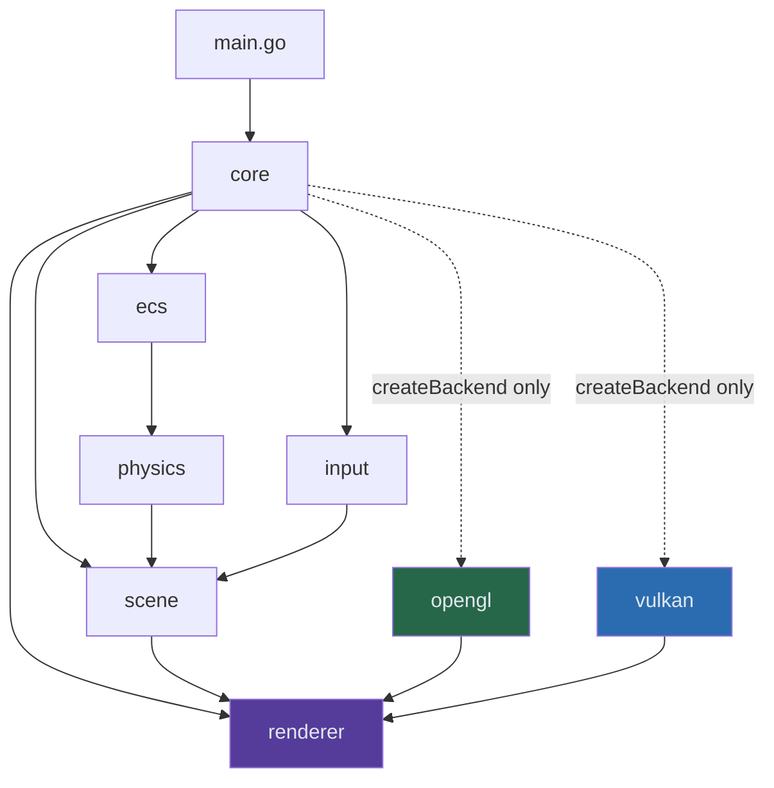
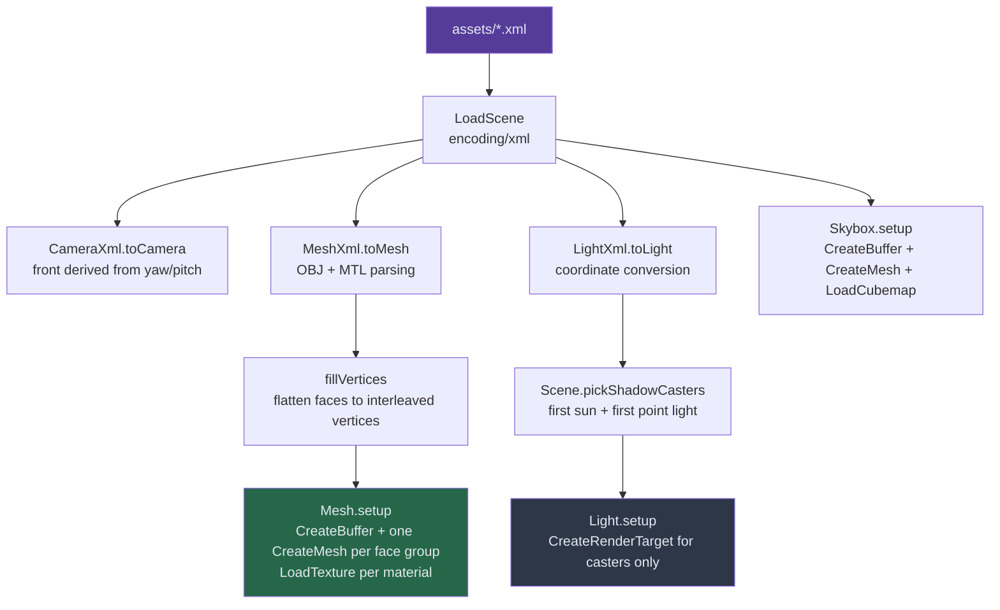
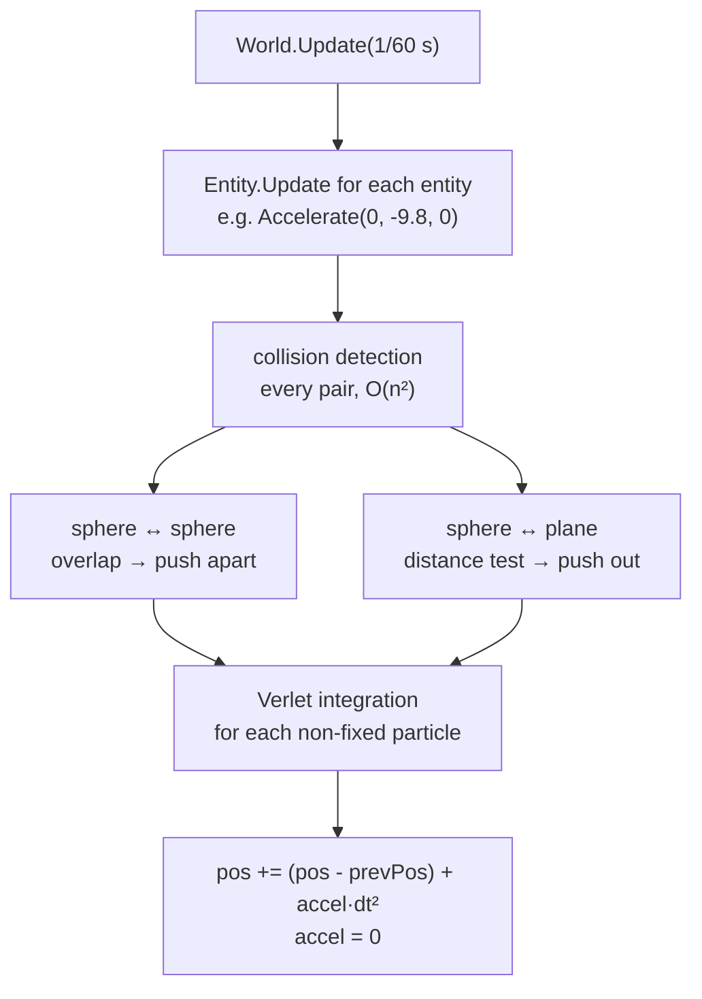

# ARCHITECTURE.md — the code map

Where everything lives and what calls what, package by package. This is the
**navigation** document: use it to find the file you need.

`ENGINE_FLOW.md` is the other half — it takes the same tree and follows *one
frame* through it, then walks the `renderer.Backend` contract method by method.
Nothing about backend internals is repeated here.

---

## Contents

1. [Repository layout](#1-repository-layout)
2. [The dependency rule](#2-the-dependency-rule)
3. [Scene loading](#3-scene-loading)
4. [Physics and the ECS](#4-physics-and-the-ecs)
5. [Package reference](#5-package-reference)
6. [Scene and asset format](#6-scene-and-asset-format)
7. [Shaders](#7-shaders)
8. [Dead code](#8-dead-code)

---

## 1. Repository layout

The Go module root is **`src/`** (module `github.com/Zephyr75/overdrive`). Every
asset, shader and texture path is relative to it, so every command runs from
there.

```
overdrive/
├── README.md              public overview, build and run
├── CLAUDE.md              working rules for this repo
├── notes/                 this documentation, see notes/README.md
├── textures/              fonts and images used by the UI layer
└── src/                   the engine, and the Go module root
    ├── main.go            builds an App, loads a Scene, builds an ECS World
    ├── build_shaders.sh   Slang → GLSL 4.10 + SPIR-V, must run before first build
    │
    ├── core/              app lifecycle and the frame loop
    │   ├── app.go         NewApp (window + backend), App.Run (the frame loop)
    │   └── ui.go          renderUI: rasterise widgets → texture → fullscreen quad
    │
    ├── renderer/          the abstraction, imports no graphics API
    │   ├── backend.go     Backend interface, opaque handles, RenderTargetSpec
    │   └── uniforms.go    FrameUniforms, DrawUniforms, the layout guard
    │
    ├── opengl/            OpenGL 4.1 backend — may import gl.*
    │   ├── backend.go     resource tables, passes, draws
    │   ├── shader.go      compile, link, pin sampler units and block bindings
    │   ├── uniforms.go    UBO upload (a memcpy) and the sampler unit map
    │   └── uniforms_test.go  derives std140 from the generated GLSL, diffs it
    │                         against the Go structs
    │
    ├── vulkan/            Vulkan 1.3 backend — may import vk.*
    │   ├── backend.go     device, swapchain, passes, lifetimes
    │   ├── buffer.go      VMA allocations
    │   ├── draw.go        the uniform ring, push constants, Draw
    │   ├── shader.go      modules and lazy pipeline construction
    │   ├── swapchain.go   creation and resize
    │   └── texture.go     images, staging, bindless descriptors, render targets
    │
    ├── scene/             what is in the world
    │   ├── scene.go       XML loading, shadow-caster budget, render dispatch
    │   ├── mesh.go        OBJ/MTL parsing, vertex data, per-face-group draws
    │   ├── material.go    material fields and texture handles
    │   ├── light.go       light types, shadow targets, the depth passes
    │   ├── camera.go      position, yaw/pitch, field of view
    │   ├── skybox.go      the cube and its cubemap
    │   └── showcase_test.go  loads assets/showcase.xml, no GPU needed
    │
    ├── ecs/               entity component system
    │   └── entity.go      World and the Entity interface
    │
    ├── physics/           plain Go, zero graphics calls
    │   ├── verlet.go      position integration
    │   ├── sphere.go      sphere collider and responses
    │   └── plane.go       plane collider
    │
    ├── input/             GLFW callbacks
    │   ├── input.go       keyboard, camera movement
    │   └── callback.go    mouse look, scroll FOV, framebuffer resize
    │
    ├── configs/           the settings files: opengl.toml (loaded by default) and vulkan.toml, the same settings on either backend
    ├── settings/          resolution, backend and anti-aliasing globals + their TOML loader
    ├── utils/             vector parsing, Euler conversion, error handling
    │
    ├── shaders/
    │   ├── slang/         the source of truth, authored once
    │   ├── gl/            generated GLSL 4.10 — git-ignored
    │   └── vk/            generated SPIR-V — git-ignored
    │
    ├── assets/            scene XML plus meshes/ (OBJ + MTL)
    ├── textures/          colour and normal maps, skybox and cubemap faces
    └── plugin/
        └── xml_export.py  Blender add-on that writes the scene XML
```

---

## 2. The dependency rule

**Nothing above `renderer/` imports a graphics API.** Scene, core, ecs, input and
physics own opaque handles (`renderer.MeshHandle`, `TextureHandle`,
`RenderTargetHandle`, `ShaderHandle`, `BufferHandle`) that each backend
interprets in its own table.



The two dotted edges are the whole reason `createBackend` lives in `core/`: the
backend packages import `renderer`, so `renderer` cannot import them back, and
somebody above both has to pick one. `settings.Backend` (`gl` by default, or
`vulkan`, set by the config file) is read there and nowhere else.

Two further invariants, both enforced by convention rather than by the compiler:

- **Clears and viewports exist only inside `Backend.BeginPass`.** No free-floating clear anywhere in scene or core code
- **Uniforms are two typed structs split by update frequency**, mirroring `shaders/slang/common.slang` field for field. See `ENGINE_FLOW.md` §4.5

---

## 3. Scene loading

`scene.NewScene(path, backend)` is the only entry point. It parses, uploads and
resolves the shadow budget, in that order.



**One vertex buffer, several meshes.** An OBJ with three materials becomes one
`BufferHandle` plus three `MeshHandle`s, each owning only its index list. That is
why `Mesh.gpu` is a slice.

**The shadow budget is fixed at load.** `pickShadowCasters` gives a 2D depth map
to the first directional light and a depth cube to the first point light; every
other light still lights the scene, it just casts nothing. The shader is built
for up to `MAX_SHADOW_CUBES` (4) cube slots, but `Scene` currently fills only
slot 0 — see `TODO.md`.

**Texture paths are made portable.** Blender bakes the absolute path of the
machine that exported the scene into the MTL, so `texturePath` keeps only the
basename and resolves it against the engine's own `textures/` directory.

---

## 4. Physics and the ECS

Both are plain Go with no graphics calls. `World.Update(dt)` runs three phases
in a fixed order:



**Verlet stores the previous position instead of a velocity**, which makes the
integrator unconditionally stable and constraints trivial to apply, at the cost
of no built-in damping. See `cheatsheets/GRAPHICS.md` §3 for how it compares to
Euler and RK4.

An entity that owns both a collider and a `scene.Mesh` (the demo's `Sphere` in
`main.go`) calls `Mesh.MoveTo` in its `Update`, which rebuilds the mesh's vertex
data and flags it dirty. `Scene.UpdateMeshes` reuploads exactly those at the top
of the next frame.

---

## 5. Package reference

Only what exists. Unexported symbols are marked *(pkg)*.

### `main.go`

| Symbol | Kind | Description |
|---|---|---|
| `main` | func | Creates the `App`, loads `assets/showcase.xml`, builds the ECS world, runs |
| `createWorld` | func | Wires the demo's physics bodies, skipping meshes the scene lacks |
| `StaticCollider` | type | An immovable body wrapping a `physics.Collider` |
| `Sphere`, `Sphere2` | type | A falling and a static ball, each pairing a collider with a `scene.Mesh` |
| `MainWindow` | func | The demo widget tree. Currently unused — `App.Run` is called with a nil widget |

### `core/`

| Symbol | Kind | Description |
|---|---|---|
| `App` | type | Window, backend, dimensions, debug flag, input callbacks |
| `NewApp` | func | Creates the backend, hints and creates the window, wires input, then `Backend.Init` |
| `App.Run` | func | Compiles the five shader sets, builds the UI quad, then loops until the window closes |
| `App.Quit` | func | Asks the window to close |
| `createBackend` *(pkg)* | func | Switches on `settings.Backend`. The only place that names `opengl` or `vulkan` |
| `renderUI` *(pkg)* | func | Rasterises the widget tree to RGBA, uploads it, draws the quad. Redraws only when the tree or hover state changed |

### `renderer/`

| Symbol | Kind | Description |
|---|---|---|
| `Backend` | interface | 25 methods, the whole contract. Grouped in `ENGINE_FLOW.md` §0 by call frequency |
| `TextureHandle`, `BufferHandle`, `MeshHandle`, `RenderTargetHandle`, `ShaderHandle` | type | Opaque `uint32`. Texture 0 is the white pixel, render target 0 the backbuffer |
| `VertexLayout` | type | `LayoutMesh`, `LayoutPosition`, `LayoutPositionUV` — how a mesh's vertex buffer is read. Recorded at creation, which is what lets one `Draw` serve every drawable |
| `RenderTargetSpec`, `TargetFormat` | type | Describes an offscreen target by what it *is* — size, depth or colour, cube or not |
| `Feature`, `Supports` | type, method | The seam for ray tracing and compute; both backends report `false` today |
| `FrameUniforms` | type | 1280 B: camera, lights, shadow maps. Published once per pass |
| `DrawUniforms` | type | 128 B: model matrix and material. Sent per draw |
| `LightData` | type | 68 B, mirrors the `Light` struct in `common.slang` |
| `MaxLights`, `MaxShadowCubes` | const | 8 and 4, must match `common.slang` |

### `scene/`

| Symbol | Kind | Description |
|---|---|---|
| `Scene` | type | Meshes, lights, skybox, camera, and the two shadow-caster indices |
| `NewScene` | func | Parse then upload everything through the backend |
| `LoadScene` | func | Pure XML deserialisation, no GPU work — what the tests use |
| `EmptyScene` | func | Nothing in it, for running the app as a UI shell |
| `Scene.FillFrameUniforms` | func | Camera matrices, the light array, scene-wide texture handles, shadow indices |
| `Scene.RenderScene` | func | Rebinds the frame block, then draws every mesh with the forward shader |
| `Scene.RenderSkybox` | func | Binds a *copy* of the frame block with the view translation stripped |
| `Scene.UpdateMeshes` | func | Reuploads the vertex buffers physics moved this frame |
| `Scene.ShadowCasters` | func | Returns the two caster indices, or -1 |
| `Scene.Mesh` / `Light` / `Camera` | func | Lookup by name |
| `Mesh` | type | Vertices, normals, UVs, faces, materials, plus the GPU handles |
| `Mesh.MoveTo` / `MoveBy` | func | Rebuild vertex data and flag it for reupload |
| `Mesh.draw` *(pkg)* | func | One `Backend.Draw` per face group, rewriting the material fields of `u` |
| `Light` | type | Position, direction, colour, intensity, type, and its shadow target |
| `Light.RenderShadowMap` | func | Runs this light's depth pass: ortho for the sun, six cube faces for a point |
| `Material` | type | Ambient, diffuse (= albedo), specular, shininess, alpha, metallic, roughness, ao, plus diffuse and normal-map handles |
| `Camera` | type | Position, front, up, yaw, pitch, FOV |
| `Skybox` | type | The cube mesh handle and the cubemap texture |

### `ecs/`

| Symbol | Kind | Description |
|---|---|---|
| `Entity` | interface | `Init`, `Update`, `Type`, `Collider` |
| `World` | type | A slice of entities |
| `World.AddEntities` / `Init` / `Update` | func | Build and step the world |
| `World.Entities` / `FirstEntity` | func | Lookup by type string |

### `physics/`

| Symbol | Kind | Description |
|---|---|---|
| `Collider` | interface | Anything that can `Collide` and expose its `Verlet` |
| `Verlet` | type | `Pos`, `PrevPos`, `Accel`, `Fixed` |
| `Verlet.UpdatePosition` / `Accelerate` | func | Integrate; accumulate a force |
| `Sphere` | type | A `Verlet` plus a radius |
| `NewSphere` / `NewSphereFromMesh` | func | Explicit, or bounding radius derived from a mesh |
| `Sphere.Collide` | func | Dispatches to sphere-sphere or sphere-plane |
| `Collider.Body` | method | The `Verlet` the integrator steps. Named `Body` because every implementer embeds a `Verlet` field |
| `Plane` | type | A `Verlet` plus a normal, axes and half-sizes |
| `NewPlane` / `NewPlaneFromMesh` | func | From four corners, or derived from a mesh |

### `input/`

| Symbol | Kind | Description |
|---|---|---|
| `DefaultInput` | func | WASD, Q/E for up and down, Shift to sprint, Tab toggles the cursor, Esc quits |
| `DefaultMouseCallback` | func | FPS look: yaw and pitch from mouse delta, pitch clamped to ±89° |
| `ScrollCallback` | func | Field of view, clamped |
| `FramebufferSizeCallback` | func | Records the new size in `settings`. The viewport itself is a per-pass decision |
| `SetScene` | func | Gives the input package the camera to drive |

### `settings/` and `utils/`

| Symbol | Kind | Description |
|---|---|---|
| `WindowWidth` / `WindowHeight` | var | 1920×1080, updated on resize |
| `ShadowWidth` / `ShadowHeight` | var | 1024², fixed |
| `Backend` | var | `"gl"` or `"vulkan"`, the name `core.createBackend` switches on |
| `AntiAliasing` / `MSAASamples` | var | `AAMSAA` ×4 by default; both read once at `Backend.Init` |
| `AAMode` | type | `AANone` or `AAMSAA` |
| `MSAAEnabled` | func | Mode is MSAA *and* the count actually multisamples |
| `Config` | type | The TOML file's shape: `[window]`, `[shadows]`, `[renderer]`, `[antialiasing]` |
| `Load` | func | Decodes a settings file over the defaults and validates it — the engine's only configuration input. Rejects unknown keys and values, changing nothing when it does |
| `AspectRatio` / `ShadowAspectRatio` | func | For the camera and cube-shadow projections |
| `ParseVec3` | func | `"x,y,z"` → `mgl32.Vec3` |
| `EulerToDirection` | func | Pitch/yaw/roll → direction vector |
| `HandleError` | func | Panic on a non-nil error |

---

## 6. Scene and asset format

Scenes are XML in `src/assets/`, referencing OBJ and MTL files in
`assets/meshes/`. The Blender add-on writes exactly this layout.

```xml
<scene>
  <camera name="Camera">
    <type>persp</type>
    <position>0.0,-9.5,3.5</position>
    <yaw>0.0</yaw>
    <pitch>14.0</pitch>
    <fov>45.0</fov>
  </camera>

  <mesh name="Ground">
    <position>0.0,0.0,0.0</position>
    <obj>DemoGround.obj</obj>
    <!-- <mtl> is optional: it defaults to the .obj basename -->
  </mesh>

  <light name="Sun">
    <type>sun</type>
    <position>10,10,10</position>
    <direction>-1,-1,-1</direction>
    <color>1,1,1</color>
    <diffuse>1.0</diffuse>
    <specular>0.5</specular>
    <intensity>5</intensity>
  </light>
</scene>
```

**Coordinates.** Blender and OBJ disagree about which axis is up, so import
converts:

```
Blender (x, y, z)  →  Overdrive (x, z, -y)
```

applied to mesh positions, light positions, and — with sign flips — light
directions. The camera's `front` is *not* read from the XML: it is rebuilt from
`yaw` and `pitch`, and `up` is forced to world up.

**Static geometry is baked.** The demo OBJs are exported already in world space
and the engine renders them with an identity model matrix, so `<position>` is
unused for static meshes. It matters only for meshes a physics body moves.

**Materials** come from the MTL, including the PBR extension keys `Pm`
(metalness) and `Pr` (roughness), plus `map_Kd` for albedo and `map_Bump` /
`bump` for the normal map.

**Point-light intensity is divided by 1000 on import**, because Blender's watt
units and the shader's inverse-square falloff are not on the same scale.

### The Blender add-on

`src/plugin/xml_export.py`, registered under **File → Export → Export Overdrive
scene…**

| Symbol | Description |
|---|---|
| `OverdriveWriter` | Stateful XML builder |
| `.write` | Camera → meshes (each exported via `bpy.ops.wm.obj_export`) → lights → write the `.xml` |
| `.write_camera` | Position, front and up vectors, yaw, pitch, FOV |
| `.write_mesh` | Position, rotation, and the OBJ/MTL filenames |
| `.write_light` | Type, position, direction, colour, diffuse, specular, intensity |
| `OverdriveExporter` | The `bpy.types.Operator` + `ExportHelper` that puts it in the menu |

---

## 7. Shaders

Authored **once** in Slang under `src/shaders/slang/`, compiled per backend by
`build_shaders.sh` into GLSL 4.10 and SPIR-V. Neither backend reads `.slang` at
runtime, so the script must run before the first build and after every shader
edit.

| Set | Stages | Used by |
|---|---|---|
| `common.slang` | — | Included by all of them: `MAX_LIGHTS`, `LightData`, `FrameUniforms`, `DrawUniforms`, and the per-backend uniform access macros `FRAME` / `DRAW` |
| `forward` | vert, frag | The main pass. Cook-Torrance PBR, normal mapping, both shadow tests, skybox ambient, Reinhard tonemap |
| `depth` | vert, frag | The directional light's 2D shadow pass |
| `depth_cube` | vert, **geo**, frag | The point light's cube shadow pass, one layered draw for all six faces |
| `skybox` | vert, frag | The cube, drawn with `LEQUAL` depth |
| `ui` | vert, frag | The fullscreen overlay quad |

The uniform macros are named `FRAME` and `DRAW` rather than anything shorter
because `forward.slang` already uses `F`, `D` and `G` for the Fresnel,
distribution and geometry terms of the BRDF.

---

## 8. Dead code

These files are on disk but contain nothing the build uses. They are kept as
placeholders for planned work; delete or implement.

| File | State |
|---|---|
| `src/physics/box.go` | Empty, a placeholder for box colliders (`TODO.md`) |
| `src/physics/box_old.go` | Fully commented out, the earlier box attempt |
| `src/physics/link.go` | Fully commented out, Verlet distance constraints |
| `src/ecs/ecs.go` | Fully commented out, an earlier set-based World. `entity.go` is the live one, and this file is the only thing `gofmt -l` reports |
| `src/algorithms/wfc.go` | Empty, the Wave Function Collapse placeholder |
