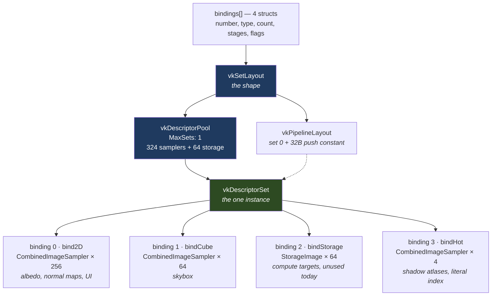
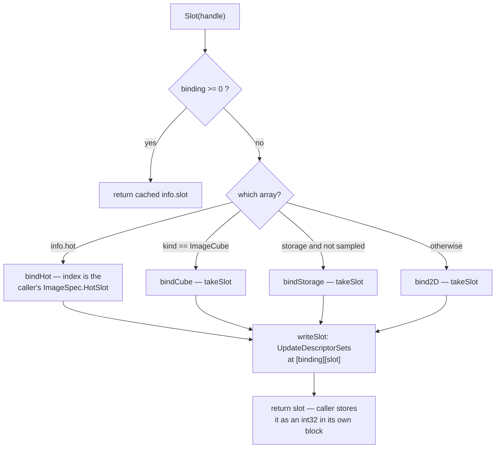

# Descriptors

How an image becomes a number a shader can index. Everything here lives in
`src/vulkan/slots.go`, plus the three fields it owns on `VKBackend`.

**Not here:** image creation and layout transitions (`ENGINE_FLOW.md` §7),
push constants and uniform blocks (`CLAUDE.md` invariant 3 — descriptors carry
images, push constants carry everything else).

**Careful:** *slot* means two unrelated things in this repo. Here it is an index
into a descriptor array. In `scene/shadowatlas.go` it is a rectangle of the
shadow atlas. Nothing connects them.

## The three objects

| Object | What it is | Lives in |
|---|---|---|
| `vk.DescriptorSetLayoutBinding` | a plain struct: one binding number, its descriptor type, how many, which stages | nothing — discarded after the create call |
| `vkSetLayout` | driver object: the **shape** of a set, built from that list of bindings | `backend.vkSetLayout` |
| `vkDescriptorPool` | the memory descriptors are allocated **from** | `backend.vkDescriptorPool` |
| `vkDescriptorSet` | the one **instance**, holding 388 live descriptors | `backend.vkDescriptorSet` |

Binding is a field declaration, layout is the struct type, set is the instance.

A **descriptor** itself is never a Go value the engine keeps: `writeSlot` builds
a `vk.DescriptorImageInfo` (view + sampler + the layout it will be read in),
hands it to `vk.UpdateDescriptorSets`, and the driver copies it into the set.

## What a descriptor actually holds

An opaque, hardware-specific blob, 32-64 bytes. Roughly:

```c
struct Descriptor {          // combined image sampler
    uint64 baseAddress;      // the pixels in VRAM
    uint32 format;
    uint32 width, height, mipLevels, arrayLayers;
    uint32 swizzle, tilingMode, viewType;

    uint32 minFilter, magFilter, mipFilter;   // the sampler half,
    uint32 addressU, addressV, addressW;      // present only because
    float  minLod, maxLod, maxAnisotropy;     // the type is COMBINED
};
```

**No handles in it.** It stores no `vk.ImageView` and no `vk.Sampler`:
`UpdateDescriptorSets` reads those two objects and bakes their fields in, so the
write is a copy, not a pointer. Two consequences the engine depends on —
replacing a view means calling `writeSlot` again, and destroying a view leaves
its descriptor pointing at freed VRAM, which is the whole reason `drainRetired`
holds a slot for `framesInFlight` frames.

## Why a pool, and where the set lives

Descriptors are GPU-visible memory the shader fetches from, and Vulkan allocates
nothing implicitly — so the pool is a pre-sized arena, declared per descriptor
*type* because the types are different byte sizes on real hardware. (The other
two reasons for pools, bulk reset and per-thread allocation without a lock, go
unused here: one set, made at `Init`, freed with the pool at shutdown.)

The set is **not** stored beside the descriptors — the set *is* a range of the
pool, and it holds one address, not one per descriptor:

```c
// what the VkDescriptorSet handle points at — CPU-side driver bookkeeping
struct DescriptorSet {
    VkDescriptorPool      pool;
    VkDescriptorSetLayout layout;   // where each binding starts, and its stride
    uint64                gpuBase;  // ONE address: the range below
    uint32                size;
};

// that range, in the pool's GPU arena — blobs back to back, no headers
[ binding 0: 256 ][ binding 1: 64 ][ binding 2: 64 ][ binding 3: 4 ]
```

Descriptor *i* of binding *b* is at `gpuBase + layout.offsetOf(b) + i*strideOf(b)`.
One fetch, no indirection — which is why `DstBinding`/`DstArrayElement` are
indices rather than addresses, and why a set can never be resized: the offsets
are baked into the layout, so raising `max2DTextures` would move every binding
after it.

None of this layout is in the Vulkan spec — it is opaque and drivers differ
(some keep all descriptors in one global heap and make a set an offset into it;
some split samplers into a second heap, so a `CombinedImageSampler` is two
blobs). What is guaranteed is the contract: a handle, index-based writes, and
contiguity within a binding.

## The three variables

- **`vkSetLayout`** — referenced by the pool's allocation, by
  `CreatePipelineLayout` (`backend.go:360`, so every pipeline agrees on it), and
  destroyed last at shutdown. Every `[[vk::binding(n, 0)]]` in
  `shaders/slang/common.slang` must match it; nothing checks that at build time.
- **`vkDescriptorPool`** — sized once, `MaxSets: 1`. Its sizes are per *descriptor
  type*, not per binding, so the three `CombinedImageSampler` arrays add into one
  entry of 324 and the storage array is the other 64.
- **`vkDescriptorSet`** — allocated once at `Init`, bound twice at the start of
  every frame (`frame.go:83-86`, graphics and compute bind points), never rebound.
  Only its **contents** change, which is what `UpdateAfterBind` makes legal.

Plus the allocator state: `slotFree[4][]uint32` (returned indices) and
`slotNext[4]` (high-water mark).

## Structure



Bindings 0-2 are declared **unsized** in the shader (`Sampler2D textures2D[]`),
so the layout's count is what sizes them. Binding 3 is declared
`Sampler2D hotTextures[4]` — a literal that `maxHotTextures` must match.

## Getting a slot

`Slot(handle)` is the whole handle-to-shader translation. It is **lazy**: an
image has no descriptor until someone asks. Seven call sites — the two material
textures (`scene/mesh.go:346,354`), the skybox (`scene/skybox.go:106`), the two
atlases (`scene/shadowatlas.go:153-154`), the UI overlay (`core/ui.go:95`) and
the two defaults (`backend.go:376,383`). The depth buffer, the MSAA target and
the backbuffer are never slotted and hold no descriptor at all.



`takeSlot` pops `slotFree[binding]` if anything is there, otherwise bumps
`slotNext[binding]` and panics at `bindingCapacity`.

Recycling is the other half: `Destroy` only **retires** a resource, and
`drainRetired` returns the slot to `slotFree` once `framesInFlight` frames have
passed — reusing an index earlier is not an error, it is a draw sampling the
wrong image. Hot slots are never recycled, because the shader names them by
literal and the scene owns which is which.

## Rules that bite

- **One image, one descriptor, in one array.** The first `Slot` call decides;
  `info.binding`/`info.slot` is a single pair.
- **`ImageSampled|ImageStorage` lands in `bind2D` only** (`slots.go:136` takes
  the storage branch solely when *not* sampled), so a compute shader could not
  write it. Nothing does this today; it would fail silently if it did.
- **Precedence is hot → cube → storage → 2D**, so a hot cubemap is impossible.
- **`PartiallyBound` makes a hole legal, not safe.** A draw that samples an
  unwritten slot reads undefined data, which is why `createDefaultImages` seeds
  all four hot descriptors with the white pixel.
- **The layout's counts and `common.slang` are matched by hand.** A mismatch is a
  validation error at best and a wrong tap at worst.
