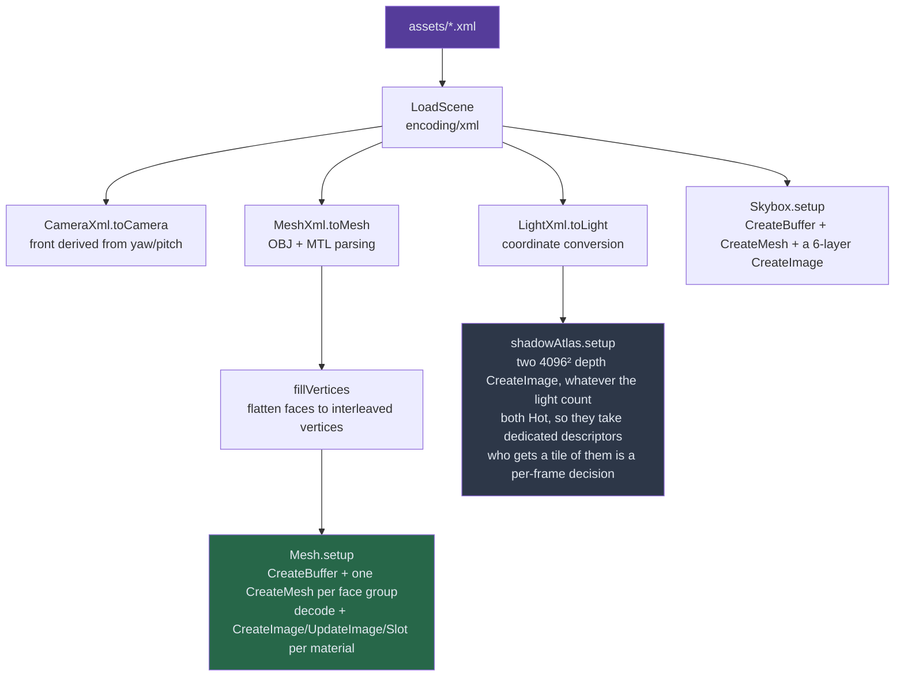
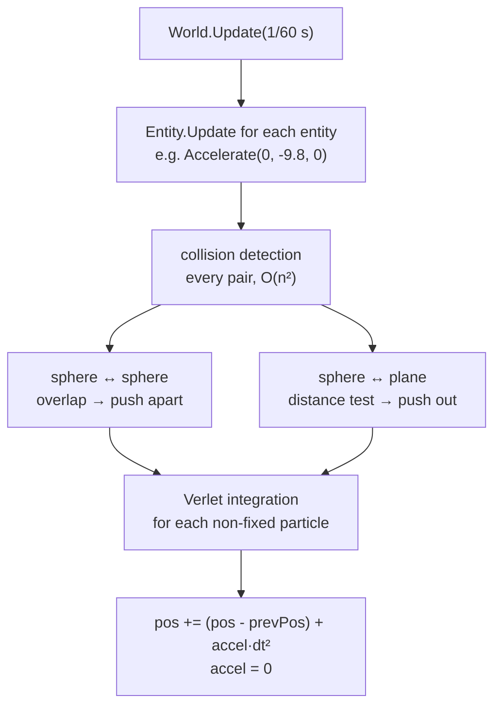

# Features — what the engine does, and why

> **Scope** every implemented feature with where it lives and why it is built that way, the scene format, the config tiers, the roadmap and the performance history. Paths are relative to `src/`.
>
> **Not here** the frame order → `OVERVIEW.md`. The backend contract → `RENDERER.md`. The theory (BRDF, shadow mapping, MSAA in general) → `cheatsheets/PBR.md`, `cheatsheets/GRAPHICS.md`.

---

## 1. Rendering stack

- **Vulkan 1.3 only**, behind `renderer.Backend`/`Frame`/`Pass`/`Compute` (25 methods). The OpenGL 4.1 backend was deleted on 2026-08-05.
- **The modern stack** from howtovulkan.com: dynamic rendering, buffer device address with scalar layout for uniforms, bindless descriptor indexing, synchronization2, VMA, 2 frames in flight.
- **Shaders in Slang** (`shaders/slang/`), compiled to SPIR-V by `build_shaders.sh`.
- **Compute is in the interface** (`Frame.Compute`, storage images through `Slot`, storage buffers by address) but nothing uses it yet.

## 2. Lighting and materials

**Cook-Torrance metallic-roughness PBR** in `forward.slang`: GGX distribution, Smith geometry via Schlick-GGX with direct-lighting `k = (r+1)²/8`, Fresnel-Schlick, and a Lambert diffuse weighted `kD = (1 - F)(1 - metallic)`, so metals have no diffuse. `F0 = lerp(0.04, albedo, metallic)`.

| Light | Function | Notes |
| --- | --- | --- |
| sun | `calcDirLight` | infinite, along `direction` |
| point | `calcPointLight` | inverse-square falloff. Import divides Blender's watts by 1000 |
| spot | `calcSpotLight` | point falloff × `smoothstep` between outer and inner cone cosines. The XML keeps Blender's `<cone>` (degrees) and `<coneBlend>` |

- **Up to 64 lights** (`MaxLights` in Go, `MAX_LIGHTS` in Slang, kept in step by hand) in any mix. Each has a `Radius`, the distance where its falloff drops below 1/255 (`scene.lightRadius`); the fragment loop skips a light beyond it before any BRDF or shadow work, which is what makes 64 affordable. A sun has radius 0 and never skips.
- **Materials** come from the MTL: `Kd` (base colour), `Pm` (metallic), `Pr` (roughness), `map_Kd` (albedo texture, linearised with `pow(·, 2.2)`), `map_Bump`/`bump` (normal map). Without `Pm`/`Pr` a material is a matte dielectric (roughness 1).
- **Normal mapping** builds the tangent frame per fragment from screen derivatives (`perturbNormal`, Schüler's cotangent frame), so meshes carry no tangents. Enabled per face group by `UseNormalMap`.
- **Environment.** The skybox cubemap is drawn behind the scene with `LEQUAL` and doubles as a crude reflection probe: sampled along `N` for irradiance (damped ×0.35) and `reflect(-V, N)` for specular, mixed by `fresnelSchlickRoughness`. Real prefiltered IBL is on the roadmap.
- **Tonemapping.** Radiance is unbounded, so `fsMain` ends with Reinhard plus gamma until an HDR pass exists.

## 3. Shadows

### One atlas per kind, one lookup

**Every shadow is a sub-rect of a 4096² depth texture**, of two of them: `staticAtlas` holds casters that cannot move and is re-baked only when allocation moves; `dynamicAtlas` is a copy of it plus movable casters drawn on top. `ShadowTile.Flags` bit 0 picks which one a light samples.

| Light | Tiles | Baked with | Stored depth |
| --- | --- | --- | --- |
| sun | 1 | `depth.slang`, orthographic | projected depth |
| spot | 1 | `depth.slang`, the cone's frustum widened by 2 texels | projected depth |
| point | 6, one per 90° face | `depth_point.slang` | radial distance / `farPlane`, continuous across faces so one bias fits all six |

One `shadowLookup` in `forward.slang` serves every type: it projects through the tile's own matrix, maps tile uv into the atlas through `AtlasCoords`, and forks only on the depth encoding.

**Why an atlas.** The pass count stops growing with the light count (one pass per atlas, then a `Pass.Viewport` per tile), tile size is chosen per light, and the static/dynamic cache has one texel currency. It costs two things a cubemap gave free:

- **No cross-face filtering**: each cube face (and spot cone) is widened to `90° + 2 texels` (`cubeFaceFov`) so the kernel at an edge stays in its own tile. Exact on edges, approximate at corners.
- **No border**: a tile's neighbours are other lights' shadows. `shadowLookup` returns lit for anything outside the tile, and `tileSample` clamps every tap one texel inside it. Miss either and one light shows another's shadow.

### Slots and allocation

The atlas is carved once at load into a **fixed slot layout** (`slotLayout` / `buildLayout`, `scene/shadowatlas.go`): by default 1×2048 + 16×512 + 64×256 + 256×128 = 337 slots, 100% of the atlas. Sizes are divisions of `atlasSize`, so **the atlas size buys sharpness and the slot counts buy light budget**: two separate `[shadows]` knobs.

Who holds a slot is decided **per frame** by `shadowAtlas.allocate`:

- **Score** = `radius / distance to camera`, a rough screen footprint. Lights sort by score.
- **Rank picks the slot, the tier caps it.** Each takes the best free slot no larger than its ceiling: 512 above 0.50, 256 above 0.20, 128 above 0.08, nothing below. A sun skips scoring and is capped at 2048.
- **A point light takes six slots at its tier's size**, all or nothing (five faces would leave a lit wedge). Slots are typeless, so the six need not be adjacent.
- **Phase 1b** re-offers spare slots to lights that ended under their ceiling, so a layout tuned for one light mix does not waste sizes on another.
- **Running out costs resolution, never frame time.** A light walks down a pool at a time and finally gets `ShadowIndex = -1`, lit unshadowed.
- **Two hysteresis margins**: `nextTierThreshold` (20%) stops a boundary score changing a light's ceiling every frame; `slotStickiness` (20%) stops two near-equal lights trading a contended pool's last slot every frame. Both are deliberately not config knobs.

**Static vs dynamic.** A mesh is movable when the XML says `<movable>` or `MoveBy`/`MoveTo` has been called. A light takes a dynamic tile only while a movable caster is in range. The static side is all-or-nothing (a tile with no caster writes nothing, so a partial re-bake would leave a stale tile); the dynamic side is per tile, capped at `settings.ShadowBakeBudget()` texels a frame in score order, a light that misses out keeping its old tile.

### Layout capacity

The atlas is 16 cells of 1024². Cost per light, in cells:

| Light | Cells |
| --- | --- |
| spot @1024 / @512 / @256 / @128 | 1.0 / 0.25 / 0.0625 / 0.015625 |
| point @512 / @256 / @128 per face | 1.5 / 0.375 / 0.09375 |

Capacity after a sun, everything at one tier:

| Tier | Spots | Point lights |
| --- | --- | --- |
| top (score > 0.50) | 48 | 32 |
| mid (> 0.20) | 192 | 128 |
| far (> 0.08) | 768 | 512 |

- **There is no 1024 tier**: four 1024 slots cost a whole quadrant, the one the 128 row uses. An 8192 atlas buys both.
- **The real ceiling is draw calls**: every tile redraws every caster, so 121 tiles × 200 casting meshes would be 24,200 draws. The static/dynamic split is the answer.

### Bias

**Normal-offset**, not depth bias: `shadowLookup` pushes the receiver along its world-space normal before projecting (`NORMAL_OFFSET_2D = 0.08` scaled by the incidence angle, `NORMAL_OFFSET_CUBE = 0.10`), so the remaining depth bias is tiny and contact shadows stay attached. Tuned for the showcase's ~10-unit scale; `FrameUniforms.ShadowNormalScale` (`4096 / atlasSize`) grows it on a smaller atlas.

- **Front-face culling was tried and rejected**: it bakes the far side of a closed mesh, so a sphere floats above a lit disc of its own size. Every tile bakes `CullBack`.
- **`Mesh.CastsShadow`** (`<castsShadow>false</castsShadow>`, default true) keeps a mesh out of every bake. A single-sided ground plane needs it: with the whole scene above it, it can only shadow itself, and at grazing angles that is acne over the whole surface, which reads as a near-black scene.
- **Still missing**: slope-scaled depth bias (`vkCmdSetDepthBias`, not bound in `go-vulkan`), for a flat surface that must cast.

### PCF

A raw lookup answers lit or shadowed per texel, so edges are blocky. PCF compares the fragment against several neighbouring texels and averages the yes/no answers. It filters the *comparisons*, not the depths, so the atlas sampler is `FilterNearest` and the shader blends.

- `[shadows] pcf` → `settings.ShadowPCF` → `Flags` bit 1 when cheap, and `PCFStep = 1 / tileSize` (one texel, `texelSize` in the shader).
- **Early bail** (`pcfTile`): 4 corner taps first. If they agree (almost every fragment outside a penumbra) it returns at once; otherwise the full 3×3. `"cheap"` stops at the 4 corners, so a penumbra quantises to quarters.

### Test scenes and reading the atlas

- **`assets/showcase.xml`** (default) is the beauty shot: 9 lights all near the camera, so every one lands in the top tier. It never exercises variable resolution.
- **`assets/stress.xml`** (`-scene stress.xml`) is the allocator's: 64 lights, intensities solved backwards from the tier each should land in. Measured: all 64 shadowed, 11 degraded a step, 259 tiles filling 91.8% of the atlas. `MaxLights`, not the atlas, stops it reaching 100%.
- **The atlas is read in RenderDoc.** The three encodings need different contrast ranges (a range that shows the sun renders every spot tile white), and a wrong tile rect still looks plausible, so check tile positions against `AtlasCoords`.
- **Lighting so a shadow is visible**: a light must be high and off to one side; a spot beats a point light (zero contribution outside its cone); with several lights per fragment Reinhard compresses hard, so shadows read by hue, hence near-primary spot colours.

## 4. Depth prepass

`[renderer] depthPrepass`, on by default. A depth-only pass draws every mesh through `prepass.slang` (no colour attachment, empty fragment stage); the main pass keeps that depth and the forward pipeline compares `EQUAL`, so `fsMain` runs once per pixel.

- **Why**: `fsMain` is the most expensive shader (up to 64 lights, each with Cook-Torrance and 4–13 PCF taps). Early-Z already rejects hidden fragments, but only against what has been drawn; the prepass gives exact per-pixel rejection with no sorting. It wins on depth complexity and shows no gain on the flat showcase, which is expected.
- **`EQUAL` compares bits.** `prepass.slang` repeats `forward.slang`'s position maths operation for operation (not `depth.slang`'s premultiplied matrix, which rounds differently), and both passes read the same uploaded `FrameUniforms` address. Verified: prepass on and off differ in 6 pixels of 2.07 M.
- **Transparency must stay out of it**: blending needs several fragments per pixel. When it lands it is a third pass, sorted back to front, `CompareLess`, depth write off. Alpha cutout belongs in the prepass, but `prepass.slang` must then `discard` identically.

## 5. Anti-aliasing — MSAA

`[antialiasing] mode` (`none` / `msaa`) and `samples` (2/4/8), clamped to what the device supports, so 8× steps down to 4× rather than failing.

**How it works.** Each pixel stores N samples (colour and depth) at fixed points *inside* the pixel, not neighbours. Coverage and depth are tested per sample, but the fragment shader runs **once per pixel per triangle** and its colour fills the samples that triangle covers. Inside a surface all N match and compress; on an edge they split between triangles, and the resolve averages them. Supersampling would instead run the full shader N times everywhere.

- The flow from config to resolve: `core/app.go` requests the count → `pickSampleCount` clamps it → `Capacities().BackbufferSamples` → `core/targets.go` builds the MSAA colour and depth images → screen pipelines take the same count → the main pass resolves into the swapchain image (`RENDERER.md` §3).
- **Limit**: only geometric edges are smoothed; specular shimmer and normal-map aliasing are not. That is what a post-process AA (FXAA/TAA) would add.
- **Cost** on an Intel UHD 620 at 1080p: ~49 FPS off, ~44 at 4×, ~28 at 8×.

## 6. UI overlay

Widget trees from [Gutter](https://github.com/Zephyr75/gutter) are rasterised on the CPU into an RGBA image, uploaded with `UpdateImage`, and drawn as a fullscreen quad over the scene (`core/ui.go`). It redraws only when the tree or hover state changed. An upload inside a pass is staged and copied at the next frame's start: one frame of latency, no stall. `main.go` passes a nil widget today, so only the crosshair draws.

## 7. Scene, assets and physics

### Loading

`scene.NewScene(path, backend)` parses, then uploads:



- **One vertex buffer, several meshes**: an OBJ with three materials is one buffer plus three index lists.
- **Texture paths are portable**: `texturePath` keeps only the basename of Blender's absolute path and resolves it under `assets/textures/`.

### Format

Scenes are XML in `assets/`, referencing OBJ/MTL in `assets/meshes/`, written by the Blender add-on `xml_export.py` (**File → Export → Export Overdrive scene…**).

```xml
<scene>
  <camera name="Camera">
    <type>persp</type>
    <position>0.0,-9.5,3.5</position>
    <yaw>0.0</yaw>
    <pitch>14.0</pitch>
    <fov>45.0</fov>
  </camera>

  <mesh name="Ground">
    <position>0.0,0.0,0.0</position>
    <obj>DemoGround.obj</obj>
    <!-- <mtl> is optional: it defaults to the .obj basename -->
    <!-- <castsShadow> is optional and defaults to true. False keeps the mesh
         out of the shadow bake, which a single-sided ground plane wants: with
         the whole scene above it, it can only occlude itself -->
    <castsShadow>false</castsShadow>
  </mesh>

  <light name="Sun">
    <type>sun</type>
    <position>10,10,10</position>
    <direction>-1,-1,-1</direction>
    <color>1,1,1</color>
    <diffuse>1.0</diffuse>
    <specular>0.5</specular>
    <intensity>5</intensity>
  </light>
</scene>
```

Blender and OBJ disagree on the up axis, so import converts positions and (with sign flips) light directions:

```
Blender (x, y, z)  →  Overdrive (x, z, -y)
```

- The camera's `front` is rebuilt from `yaw`/`pitch`, never read; `up` is world up.
- **Static geometry is baked** into the OBJ in world space and drawn with an identity model matrix, so `<position>` matters only for meshes physics moves.

### Physics and the ECS

Plain Go, no graphics calls. `World.Update(dt)` runs three phases:



Verlet stores the previous position instead of a velocity: stable and easy to constrain, no built-in damping. An entity owning a `scene.Mesh` calls `Mesh.MoveTo` in its `Update`; `Scene.UpdateMeshes` re-uploads exactly those meshes next frame and marks them as moved for the shadow cache.

## 8. Configuration and quality tiers

Every runtime knob is in the TOML file; a bad value rejects the file (`settings.Load`, `checkShadowAtlas`) rather than being clamped.

| Section | Keys |
| --- | --- |
| `[window]` | `width`, `height` |
| `[renderer]` | `backend` (only `"vulkan"`), `depthPrepass` |
| `[shadows]` | `atlasSize`, `slotDivisors`/`slotCounts`, `tierScores`, `dynamicAtlas`, `bakeBudgetMiB`, `pcf`, `nearPlane`/`farPlane` |
| `[antialiasing]` | `mode`, `samples` |
| `[textures]` | `anisotropy` (does almost nothing until textures have mips) |
| `[debug]` | `validation`, `lockCamera` (reproducible captures), `noShadows` (tells "too dark" from "wrongly shadowed") |

**`configs/low.toml`** is the low tier, with no low-end code path: atlas halved to 2048 (same 337 slots, half the sharpness each), `dynamicAtlas = false` (no per-frame shadow work, movers cast nothing), `pcf = "cheap"`, no MSAA, no anisotropy.

## 9. Roadmap and known gaps

1. **Texture-driven PBR and real IBL.** Metallic/roughness/AO maps (`map_Pm`/`map_Pr` in `scene/mesh.go`), and the skybox prefiltered into an irradiance cubemap, a roughness-mip specular cubemap and a BRDF LUT (`cheatsheets/PBR.md` §9).
2. **HDR, tonemapping, bloom.** Render the main pass into an `RGBA16F` image, then a post pass: bright-pass, separable blur, ACES/Reinhard, gamma. Nothing under `vulkan/` has to change, which is the test of the interface.
3. **Ray-traced shadows** through `VK_KHR_ray_query` in `forward.slang`'s shadow test, then AO, reflections, one-bounce GI (`cheatsheets/RAYTRACING.md` §5). Needs the acceleration-structure bindings in `go-vulkan`.
4. **Clustered forward**: the per-cluster light list that removes the fixed 64-light cap and stops off-screen lights scoring high.

| Known gap | Where |
| --- | --- |
| No cascades: the sun is one 2048 ortho tile over a fixed [-10, 10] box | `Light.shadowTile` |
| A static re-bake redraws every tile, not the changed ones | `Scene.UpdateShadows` |
| The score ignores whether a light is on screen | `lightScore` |
| A moving light does not dirty its own tiles | nothing moves a light yet |
| No mipmaps on any texture | the mip fields and `GenerateMips` come back with their first caller |
| The physical device is `devices[0]`, not scored | `vulkan/backend.go` |
| No automated image regression test | `-screenshot` makes one possible |
| No slope-scaled depth bias | needs `vkCmdSetDepthBias` in `go-vulkan` |

## 10. Performance notes

Every fix below was found by measurement.

- **Shadow taps dominate the fragment shader** (up to 13 per light per fragment). Two fixes closed most of the gap to the old OpenGL backend on an Intel UHD 620:
  - **Dedicated shadow descriptors.** Intel's driver re-fetches a dynamically indexed descriptor on every tap, so the atlases sit in binding 3 indexed by a literal, ~1.7× faster. Near-free on discrete GPUs, but the atlas made it cost nothing to keep.
  - **Early-bail PCF** (§3).
- **Material reads hoisted out of the light loop.** Through a BDA pointer the compiler cannot prove a load is loop-invariant, so reading material fields per light re-fetched them every iteration. `fsMain` copies them into a local `MatParams` once.
- **The uniform split** (per frame / per tile / per draw) cut the per-draw payload from 1312 to 100 bytes. No measurable frame-rate change on the iGPU: the win is structural. Splitting `BakeUniforms` out took a full atlas from ~1.6 MiB of arena a frame to ~40 KiB.
- **FPS subtraction does not measure anything here.** Under vsync (FIFO, 180 Hz on this machine) a frame drops cleanly to the next interval, so 9 lights and 64 lights both read ~181 FPS. RenderDoc's per-pass timings are the instrument; the engine's own timestamp queries were deleted unused.
