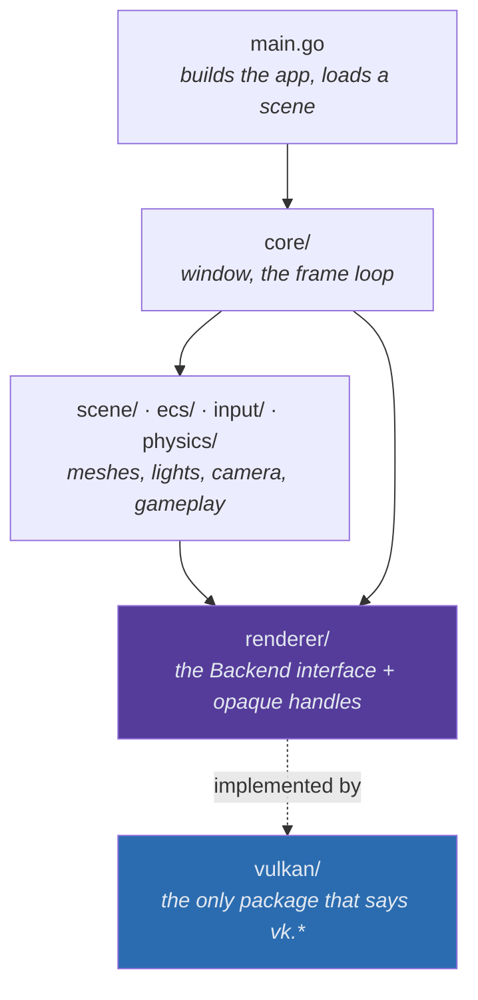
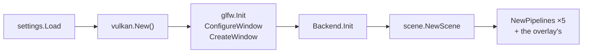
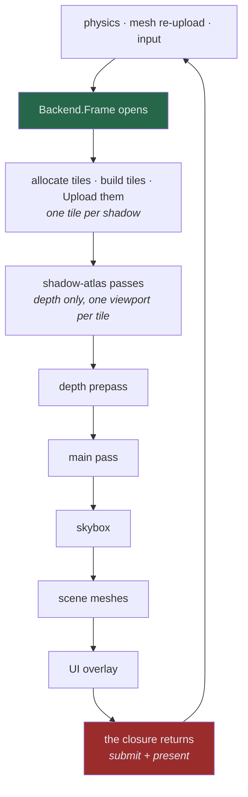
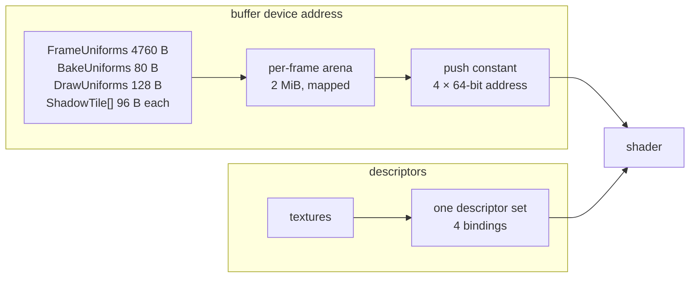
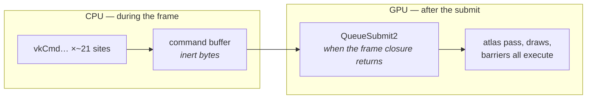

# Overdrive, end to end

The whole engine in one read: what the layers are, what happens in what order,
and how data actually gets from a Go struct into a shader.

> **Scope** the mental model. Enough to know where any given thing lives and why
> it happens when it does.
>
> **Not here** the details. Every section ends with a pointer to the document
> that goes deeper.
>
> **On duplication** the rest of `notes/` deliberately never repeats itself.
> This file is the exception — it is the on-ramp, and it restates things so you
> can read it start to finish. When it disagrees with the others, they win.

---

## 1. The shape of it

Overdrive is a Go game engine rendering on Vulkan 1.3. The layers only ever
depend downwards:



**One rule holds the whole thing together:**

> Nothing above `renderer/` may import a graphics API.

`scene/` owns `renderer.MeshHandle`, `renderer.ImageHandle`,
`renderer.PipelineHandle` — opaque integers that only `vulkan/` knows how to
interpret. That is why those packages build and
are testable
with no GPU, and why the Vulkan object graph stays in one package.

There is exactly one backend. The abstraction is kept for that rule, not for
portability.

→ `ARCHITECTURE.md` for the package-by-package map.

---

## 2. Startup, in order

Order matters here more than anywhere else — each step needs the one before it.



`Backend.Init` is the big one. Inside it, again strictly ordered:

```
instance → surface → physical device → queue family → logical device
  → VMA allocator          (needs the device)
  → swapchain              (needs the surface, and MSAA sample count)
  → command pool
  → per-frame data         (needs the pool AND the allocator)
  → samplers
  → descriptors            (layout, pool, one set)
  → pipeline layout        (needs the descriptor layout)
  → default textures       (needs samplers AND descriptors)
```

Two things to notice:

- **Per-frame data** is one function creating four things — command buffer,
  fence, semaphore, uniform arena — because they share a lifetime, not a
  subsystem. Everything that exists _once per frame in flight_ is built there.
- **Samplers and descriptors are independent.** Neither uses the other. They
  only meet later, when a texture is written into a descriptor (§4).

Then `App.Run` loads five shader sets — `forward`, `depth`, `depth_point`, `ui`,
`skybox` — and `scene.NewScene` parses XML, uploads meshes and textures, and
allocates the one shadow atlas.

→ `ENGINE_FLOW.md` §2.

---

## 3. One frame



Each pass is the same shape: `Frame.Pass(spec, func(p Pass) { p.Draw(...) })`.
The spec says what is attached, what is sampled and what it is called; the
closure is the only place a draw is legal, so a copy or a dispatch inside a
render pass is a compile error.

What the green and red boxes actually do:

|                  |                                                                                                                                                                                         |
| ---------------- | --------------------------------------------------------------------------------------------------------------------------------------------------------------------------------------- |
| **frame open**   | wait on this slot's fence _(the CPU throttle)_ · read back the timestamps this slot wrote two frames ago · acquire a swapchain image · reset the arena and the query pool · flush any staged image uploads · begin the command buffer · bind the one descriptor set |
| **frame close**  | barrier the image to present layout · end the command buffer · **submit** · present · advance the frame slot                                                                            |

Every shadow in the scene is a sub-rect of **one** 4096² depth texture — of two
of them, static and dynamic: a sun or spot takes one tile, a point light six 90°
tiles instead of a cubemap. So the pass count no longer grows with the light
count — one `Frame.Pass` per atlas, then a `Pass.Viewport` per tile.

The image is carved into a **fixed slot layout** at load — so many slots at 2048,
512, 256 and 128 — and those rects never move. Who occupies them is scored
**per frame** from `radius / distance to camera`: lights sort by score and take
the best free slot no larger than the ceiling their score earns. Running out of
slots degrades a light a pool at a time and finally leaves it unshadowed — it
still lights the scene, it just casts nothing. Because the layout is declared in
divisions of the atlas rather than in pixels, changing the atlas size changes how
sharp the shadows are and not how many lights cast them. The atlas is a render
target nothing puts on screen, so it is read out of a RenderDoc capture.

→ `ENGINE_FLOW.md` §3.

---

## 4. How data reaches a shader

Two completely separate paths, and the split is forced rather than chosen.



### Uniforms — by pointer

The blocks are memcpy'd into a mapped per-frame arena by `Frame.Upload`, and
their **GPU addresses** go out as a 32-byte push constant. The shader
dereferences them like C pointers. No descriptors, no dynamic offsets, no
binding.

The backend never looks inside a block. `Upload(data any) Address` takes bytes
and gives back an address; `DrawCall.Push [4]Address` carries four of them
positionally, and which slot means what is declared once in `common.slang` and
filled in `scene/`. That is why the backend can be told to bake a shadow atlas
without containing the word.

They are split by **update frequency**, which is the whole reason it is cheap:

- `FrameUniforms` — camera, lights, atlas handles — published **once per pass**
- `DrawUniforms` — model matrix, material — sent **once per draw**
- `ShadowRecord[]` — one per shadow tile — published **once per frame**

So a draw costs one 128-byte memcpy plus a 24-byte push. Before the split, all
1.3 KB went out on every draw.

The records are a pointer rather than a member of `FrameUniforms` for one
reason: their count is a property of the scene, and a block whose size is fixed
at compile time cannot hold it.

This works because Go packs `float32`/`int32` structs exactly the way Vulkan's
_scalar layout_ does — so both sides agree with no marshalling code. The only
rule left: **keep the field order in `renderer/uniforms.go` and `common.slang`
identical.**

Four things must all be true for BDA, and they fail differently: the device
feature, the VMA allocator flag, the per-buffer usage flag, and scalar layout.
Miss the last one and it compiles, runs, and renders garbage.

### Textures — by descriptor

You cannot take the address of an image. Images are opaque, retiled, possibly
compressed — so they need descriptors, and always will.

One set, four bindings, bound **once per frame**:

| binding | what                                     | how many |
| ------- | ---------------------------------------- | -------- |
| 0       | sampled 2D — bindless                    | 256      |
| 1       | cubemaps — bindless                      | 64       |
| 2       | storage images — bindless                | 64       |
| 3       | "hot" sampled 2D — dedicated             | 4        |

"Bindless" means the shader indexes an array: `textures2D[DRAW.texOurTexture]`.
`Backend.Slot(handle)` translates a handle into a slot index on the CPU and the
caller writes that integer into its own uniform block. **The shader never
receives a descriptor — it receives an int.** Slots are reclaimed when a resource
is destroyed, but only once the frames that could still sample it have retired.

Binding 3 is deliberately _not_ bindless, and deliberately indexed by a literal:
PCF taps the shadow atlases up to 13× per fragment, and some drivers re-fetch a
dynamically-indexed descriptor on every tap. That cost ~1.7× the frame time. An
image asks for one of the four with `ImageSpec.Hot` and names which with
`HotSlot`, so the backend still never learns what they are for. Both are plain
`Sampler2D` — a point
light's six faces are ordinary tiles of the same atlas, not a cubemap. The
second one is Part E's static/dynamic split; today both point at one texture.

### What a descriptor actually holds

For the type used here, one slot is a **triple**:

```
(image view, sampler, image layout)
```

| part           | answers                                 | comes from                                          |
| -------------- | --------------------------------------- | --------------------------------------------------- |
| **image view** | _which_ pixels, read as what type       | view creation — several views can overlay one image |
| **sampler**    | _how_ to filter them                    | sampler creation, referencing no image at all       |
| **layout**     | how the pixels are arranged _when read_ | a **promise**, kept by a barrier elsewhere          |

That last one is the subtle bit. **The layout in a descriptor performs no
transition.** It declares "when a shader reads through this, the image will be
in this layout". A barrier has to make that true.

→ `cheatsheets/VULKAN.md` §7, §10 · `ENGINE_FLOW.md` §4.5.

---

## 5. The Vulkan machinery underneath

### Recording is not executing

This is the mental model that makes everything else click:



Every `vkCmd*` call **records**. Nothing in the frame's command buffer runs
until the frame closure returns and the frame is submitted. The queue is touched
in only three places:

| where             | what                                                      |
| ----------------- | --------------------------------------------------------- |
| frame close       | `QueueSubmit2` — **one submit carries the entire frame**  |
| frame close       | `QueuePresentKHR`                                         |
| `immediateSubmit` | load-time image and buffer uploads, and `ReadBuffer`, which block the CPU until done |

But _host-side_ work is immediate, not deferred: memcpy into mapped memory,
`vkUpdateDescriptorSets`, and lazy pipeline compilation all take effect the
moment they are called. That distinction is why the fence throttle exists — it
protects the _memory the commands point at_, not the commands.

The submit also does not wait for everything at once. Its semaphore wait is
scoped to `ColorAttachmentOutput`, so the shadow-atlas pass can start immediately
while only the swapchain colour writes wait for the image to arrive.

### Barriers

Nine of the ~21 recording sites are barriers — the work OpenGL did invisibly.
One `vkCmdPipelineBarrier2` does **three jobs at once**:

1. **ordering** — these stages finish before those stages start
2. **cache flushing** — make writes _available_ (out of the writer's cache),
   then _visible_ (into the reader's)
3. **layout transition** — the physical re-tiling

Jobs 2 and 3 happen _because_ you expressed job 1. Right layouts with sloppy
stage masks still renders garbage.

> "The write finished" and "the reader can see it" are different claims.

The `2` suffix is **synchronization2** — a redesign of the same concepts giving
64-bit stage masks and per-barrier stage scoping. `QueueSubmit2` is its submit
counterpart; the engine uses the pair consistently.

### Frames in flight

Two of everything the CPU and GPU both touch: command buffer, fence, acquire
semaphore, uniform arena. While the GPU renders frame N, the CPU records N+1.

Two index spaces that are **not** interchangeable:

- `frameIndex` cycles 0..1 — selects command buffer, fence, arena
- `imageIndex` comes back from acquire — selects the swapchain image and its
  render semaphore

Present waits on the _image's_ semaphore; the submit waits on the _frame's_.
Mixing them is a subtle race.

→ `cheatsheets/VULKAN.md` §8 · `ENGINE_FLOW.md` §4.11, §7.

---

## 6. Things that would silently break the image

Not crashes — wrong pictures. Each is a convention that must hold everywhere.

| convention                                                                   | why                                                                                                                                                         |
| ---------------------------------------------------------------------------- | ----------------------------------------------------------------------------------------------------------------------------------------------------------- |
| Main pass uses a **negative-height viewport**                                | Vulkan's clip space is y-down; the projections in `scene/` assume y-up. Flipping the viewport also flips winding, which is why CCW front faces stay correct |
| The shadow pass uses a **positive** viewport and declares **CW** front faces | an atlas is sampled, not presented, so it wants the other memory layout — and pays for it in winding                                                        |
| Every vertex stage calls `TO_VK_DEPTH`                                       | the projections give clip z in `[-w, w]`; Vulkan clips to `[0, w]`                                                                                          |
| Uniform **field order** matches between Go and Slang                         | scalar layout means no marshalling — and no protection if the order drifts                                                                                  |
| Offscreen targets stay single-sampled                                        | a later pass samples them, and these shaders cannot read a multisampled texture                                                                             |

The first three are all leftovers of the OpenGL era, and all four workarounds
disappear together if the projections are rebuilt Vulkan-native — which is the
next planned change.

→ `ENGINE_FLOW.md` §5, and §6 for a symptom→file table.

---

## 7. Where to go next

| you want                                               | read                           |
| ------------------------------------------------------ | ------------------------------ |
| how a frame is drawn, method by method                 | `ENGINE_FLOW.md` — start at §0 |
| where a symbol lives                                   | `ARCHITECTURE.md` §5           |
| whether a feature exists, and why it is built that way | `FEATURES.md`                  |
| Vulkan concepts, engine-independent                    | `cheatsheets/VULKAN.md`        |
| the theory behind the shading                          | `cheatsheets/PBR.md`           |
| what is planned, in order                              | `tmp/INTERFACE_PLAN.md` §6, then `tmp/BACKEND_DECISION.md` §9 |
| the next small task                                    | `TODO.md`                      |
