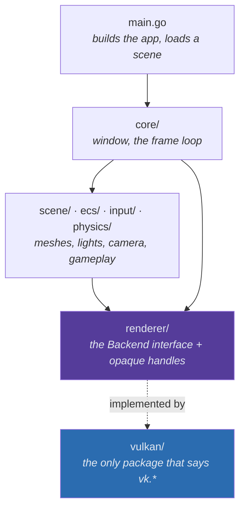
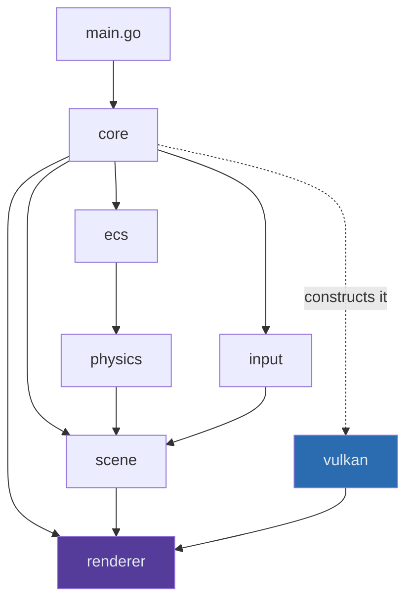
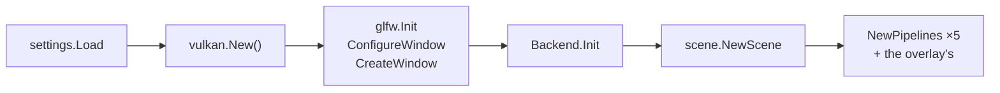
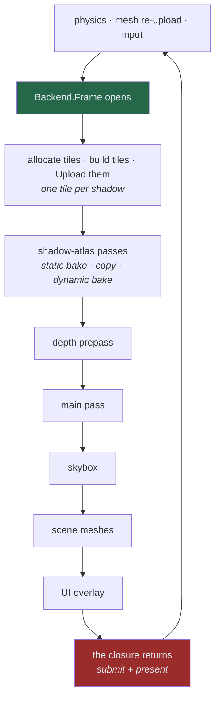

# Overview — the engine in one read

> **Scope** the layers, where the code lives, startup, one frame, the conventions that silently break the image, and where to look when something is wrong.
>
> **Not here** the backend contract and how data reaches a shader → `RENDERER.md`. Fences, semaphores and barriers → `SYNCHRONIZATION.md`. What each feature does and why → `FEATURES.md`.

---

## 1. Layers

Overdrive is a Go engine rendering on Vulkan 1.3. Layers only depend downwards:


```mermaid
graph TD
    M["main.go<br/><i>builds the app, loads a scene</i>"] --> C["core/<br/><i>window, the frame loop</i>"]
    C --> S["scene/ · ecs/ · input/ · physics/<br/><i>meshes, lights, camera, gameplay</i>"]
    S --> R["renderer/<br/><i>the Backend interface + opaque handles</i>"]
    C --> R
    R -.->|"implemented by"| V["vulkan/<br/><i>the only package that says vk.*</i>"]

    style R fill:#553c9a,color:#e2e8f0
    style V fill:#2b6cb0,color:#e2e8f0
```

**Nothing above `renderer/` imports a graphics API.** Packages above it hold opaque handles (`renderer.MeshHandle`, `ImageHandle`, …) that only `vulkan/` interprets, so they build without a GPU. There is one backend; the abstraction is kept for this rule, not for portability.

Package dependencies in detail:


```mermaid
graph TD
    M[main.go] --> C[core]
    C --> S[scene]
    C --> E[ecs]
    C --> I[input]
    C --> R[renderer]
    S --> R
    E --> P[physics]
    P --> S
    I --> S
    C -.->|constructs it| VK[vulkan]
    VK --> R

    style R fill:#553c9a,color:#e2e8f0
    style VK fill:#2b6cb0,color:#e2e8f0
```

The dotted edge is the only place `vulkan` is named above `renderer/`: `core.NewApp` calls `vulkan.New()` and holds the result as a `renderer.Backend`.

## 2. Code map

The Go module root is `src/`. Runtime files are resolved by `paths` against the project root (the directory holding `assets/` and `src/`), so no package holds a relative path literal.

```
overdrive/
├── CLAUDE.md, README.md
├── notes/                 this documentation
├── configs/               vulkan.toml (default), low.toml (low tier)
├── assets/                scene XML, meshes/ (OBJ+MTL), textures/
├── xml_export.py          the Blender add-on that writes the scene XML
└── src/
    ├── main.go            builds an App, loads a Scene, builds an ECS World
    ├── build_shaders.sh   Slang → SPIR-V, run before the first build and after every shader edit
    ├── paths/             the one place a runtime path is spelled out
    ├── core/              app.go (window, frame loop), targets.go (screen depth + MSAA images),
    │                      ui.go (overlay), screenshot.go (-screenshot)
    ├── renderer/          backend.go (interfaces), handles.go, spec.go, uniforms.go (uniform blocks + size guard)
    ├── vulkan/            the backend, one file per concept (table below)
    ├── scene/             scene.go, mesh.go, material.go, light.go, camera.go, skybox.go, image.go,
    │                      pipelines.go (every pipeline), shadowatlas.go (allocation + bakes)
    ├── ecs/ physics/      entities, Verlet integration, sphere and plane colliders
    ├── input/             GLFW callbacks: WASD, mouse look, scroll FOV, resize
    ├── settings/ utils/   the TOML loader and its globals; vector parsing, error handling
    └── shaders/           slang/ (source of truth), vk/ (generated SPIR-V, git-ignored)
```

| `vulkan/` file | What is in it |
| --- | --- |
| `backend.go` | the struct, `Init`, `Shutdown`, `Capacities`, instance and device setup, default images |
| `frame.go` | `Frame`/`Pass`/`Compute`, the upload arena, copies, clears, capture labels |
| `barrier.go` | the `use` enum and the one table that turns a use change into a barrier |
| `slots.go` | the descriptor set, `Slot`, `Destroy`, the retire queue |
| `pipeline.go` | `CreatePipeline`, `ReloadPipelines`, the shader-module cache |
| `image.go`, `buffer.go` | images, views, uploads; buffers, meshes, readback |
| `convert.go`, `data.go` | engine enums → Vulkan, `CreateSampler`; byte views of uploaded values |
| `swapchain.go` | the swapchain, its views, the sample-count pick |

| Shader | Used for |
| --- | --- |
| `common.slang` | included by all: the uniform structs, the push constant, the descriptor arrays |
| `forward` | the main pass: Cook-Torrance PBR, normal mapping, shadow lookup, skybox ambient, tonemap |
| `prepass` | depth only, same position maths as `forward` |
| `depth` / `depth_point` | a sun or spot tile (projected depth) / a point-light face (radial distance) |
| `skybox`, `ui` | the cube at the far plane; the overlay quad |

## 3. Startup


```mermaid
graph LR
    A["settings.Load"] --> B["vulkan.New()"]
    B --> C["glfw.Init<br/>ConfigureWindow<br/>CreateWindow"]
    C --> D["Backend.Init"]
    D --> F["scene.NewScene"]
    F --> E["NewPipelines ×5<br/>+ the overlay's"]
```

`Backend.Init` is strictly ordered, each step needing the one before:

```
instance → surface → physical device → queue family → logical device
  → VMA allocator          (needs the device)
  → swapchain              (needs the surface, and MSAA sample count)
  → command pool
  → per-frame data         (needs the pool AND the allocator)
  → samplers
  → descriptors            (layout, pool, one set)
  → pipeline layout        (needs the descriptor layout)
  → default textures       (needs samplers AND descriptors)
```

- **Per-frame data** is one function creating command buffer, fence, semaphore and uniform arena, because they share a lifetime.
- **`scene.NewScene`** parses the XML, uploads meshes and textures, creates the two shadow atlases and the skybox, and calls `Slot` on each so its descriptor is written once.

## 4. One frame


```mermaid
graph TD
    P["physics · mesh re-upload · input"] --> BF["Backend.Frame opens"]
    BF --> AL["allocate tiles · build tiles · Upload them<br/><i>one tile per shadow</i>"]
    AL --> S1["shadow-atlas passes<br/><i>static bake · copy · dynamic bake</i>"]
    S1 --> DP["depth prepass"]
    DP --> MP["main pass"]
    MP --> SK["skybox"] --> SC["scene meshes"] --> UI["UI overlay"]
    UI --> EF["the closure returns<br/><i>submit + present</i>"]
    EF --> P

    style BF fill:#276749,color:#e2e8f0
    style EF fill:#9b2c2c,color:#e2e8f0
```

Every pass is opened in `core/app.go`, in order:

```
world.Update                      physics and ECS, fixed 1/60 step
s.UpdateMeshes                    re-upload the vertices a move dirtied
input                             camera, unless [debug] lockCamera

Backend.Frame(func(f) {
    s.UpdateShadows               allocate tiles, decide the bake queues, build the records
    s.FillFrameUniforms           camera, lights, skybox slot
    f.Upload(&frameUniforms)      once — the prepass and the forward pass share the address
    f.Upload(shadowTiles)         once — a variable-length array, so it is a pointer

    f.Pass("shadowStatic", …) {   only when s.HasStaticBakes: it clears the atlas
        s.RenderStaticBakes
    }
    s.InitDynamicTiles            a Copy per dirty dynamic tile, from the static atlas
    f.Pass("shadowDynamic", …) {  only when s.HasDynamicBakes: loads, draws over the copies
        s.RenderDynamicBakes
    }
    f.Pass("depthPrepass", …) {   depth only, no colour attachment
        s.RenderDepth
    }
    f.Pass("main", …) {           the only pass that clears colour
        s.RenderSkybox            its own uploaded block, view translation stripped
        s.RenderScene             EQUAL against the depth the prepass left
        overlay.draw              a fullscreen quad over the finished scene
    }
})
```

|                 |                                                                                                                                              |
| --------------- | -------------------------------------------------------------------------------------------------------------------------------------------- |
| **frame open**  | wait on this slot's fence · acquire a swapchain image · reset the arena · flush staged image uploads · begin the command buffer · bind the descriptor set |
| **frame close** | transition the swapchain image to present · end the command buffer · **submit** · present · advance the frame slot                          |

- **The order is a data dependency.** `UpdateShadows` sets each light's `ShadowIndex`, which `FillFrameUniforms` copies; the main pass declares both atlases in `PassSpec.Reads`, which transitions them out of the bake's layout.
- **A settled scene runs neither bake pass.** The `bakes:` counter beside the FPS shows it; non-zero after settling means the static/dynamic split broke.
- **Nothing runs while recording.** Every call inside the closure writes commands down; the GPU runs them after the submit (`SYNCHRONIZATION.md` §1).

## 5. Conventions that silently break the image

| Convention | Why |
| --- | --- |
| Screen passes set `PassSpec.FlipY`: a **negative-height viewport**, pipelines `WindingCounterClockwise` | Vulkan clip space is y-down; the projections in `scene/` assume y-up. Flipping the viewport also flips winding |
| Atlas passes leave `FlipY` false, pipelines `WindingClockwise` | an atlas is sampled, not presented; the price is inverted winding |
| Every vertex stage calls `TO_VK_DEPTH` | projections are OpenGL style, clip z in `[-w, w]`; Vulkan clips to `[0, w]` |
| Uniform **field order** matches between `renderer/uniforms.go` and `common.slang` | scalar layout means no marshalling and no protection; the `init()` size guard misses a swap |
| `prepass.slang` builds position exactly like `forward.slang`'s `vsMain` | the main pass tests `EQUAL`, a last-bit difference shows as speckle |
| Clears and viewports only inside `Frame.Pass` (or `Pass.Viewport` within it) | a free-floating clear has no pass to belong to |
| Offscreen images stay single-sampled | a later pass samples them, and a multisampled texture cannot be filtered |
| `cubeFaceDirs` (`scene/shadowatlas.go`) and `cubeFace()` (`forward.slang`) agree | a point shadow lands on the wrong face otherwise |

The first three are OpenGL leftovers; building the projections Vulkan-native removes all of them (`TODO.md`).

## 6. When something is wrong

| Symptom | Look at |
| --- | --- |
| Nothing starts | `./build_shaders.sh`: the generated SPIR-V is git-ignored |
| Mirrored, or culled inside-out | `PassSpec.FlipY` at the pass, `PipelineSpec.FrontFace` at the pipeline |
| Garbage after editing `common.slang` | `spirv-dis shaders/vk/forward.frag.spv \| grep OpMemberDecorate` against the Go struct, in order |
| `spirv-val` rejects every module | missing `--scalar-block-layout` |
| Validation complains about layouts | `vulkan/barrier.go`, then the spec that forgot a resource: `PassSpec.Reads`, `ComputeSpec.Reads`/`Writes` |
| Pipeline creation fails after a pass change | sample count or attachment formats disagree with the pass |
| Shadows missing on one light | `shadowAtlas.allocate`: score under the last tier or every pool full, so `ShadowIndex = -1` |
| A shadow pops coarse/sharp as the camera moves | `nextTierThreshold`, the 20% band against tier flicker |
| Two shadows flicker against each other | `slotStickiness`: they trade a contended pool's last slot |
| Scene near black, bright with `[debug] noShadows` | a single-sided plane shadowing itself: `<castsShadow>false</castsShadow>` |
| A lit disc under a round object | peter-panning: the depth pipelines must keep `CullBack` |
| Shadows from the wrong light, or a crack at a cube-face edge | `tileSample`'s one-texel clamp and `cubeFaceFov`'s `+2 texel` widening |
| UI overlay lags a frame | expected: `UpdateImage` inside a pass is staged for the next frame |

Debug tools: `[debug] validation = true` with the `VK_LAYER_SETTINGS_PATH` file from `CLAUDE.md` (the engine registers no messenger, so the layer is silent without it); `go run . -screenshot out.png` for a PNG of frame 90; RenderDoc with `lockCamera = true` for the atlases and per-pass state.

## 7. Where to go next

| You want | Read |
| --- | --- |
| the backend contract, uniforms, descriptors, the backbuffer | `RENDERER.md` |
| fences, semaphores, barriers, frames in flight | `SYNCHRONIZATION.md` |
| what a feature does and why it is built that way | `FEATURES.md` |
| what is next | `TODO.md` |
| engine-independent theory | `cheatsheets/` (`GLOSSARY.md` for one-line definitions) |
