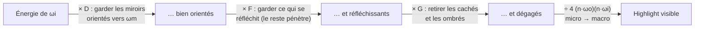

# PBR — Les bases essentielles

> Cheat-sheet de révision pour l'entretien R&D rendu temps réel.
> Source principale : **Physically Based Rendering, 4ᵉ éd.** (Pharr, Jakob, Humphreys) — [pbr-book.org/4ed](https://www.pbr-book.org/4ed/). Les figures sont tirées du livre (chapitre 9, *Reflection Models*).
>
> **Convention de lecture** : PBRT est un moteur *offline* rigoureux. Là où le temps réel (UE4, Frostbite, LearnOpenGL) prend des raccourcis, c'est signalé par le tag **⚡ temps réel**. Maîtriser les deux = exactement ce qui montre que tu comprends *pourquoi* les approximations existent.

---

## Table des matières

1. [Fondations radiométriques](#1-fondations-radiométriques)
2. [La BRDF](#2-la-brdf)
3. [L'équation de réflexion](#3-léquation-de-réflexion)
4. [Réflexion diffuse (Lambert)](#4-réflexion-diffuse-lambert)
5. [Fresnel](#5-fresnel)
6. [Théorie microfacette](#6-théorie-microfacette)
7. [La BRDF spéculaire complète (Cook-Torrance)](#7-la-brdf-spéculaire-complète-cook-torrance)
8. [Le workflow metallic-roughness](#8-le-workflow-metallic-roughness)
9. [Image-Based Lighting & split-sum](#9-image-based-lighting--split-sum)
10. [Importance sampling](#10-importance-sampling)
11. [Récap formules](#11-récap-formules)
12. [Pour l'entretien](#12-pour-lentretien)

---

## 1. Fondations radiométriques

Avant les BRDF, il faut les grandeurs physiques. Tout le PBR repose sur la **radiance**.

### Angle solide

L'analogue 2D de l'angle, mesuré en stéradians (sr). Un hémisphère couvre $2\pi$ sr, une sphère $4\pi$ sr. En coordonnées sphériques :

$$d\omega = \sin\theta \, d\theta \, d\phi$$

### Les quatre grandeurs

| Grandeur | Symbole | Unité | Définition |
|---|---|---|---|
| Flux (puissance) | $\Phi$ | W | Énergie par unité de temps |
| Irradiance | $E$ | W/m² | Flux reçu par unité de surface |
| Intensité | $I$ | W/sr | Flux par unité d'angle solide |
| **Radiance** | $L$ | W/(m²·sr) | Flux par unité de surface projetée **et** d'angle solide |

### Radiance — la grandeur reine

$$L = \frac{d^2\Phi}{dA \, \cos\theta \, d\omega}$$

Pourquoi c'est la grandeur centrale :
- **Elle est constante le long d'un rayon dans le vide.** C'est ce qui rend le ray tracing possible : `L` à la caméra = `L` au point touché.
- C'est ce que mesure un capteur (œil, photosite).
- Le $\cos\theta$ au dénominateur tient compte de la **surface projetée** (foreshortening).

### Irradiance et loi du cosinus de Lambert

L'irradiance reçue en un point, c'est l'intégrale de la radiance incidente sur l'hémisphère, pondérée par le cosinus :

$$E = \int_{\mathcal{H}^2} L_i(\omega) \, \cos\theta \, d\omega$$

Le facteur $\cos\theta$ (loi de Lambert) vient du fait qu'un faisceau qui arrive en biais étale son énergie sur une plus grande surface. **Ce cosinus revient partout** — retiens-le, c'est l'origine du `NdotL`.

---

## 2. La BRDF

La **Bidirectional Reflectance Distribution Function** décrit comment la lumière est réfléchie en un point, pour un couple (direction entrante, direction sortante).

### Le repère de shading

Tous les calculs se font dans un repère local où la normale $\mathbf{n}$ est l'axe $z$, et les tangentes $\mathbf{s}, \mathbf{t}$ sont $x, y$.


*Figure 9.2 (PBRT) — Le repère de shading $(\mathbf{s}, \mathbf{t}, \mathbf{n})$ aligné sur $(x, y, z)$. Toutes les directions $\omega$ sont transformées dans ce repère avant l'appel des BxDF.*

Conséquence pratique : $\cos\theta = \mathbf{n} \cdot \omega = \omega_z$. C'est juste la composante $z$ du vecteur. D'où l'optimisation classique en shader : pas besoin de produit scalaire, on lit `.z`.

**⚠️ Convention PBRT** : $\omega_o$ et $\omega_i$ pointent **tous les deux vers l'extérieur** de la surface (ils ne suivent pas la propagation physique de la lumière). Utile pour les algos bidirectionnels.

### Définition formelle

$$f(\omega_o, \omega_i) = \frac{dL_o(\omega_o)}{dE(\omega_i)} = \frac{dL_o(\omega_o)}{L_i(\omega_i) \, \cos\theta_i \, d\omega_i}$$

En clair : « combien de radiance sort dans $\omega_o$ par unité d'irradiance arrivant de $\omega_i$ ». Unité : sr⁻¹.

### Les trois propriétés d'une BRDF physiquement plausible

1. **Positivité** : $f(\omega_o, \omega_i) \geq 0$.

2. **Réciprocité de Helmholtz** : $f(\omega_o, \omega_i) = f(\omega_i, \omega_o)$. On peut échanger source et caméra. *(Indispensable pour les algos bidirectionnels — une BRDF non réciproque casse le path tracing inversé.)*

3. **Conservation de l'énergie** : une surface ne réfléchit jamais plus d'énergie qu'elle n'en reçoit.

$$\int_{\mathcal{H}^2} f(\omega_o, \omega_i) \, \cos\theta_i \, d\omega_i \leq 1 \quad \forall \, \omega_o$$

> **Question piège classique** : « pourquoi une BRDF diffuse vaut $\rho/\pi$ et pas $\rho$ ? » → c'est précisément cette contrainte de conservation. Voir §4.

---

## 3. L'équation de réflexion

Le cœur de tout. La radiance sortante dans une direction = intégrale de toute la lumière incidente, filtrée par la BRDF et pondérée par le cosinus :

$$L_o(\omega_o) = \int_{\mathcal{H}^2} f(\omega_o, \omega_i) \, L_i(\omega_i) \, |\cos\theta_i| \, d\omega_i$$

C'est la brique de **l'équation du rendu** (Kajiya 1986). L'équation du rendu complète ajoute juste un terme d'émission $L_e$ et rend $L_i$ récursif (la lumière incidente vient elle-même d'autres surfaces) :

$$L_o(\omega_o) = L_e(\omega_o) + \int_{\mathcal{H}^2} f(\omega_o, \omega_i) \, L_i(\omega_i) \, |\cos\theta_i| \, d\omega_i$$

Tout le rendu — raster, ray tracing, path tracing — n'est qu'une façon différente d'**approximer cette intégrale**.

---

## 4. Réflexion diffuse (Lambert)

Le modèle le plus simple : la lumière est réfléchie **uniformément** dans toutes les directions de l'hémisphère. La BRDF est donc une constante.

$$f_\text{diff} = \frac{\rho}{\pi}$$

où $\rho$ (albédo) ∈ [0, 1] est la fraction de lumière réfléchie.

### D'où vient le $\pi$ ?

On impose la conservation d'énergie. Si $f = k$ (constante), alors :

$$\int_{\mathcal{H}^2} k \, \cos\theta_i \, d\omega_i = k \int_0^{2\pi}\!\!\int_0^{\pi/2} \cos\theta \sin\theta \, d\theta \, d\phi = k \cdot \pi$$

Pour que la surface réfléchisse exactement la fraction $\rho$ de l'énergie, il faut $k\pi = \rho$, donc $k = \rho/\pi$. **Le $\pi$ vient de l'intégrale du cosinus sur l'hémisphère.**

> ⚡ **temps réel** : c'est pour ça qu'en shading direct on écrit souvent `diffuse = albedo * NdotL` sans le $\pi$ — il est absorbé dans l'intensité de la lumière par convention. À connaître pour ne pas se faire avoir sur un facteur $\pi$.

---

## 5. Fresnel

Les équations de **Fresnel** donnent la fraction de lumière réfléchie (vs réfractée/absorbée) à une interface, en fonction de l'angle d'incidence. **Toute surface devient un miroir parfait à incidence rasante** — c'est l'effet Fresnel, visible sur l'eau d'un lac vue de loin.

### Les équations exactes (diélectriques)

Pour une interface entre indices $\eta_i$ et $\eta_t$, la réflectance dépend de la polarisation (parallèle $r_\parallel$ et perpendiculaire $r_\perp$) :

$$r_\parallel = \frac{\eta_t \cos\theta_i - \eta_i \cos\theta_t}{\eta_t \cos\theta_i + \eta_i \cos\theta_t}, \qquad r_\perp = \frac{\eta_i \cos\theta_i - \eta_t \cos\theta_t}{\eta_i \cos\theta_i + \eta_t \cos\theta_t}$$

Pour de la lumière non polarisée (cas usuel en graphics) :

$$F_r = \frac{1}{2}\left(r_\parallel^2 + r_\perp^2\right)$$

Les angles sont liés par la **loi de Snell** : $\eta_i \sin\theta_i = \eta_t \sin\theta_t$.

### ⚡ L'approximation de Schlick (1993) — celle que tu utiliseras

Évaluer Fresnel exactement à chaque pixel est cher. Schlick approxime ça avec une simple puissance 5 :

$$F(\theta) = F_0 + (1 - F_0)(1 - \cos\theta)^5$$

où $F_0$ est la réflectance à incidence normale ($\theta = 0$). C'est **la** formule à connaître par cœur. Implémentation PBRT (chapitre 9) :

```cpp
SampledSpectrum SchlickFresnel(Float cosTheta) {
    auto pow5 = [](Float v) { return (v * v) * (v * v) * v; };
    return F0 + pow5(1 - cosTheta) * (SampledSpectrum(1.f) - F0);
}
```

> **Détail qui compte** : dans un modèle microfacette, l'angle de Fresnel est celui entre $\omega_o$ et la **micronormale** $\omega_m$ (le half-vector), **pas** la macronormale $\mathbf{n}$. Erreur fréquente.

### $F_0$ et l'insight métallique

$F_0$ encode la nature du matériau. C'est ici que se joue la distinction **conducteur (métal) vs diélectrique (non-métal)** :

| Matériau | $F_0$ | Diffus ? |
|---|---|---|
| Eau | 0.02 | oui |
| Plastique / verre | **0.04** (défaut diélectrique) | oui |
| Diamant | 0.17 | oui |
| Fer | (0.56, 0.57, 0.58) | **non** |
| Or | (1.00, 0.71, 0.29) | **non** |
| Cuivre | (0.95, 0.64, 0.54) | **non** |
| Aluminium | (0.91, 0.92, 0.92) | **non** |

Les deux faits fondamentaux du PBR moderne :

- **Diélectriques** : $F_0 ≈ 0.04$ achromatique (gris), **+ une composante diffuse** colorée. La lumière non réfléchie pénètre, rebondit, et ressort diffuse.
- **Métaux** : $F_0$ **coloré** (c'est leur couleur de réflexion), et **aucun diffus** — toute la lumière réfractée est immédiatement absorbée par le nuage d'électrons libres.

C'est exactement ce que le workflow metallic-roughness exploite (§8).

---

## 6. Théorie microfacette

Les surfaces réelles sont rugueuses à l'échelle microscopique. Plutôt que de modéliser géométriquement chaque aspérité (impossible à stocker/ray-tracer), on les traite **statistiquement** : la surface est un nuage de micro-miroirs (microfacettes), et seule leur distribution agrégée compte.


*Figure 9.20 (PBRT) — (a) Plus la variation des micronormales $\omega_m$ est grande, plus la surface est rugueuse. (b) Une surface lisse a peu de variation.*

Trois effets géométriques entrent en jeu :


*Figure 9.21 (PBRT) — (a) **Masking** : la microfacette est cachée du viewer. (b) **Shadowing** : la lumière n'atteint pas la microfacette. (c) **Interreflection** : la lumière rebondit entre microfacettes. Les BSDF usuels modélisent masking + shadowing et **ignorent** l'interréflexion (d'où une perte d'énergie aux fortes rugosités).*

Une BRDF microfacette se construit avec **trois termes** : la distribution $D$, le masking-shadowing $G$, et le Fresnel $F$.

### L'intuition d'ensemble (à avoir en tête *avant* les formules)

Imagine la surface comme une **foule de micro-miroirs** orientés aléatoirement. Tu envoies un pinceau de lumière depuis $\omega_i$ et tu regardes depuis $\omega_o$. Trois questions, et trois seulement, décident combien d'énergie te revient :

| Terme | Question | Ce qu'il contrôle |
|---|---|---|
| **$D$** | Combien de micro-miroirs sont inclinés **pile poil** pour renvoyer $\omega_i$ vers $\omega_o$ ? | la **forme et la taille** du highlight |
| **$F$** | Ces miroirs-là, quelle **fraction** de la lumière réfléchissent-ils vraiment (le reste pénètre) ? | l'**intensité** et la **teinte**, le bord brillant |
| **$G$** | Parmi ces miroirs bien orientés, combien sont réellement **dégagés** (ni cachés du viewer, ni à l'ombre) ? | l'**énergie** aux angles rasants |

Pour qu'un photon contribue, il faut les **trois à la fois** : être réfléchi par un miroir *bien orienté* **ET** que ce miroir *réfléchisse* **ET** qu'il soit *dégagé*. D'où une **multiplication** des trois (§7). Garde cette histoire — chaque sous-section ci-dessous ne fait que la rendre quantitative.

### 6.1 — La distribution des normales : $D$ (GGX / Trowbridge-Reitz)

$D(\omega_m)$ donne la densité de microfacettes orientées selon $\omega_m$. C'est ce qui contrôle la **forme du highlight spéculaire**. Le modèle dominant est **GGX** (= Trowbridge-Reitz 1975, rebaptisé par Walter et al. 2007).

> **Intuition** : seuls les micro-miroirs dont la normale vaut *exactement* la micronormale $\omega_m$ (le half-vector entre $\omega_i$ et $\omega_o$) peuvent renvoyer la lumière vers l'œil. $D$ compte leur densité. Surface **lisse** → presque toutes les normales sont serrées autour de $\mathbf{n}$ → highlight petit et **intense** (le pic de $D$ est haut et étroit). Surface **rugueuse** → les normales sont éparpillées → la même énergie est **étalée** sur un grand halo terne (pic bas et large). C'est une **densité de probabilité** (sr⁻¹), pas une fraction : sa valeur peut largement dépasser 1, seule son intégrale (pondérée par $\cos$) vaut 1.

**⚡ Forme isotrope (celle que tu implémenteras en temps réel)** :

$$D(\omega_m) = \frac{\alpha^2}{\pi \left( (\mathbf{n} \cdot \omega_m)^2 (\alpha^2 - 1) + 1 \right)^2}$$

**Forme anisotrope générale (PBRT éq. 9.16)**, avec $\alpha_x \neq \alpha_y$ pour du métal brossé :

$$D(\omega_m) = \frac{1}{\pi \, \alpha_x \alpha_y \cos^4\theta_m \left( 1 + \tan^2\theta_m \left( \frac{\cos^2\phi_m}{\alpha_x^2} + \frac{\sin^2\phi_m}{\alpha_y^2} \right) \right)^2}$$

La signature de GGX : ses **longues queues** (long tails). La densité décroît lentement vers les angles rasants → highlights avec un cœur brillant et un halo doux étendu, ce qui colle au réel. Comparaison avec Beckmann :


*Figure 9.23 (PBRT) — Beckmann-Spizzichino vs Trowbridge-Reitz pour $\alpha = 0.5$. GGX (Trowbridge-Reitz) a des queues bien plus hautes aux grands $\theta$.*

**Condition de normalisation** (ce qui rend $D$ physiquement valide — la projection des microfacettes doit couvrir exactement la macrosurface) :

$$\int_{\mathcal{H}^2} D(\omega_m) \cos\theta_m \, d\omega_m = 1$$


*Figure 9.22 (PBRT) — La surface projetée des microfacettes au-dessus de $dA$ doit égaler $dA$.*

**⚠️ Rugosité → $\alpha$ : attention aux conventions.**
- **⚡ Disney / UE4 (standard temps réel)** : $\alpha = \text{roughness}^2$ (roughness perceptuel au carré — donne une variation plus linéaire à l'œil).
- **PBRT-v4** : `RoughnessToAlpha` renvoie $\alpha = \sqrt{\text{roughness}}$.

Ce ne sont **pas** les mêmes. Sache laquelle ton moteur utilise.

### 6.2 — Le masking-shadowing : $G$ (Smith)

$G$ corrige l'énergie : depuis une direction donnée, seules certaines microfacettes sont visibles (les autres sont masquées). Sans $G$, on aurait des gains d'énergie non physiques aux angles rasants.

> **Intuition** : les micro-miroirs vivent dans des creux. Un miroir bien orienté ne sert à rien s'il est **caché du viewer** (masking, côté $\omega_o$) ou **dans l'ombre d'une bosse voisine** (shadowing, côté $\omega_i$). $G \in [0,1]$ est la fraction qui survit aux deux. L'effet est négligeable de face ($G \approx 1$) et mord aux **angles rasants**, là où les creux se cachent mutuellement. C'est précisément là que $D$ seul exploserait (le $\frac{1}{4(\mathbf{n}\cdot\omega_o)(\mathbf{n}\cdot\omega_i)}$ de Cook-Torrance tend vers l'infini quand un cosinus → 0) : $G$ ramène ça à zéro et **empêche le highlight de déborder l'énergie reçue**. Le raffinement *height-correlated* (Heitz 2014) reconnaît qu'un miroir caché du viewer est souvent *aussi* celui qui est à l'ombre (les deux événements sont corrélés) ; le produit naïf $G_1(\omega_o)\,G_1(\omega_i)$ les traite comme indépendants et **assombrit deux fois trop**.


*Figure 9.24 (PBRT) — La surface projetée des microfacettes visibles doit égaler $dA \cos\theta$. La fonction de masking $G_1$ donne la fraction visible.*

**L'approximation de Smith** suppose que hauteur et normale des points sont statistiquement indépendantes. On exprime $G_1$ via une fonction auxiliaire $\Lambda$ :

$$G_1(\omega) = \frac{1}{1 + \Lambda(\omega)}$$

Pour GGX, $\Lambda$ a une solution analytique (PBRT éq. 9.20) :

$$\Lambda(\omega) = \frac{\sqrt{1 + \alpha^2 \tan^2\theta} \; - \; 1}{2}$$

Il y a ensuite **deux façons** de combiner masking ($\omega_o$) et shadowing ($\omega_i$) :

**Smith séparable** (le plus simple, $G = G_1(\omega_o) \, G_1(\omega_i)$) :

$$G(\omega_o, \omega_i) = \frac{1}{1 + \Lambda(\omega_o)} \cdot \frac{1}{1 + \Lambda(\omega_i)}$$

**Smith height-correlated** (plus correct — tient compte de la corrélation des hauteurs ; c'est ce qu'utilisent PBRT-v4 et les moteurs modernes type Frostbite) :

$$G(\omega_o, \omega_i) = \frac{1}{1 + \Lambda(\omega_o) + \Lambda(\omega_i)}$$

> **Bon point d'entretien** : savoir que le height-correlated Smith (Heitz 2014) a remplacé le séparable dans les moteurs AAA, et pouvoir expliquer *pourquoi* (corrélation entre qui masque et qui ombre) montre que tu suis l'état de l'art, pas juste le tuto LearnOpenGL.

> ⚡ **Variante temps réel** : UE4 utilise souvent l'approximation **Schlick-GGX** avec un remapping $k$ de $\alpha$ : $G_1(\omega) = \frac{\mathbf{n}\cdot\omega}{(\mathbf{n}\cdot\omega)(1-k)+k}$, avec $k = \alpha/2$ (IBL) ou $k = (\text{roughness}+1)^2/8$ (lumière directe). C'est une approx de la formule de Smith ci-dessus.

---

## 7. La BRDF spéculaire complète (Cook-Torrance)

On assemble les trois termes. C'est la **BRDF de Torrance-Sparrow / Cook-Torrance** (PBRT éq. 9.33) :

$$f_\text{spec}(\omega_o, \omega_i) = \frac{D(\omega_m) \, F(\omega_o, \omega_m) \, G(\omega_o, \omega_i)}{4 \, |\mathbf{n} \cdot \omega_o| \, |\mathbf{n} \cdot \omega_i|}$$

où la **micronormale** (half-vector) est :

$$\omega_m = \frac{\omega_o + \omega_i}{\lVert \omega_o + \omega_i \rVert}$$

### Décomposition intuitive

Reprends l'histoire de la foule de micro-miroirs (§6). Le numérateur $D \cdot F \cdot G$ est une **chaîne de filtres** appliquée à l'énergie incidente : chaque terme retire ce qui ne contribue pas.



- **$D$ — la forme.** Combien de microfacettes sont orientées pile pour réfléchir $\omega_i$ vers $\omega_o$. Fixe la **taille** du spot : petit et vif si lisse, large et terne si rugueux.
- **$F$ — l'intensité et la teinte.** Quelle fraction ces facettes réfléchissent vraiment (Fresnel sur la micronormale $\omega_m$). Donne la **couleur** du reflet (neutre pour un diélectrique, colorée pour un métal) et le **bord qui s'illumine** à incidence rasante.
- **$G$ — l'énergie.** Quelle fraction n'est ni masquée ni ombrée. **Assombrit les angles rasants** et empêche le gain d'énergie non physique.
- **$4 (\mathbf{n}\cdot\omega_o)(\mathbf{n}\cdot\omega_i)$ — le dénominateur.** Pas un effet physique : le **jacobien** du changement de variable micronormale → direction sortante, plus les deux cosinus de foreshortening. Il traduit « densité dans le monde des micro-miroirs » en « radiance dans le monde macroscopique ».

### Ce que les trois disent *ensemble*

Pourquoi une **multiplication** et pas une somme ? Parce que les trois conditions sont **indépendantes et toutes nécessaires** : un photon ne te revient que s'il frappe un miroir *bien orienté* ($D$) **et** que ce miroir le *réfléchit* au lieu de le transmettre ($F$) **et** que rien ne *bloque* le trajet aller-retour ($G$). C'est une chaîne de probabilités/fractions : on les enchaîne, donc on les multiplie.

L'élégance, c'est que les trois se **partagent les rôles sans se recouvrir** :

- $D$ ne dépend que de la **rugosité** et de la **géométrie** ($\omega_m$ vs $\mathbf{n}$) → *où* et *quelle taille*.
- $F$ ne dépend que du **matériau** ($F_0$) et de l'**angle** → *quelle couleur* et *quelle force*.
- $G$ ne dépend que de la **rugosité** et des **angles rasants** → *combien on en perd*.

Concrètement, tu peux **prédire** un rendu sans calculer : un highlight *petit, vif, blanc, qui grandit et blanchit le bord quand la surface devient rasante* = roughness faible ($D$ étroit), diélectrique ($F_0$ neutre, montée de Fresnel au bord), $G \approx 1$ sauf au bord. Un highlight *large, diffus, doré* = roughness fort ($D$ étalé) + métal ($F_0$ coloré). **Chaque paramètre artiste tire exactement un des trois leviers** — c'est tout l'intérêt du modèle.

### Et avec le diffus : $F$ est le pont

À l'échelle de la BRDF **complète** (§8), c'est $F$ qui relie les deux moitiés. Toute l'énergie est un budget : ce que le Fresnel **réfléchit** en spéculaire n'est plus disponible pour pénétrer et ressortir en **diffus**. D'où le $(1 - F)$ devant le terme diffus (§8). Donc :

- $D$ et $G$ vivent **uniquement** dans le spéculaire (ce sont des propriétés de surface microscopique).
- $F$ est le **répartiteur** spéculaire ↔ diffus, l'unique terme partagé.

C'est la vision unifiée : **$D$ et $G$ sculptent le reflet, $F$ décide combien d'énergie va au reflet plutôt qu'à la couleur de fond.**

### Le code PBRT (forme exacte, à reconnaître)

```cpp
Float cosTheta_o = AbsCosTheta(wo), cosTheta_i = AbsCosTheta(wi);
if (cosTheta_i == 0 || cosTheta_o == 0) return {};   // angles rasants → NaN guard
Vector3f wm = wi + wo;
if (LengthSquared(wm) == 0) return {};
wm = Normalize(wm);
SampledSpectrum F = FrComplex(AbsDot(wo, wm), eta, k);   // Fresnel sur la micronormale
return mfDistrib.D(wm) * F * mfDistrib.G(wo, wi) / (4 * cosTheta_i * cosTheta_o);
```

> **Élégance du modèle** (et bon à dire en entretien) : la dérivation de Torrance-Sparrow **ne dépend ni de la distribution $D$ choisie, ni de la fonction de Fresnel**. On peut brancher GGX ou Beckmann, conducteur ou diélectrique — la structure reste la même.

---

## 8. Le workflow metallic-roughness

⚡ **C'est la convention temps réel standard** (glTF, UE4, Unity). Au lieu d'exposer $F_0$ et l'albédo séparément, on donne à l'artiste deux paramètres intuitifs : **base color**, **metallic** ($m$ ∈ [0,1]), **roughness**.

On reconstruit les paramètres physiques ainsi :

```
F0      = lerp(vec3(0.04), baseColor, metallic)
albedo  = baseColor * (1.0 - metallic)   // les métaux n'ont pas de diffus
```

- Si **metallic = 0** (diélectrique) : $F_0 = 0.04$ gris, albédo = base color → diffus coloré + spéculaire neutre.
- Si **metallic = 1** (métal) : $F_0$ = base color (spéculaire coloré), albédo = 0 → pas de diffus.

### La BRDF complète assemblée

$$f(\omega_o, \omega_i) = \underbrace{(1 - F) \, (1 - m) \, \frac{\rho}{\pi}}_{\text{diffus}} \; + \; \underbrace{\frac{D \, F \, G}{4 (\mathbf{n}\cdot\omega_o)(\mathbf{n}\cdot\omega_i)}}_{\text{spéculaire}}$$

Le $(1 - F)$ sur le terme diffus assure la conservation d'énergie : ce qui est réfléchi en spéculaire (Fresnel) n'est pas disponible pour le diffus. Le $(1 - m)$ coupe le diffus pour les métaux.

Et le shading direct pour une lumière ponctuelle devient :

$$L_o = f(\omega_o, \omega_i) \cdot L_i \cdot (\mathbf{n} \cdot \omega_i)$$

Le fameux `NdotL` final, c'est le $\cos\theta_i$ de la loi de Lambert (§1).

---

## 9. Image-Based Lighting & split-sum

⚡ **La partie temps réel critique** : comment gérer l'éclairage par un environnement (une HDRI complète) sans intégrer des milliers d'échantillons par pixel à chaque frame. La réponse est l'**approximation split-sum** de Karis (Epic, UE4, 2013).

On veut évaluer l'intégrale de réflexion avec $L_i$ venant d'une env-map. Karis la **scinde en deux intégrales précalculées** :

$$\int_{\mathcal{H}^2} L_i(\omega_i) \, f(\omega_o, \omega_i) \cos\theta_i \, d\omega_i \;\approx\; \underbrace{\left( \frac{1}{N} \sum_{k=1}^{N} L_i(\omega_k) \right)}_{\text{(1) env-map préfiltrée}} \cdot \underbrace{\int_{\mathcal{H}^2} f(\omega_o, \omega_i) \cos\theta_i \, d\omega_i}_{\text{(2) BRDF integration map}}$$

**(1) Pre-filtered environment map** : on préfiltre la HDRI en convoluant avec GGX pour plusieurs rugosités, stockées dans les **mips** d'une cubemap. Rugosité faible → mip net (réflexion miroir). Rugosité forte → mip flou.

**(2) BRDF LUT** : le second facteur ne dépend que de $(\cos\theta_o, \text{roughness})$ et se précalcule dans une **texture 2D**. En y insérant Schlick, il se ramène à un *scale* et un *bias* sur $F_0$ :

$$\int_{\mathcal{H}^2} f \cos\theta_i \, d\omega_i = F_0 \cdot A + B$$

où $(A, B)$ sont les deux canaux lus dans la LUT. Résultat final IBL spéculaire :

```
prefiltered = textureLod(envMap, R, roughness * MAX_MIP).rgb
envBRDF     = texture(brdfLUT, vec2(NdotV, roughness)).rg
specular    = prefiltered * (F0 * envBRDF.x + envBRDF.y)
```

> **Limite connue** (et bon à mentionner) : le split-sum suppose que $\omega_o = \omega_i = \mathbf{n}$ pour le préfiltrage, ce qui introduit des erreurs aux angles rasants. Les solutions modernes (multi-scattering compensation de Fdez-Agüera 2019) corrigent la perte d'énergie aux fortes rugosités due à l'interréflexion ignorée par Smith (cf. Fig. 9.21c).

---

## 10. Importance sampling

Pour le path tracing (et le préfiltrage IBL), on ne peut pas échantillonner l'hémisphère uniformément — trop bruité. On échantillonne selon une distribution qui **suit la forme de la BRDF**.

L'estimateur Monte Carlo de l'intégrale de réflexion :

$$L_o(\omega_o) \approx \frac{1}{N} \sum_{k=1}^{N} \frac{f(\omega_o, \omega_k) \, L_i(\omega_k) \, |\cos\theta_k|}{p(\omega_k)}$$

L'astuce : choisir $p(\omega_k)$ proche de $f \cdot \cos\theta$ pour minimiser la variance. Pour GGX, on échantillonne la distribution des micronormales — et l'état de l'art est le **VNDF sampling** (Visible Normal Distribution Function, Heitz 2018), qui échantillonne uniquement les microfacettes *visibles*, bien moins bruité que l'échantillonnage naïf de $D$. PBRT-v4 l'implémente dans `Sample_wm`.

Le bruit décroît en $O(1/\sqrt{N})$ — d'où l'importance du **denoising** sur hardware contraint (peu de samples par pixel).

> **Lien avec ton contexte** : c'est exactement le compromis sur plateforme mobile — peu de samples + denoiser agressif (souvent piloté par les Tensor cores). Le bon importance sampling réduit le bruit *avant* le denoiser.

---

## 11. Récap formules

**Radiométrie**
$$d\omega = \sin\theta \, d\theta \, d\phi \qquad E = \int_{\mathcal{H}^2} L_i \cos\theta \, d\omega$$

**Équation de réflexion**
$$L_o(\omega_o) = \int_{\mathcal{H}^2} f(\omega_o, \omega_i) \, L_i(\omega_i) \, |\cos\theta_i| \, d\omega_i$$

**Diffus (Lambert)**
$$f_\text{diff} = \frac{\rho}{\pi}$$

**Fresnel-Schlick**
$$F(\theta) = F_0 + (1 - F_0)(1 - \cos\theta)^5$$

**GGX / Trowbridge-Reitz (isotrope)**
$$D(\omega_m) = \frac{\alpha^2}{\pi \left( (\mathbf{n}\cdot\omega_m)^2(\alpha^2-1)+1 \right)^2}$$

**Smith masking (GGX)**
$$\Lambda(\omega) = \frac{\sqrt{1+\alpha^2\tan^2\theta}-1}{2} \qquad G = \frac{1}{1+\Lambda(\omega_o)+\Lambda(\omega_i)}$$

**Cook-Torrance spéculaire**
$$f_\text{spec} = \frac{D \, F \, G}{4(\mathbf{n}\cdot\omega_o)(\mathbf{n}\cdot\omega_i)} \qquad \omega_m = \frac{\omega_o+\omega_i}{\lVert\omega_o+\omega_i\rVert}$$

**Metallic-roughness**
$$F_0 = \text{lerp}(0.04, \text{baseColor}, m) \qquad \rho = \text{baseColor}\cdot(1-m)$$

**Split-sum IBL**
$$\int L_i f \cos\theta_i \, d\omega_i \approx \left(\tfrac{1}{N}\textstyle\sum L_i\right)\left(F_0 \cdot A + B\right)$$

---

## 12. Pour l'entretien

**Ce qu'il faut savoir dériver / expliquer au tableau :**
- Pourquoi le diffus vaut $\rho/\pi$ (intégrale du cosinus).
- Les 3 propriétés d'une BRDF plausible (positivité, réciprocité, conservation).
- Décomposer Cook-Torrance terme par terme (D = forme, F = intensité/teinte, G = énergie).
- Écrire Fresnel-Schlick de mémoire.
- L'insight métal vs diélectrique ($F_0$ coloré + pas de diffus / $F_0 \approx 0.04$ + diffus).

**Ce qui montre que tu suis l'état de l'art (au-delà du tuto) :**
- Height-correlated Smith vs séparable (Heitz 2014).
- VNDF sampling (Heitz 2018).
- Multi-scattering / énergie perdue par l'interréflexion ignorée.
- Les deux conventions roughness→$\alpha$ ($r^2$ vs $\sqrt{r}$).

**Pièges à éviter :**
- Fresnel sur la **micronormale** $\omega_m$, pas la macronormale $\mathbf{n}$.
- Le facteur $\pi$ qui apparaît/disparaît selon les conventions de lumière.
- Confondre roughness perceptuel et $\alpha$.

**Pour approfondir** : PBRT 4ed chapitre 9 (*Reflection Models*) en entier, + les course notes SIGGRAPH « Physically Based Shading » (Karis 2013 pour UE4, Lagarde/de Rousiers 2014 pour Frostbite) — c'est de là que vient tout le vocabulaire temps réel.
