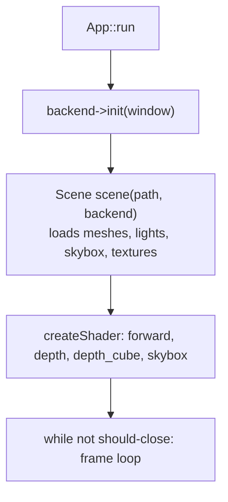
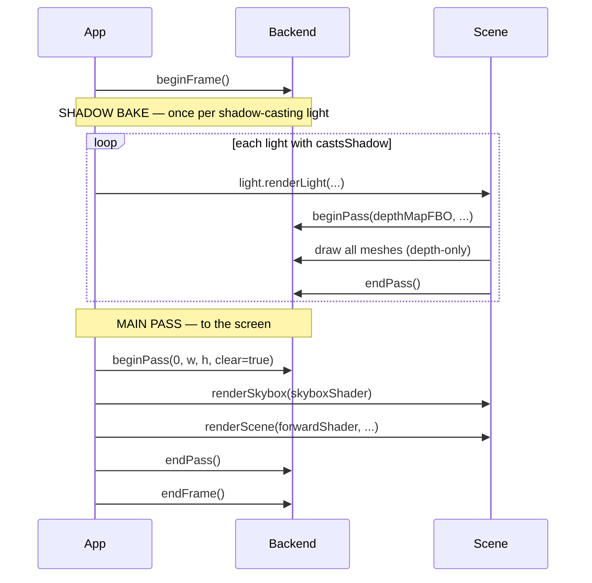
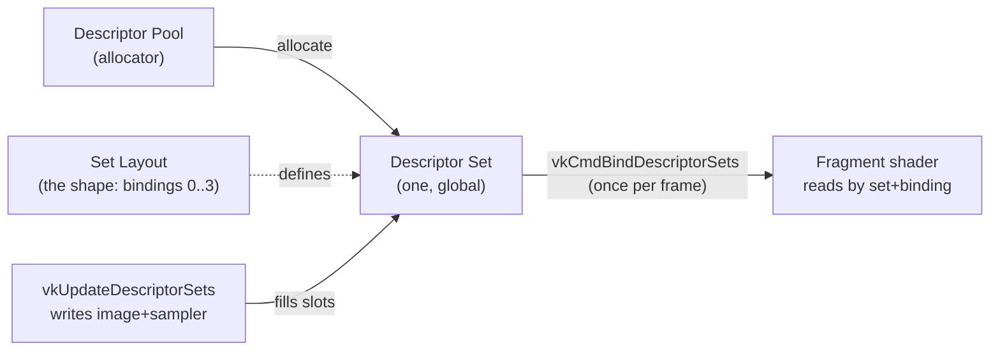
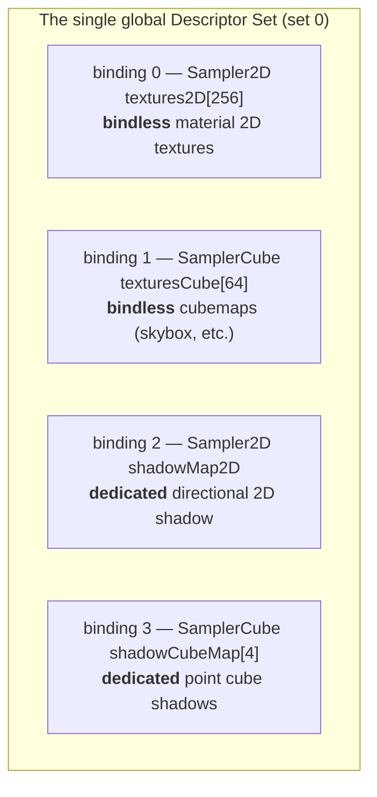
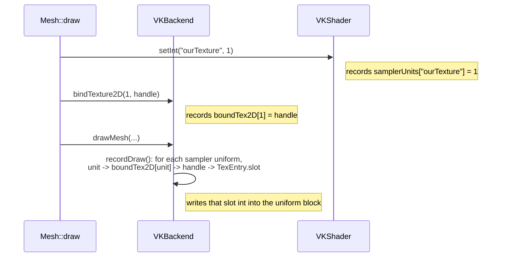

# Overdrive C++ — Rendering pipeline walkthrough

A step-by-step tour of what happens each frame, in order, in **both** backends,
with the real function names from the code. Written for someone who knew OpenGL
and is new to Vulkan, so every Vulkan idea is introduced next to its OpenGL
equivalent. **Descriptors get their own deep-dive section** (Part 4) because they
are the part of Vulkan with no direct OpenGL analogue.

Read alongside `cpp/BACKEND.md` (the renderer contract) and `notes/VULKAN.md`
(the Vulkan techniques). For background on Vulkan descriptors generally, the
clearest external references are [vkguide.dev — Descriptor
Sets](https://vkguide.dev/docs/chapter-4/descriptors/) and the [Khronos Vulkan
Tutorial — Descriptor layout and
buffer](https://docs.vulkan.org/tutorial/latest/05_Uniform_buffers/00_Descriptor_layout_and_buffer.html).

---

## Part 0 — The one big idea: a backend-agnostic scene

The scene layer (`cpp/scene/` — `Mesh`, `Light`, `Skybox`, `Scene`) makes **zero**
graphics-API calls. It talks only to two abstract interfaces:

| Interface | File | What it is |
|---|---|---|
| `Backend` | `renderer/Backend.hpp` | the device: passes, buffers, textures, draws |
| `Shader`  | `renderer/Shader.hpp`  | a program + its uniform setters (`setMat4`, `setInt`, …) |

Each is implemented twice: `opengl/` (`GLBackend`, `GLShader`) and `vulkan/`
(`VKBackend`, `VKShader`). `createBackend()` returns whichever one was compiled.
So the entire frame below is driven by the *same* scene code; only the backend
implementation differs. That is the whole point of the architecture.

---

## Part 1 — One-time setup (before the loop)

`App::run` (`core/App.cpp`) calls `backend->init(window)` then creates four
shaders and loads the scene.



### What `init` does in each backend

**OpenGL — `GLBackend::init`** is tiny: make the GL context current, load
function pointers (glad), enable depth test, cull, blend. That's it — OpenGL's
"device" is global hidden state.

**Vulkan — `VKBackend::init`** must build everything OpenGL hid, in order:

```
createInstance()            // the Vulkan loader connection (+ validation layers)
pickPhysicalDevice()        // choose a GPU
createDevice()              // logical device + the graphics queue
vmaCreateAllocator()        // VMA: GPU memory allocator
createCommandPool()         // allocator for command buffers
createSwapchain()           // the images we present to the screen
createFrameData()           // per-frame command buffer, fence, uniform ring (×2)
createSamplers()            // how textures are filtered
createDescriptors()         // <-- the descriptor set + layout + pool (Part 4)
createGlobalPipelineLayout()// push-constant + descriptor-set-layout slots
createDefaultTextures()     // handle 0 = white pixel; seed shadow bindings
createTimestampPool()       // opt-in GPU timing (OPTIMISATION.md)
```

The big conceptual additions over GL: **explicit memory** (VMA), **command
buffers** (you record commands, then submit, instead of issuing them
immediately), **frames in flight** (2 frames recorded/submitted before waiting,
so CPU and GPU overlap), and **descriptors** (Part 4).

---

## Part 2 — The frame loop (the order of everything)

Both backends run this exact sequence, from `App::run`:



The pass lifecycle is the renderer contract (see `cpp/BACKEND.md`): **clears
happen only at `beginPass`**, draws happen between `beginPass`/`endPass`, and
`framebuffer == 0` means the screen (backbuffer) while any other value is a shadow
FBO.

### 2.1 `beginFrame`

- **GL — `GLBackend::beginFrame`**: empty (plus a GPU-timing timestamp if
  enabled). Nothing to synchronize.
- **VK — `VKBackend::beginFrame`**: the real work of a frame-in-flight system.
  `vkWaitForFences` blocks until *this* frame slot's previous submission finished
  (so we don't overwrite resources the GPU is still reading). Then
  `vkAcquireNextImageKHR` gets a swapchain image, `vkResetCommandBuffer` +
  `vkBeginCommandBuffer` start recording, and crucially:

  ```cpp
  vkCmdBindDescriptorSets(cb, …, pipelineLayout, 0, 1, &descriptorSet, …);
  ```

  The **one global descriptor set is bound once here, for the whole frame.** This
  is very different from GL, where you re-bind textures to units constantly. We'll
  unpack what that set contains in Part 4.

### 2.2 Shadow bake — `Light::renderLight` (`scene/Light.cpp`)

Called once per light whose `castsShadow` is set. It renders scene depth from the
light's viewpoint into that light's own depth target.

- **Directional (`LightType::Sun`)** → a single 2D depth map. Builds an
  orthographic `lightSpaceMatrix`, `beginPass(depthMapFBO, …)`, sets `model` +
  `lightSpaceMatrix` on `depthShader`, draws every mesh, `endPass`. Front-face
  culling (`setCullFace(true)`) reduces acne.
- **Point (`LightType::Point`)** → a cube depth map (6 faces). Builds 6
  view-projection `shadowMatrices`, uses `depthCubeShader` (which has a
  **geometry shader** that amplifies one draw into all 6 cube faces), uploads
  `lightPos` + `farPlane`, draws every mesh once.

Each casting light owns its own FBO + depth texture (allocated in `Light::setup`),
so N casters just means N bake passes — see `notes/FEATURES.md` (Multi-light) and
the shadow budget (`MAX_SHADOW_CUBES = 4`).

### 2.3 Main pass

`beginPass(0, …, clearColor=true)` targets the screen. Then:

- `Scene::renderSkybox` → `Skybox::render` with `skyboxShader`.
- `Scene::renderScene` → sets camera `view`/`projection`/`model`/
  `lightSpaceMatrix`/`farPlane` on `forwardShader`, then `m.draw(shader, *this)`
  for every mesh. This is where lighting, PBR, normal mapping, and shadow
  sampling happen.

### 2.4 `endFrame`

- **GL — `GLBackend::endFrame`**: `glfwSwapBuffers`. Done.
- **VK — `VKBackend::endFrame`**: transition the swapchain image to
  `PRESENT_SRC` (`imageBarrier`), `vkEndCommandBuffer`, flush the uniform ring,
  then `vkQueueSubmit2` (run the recorded commands) and `vkQueuePresentKHR`
  (show it). Advance `frameIndex` to the other in-flight slot.

---

## Part 3 — Inside a draw: `Mesh::draw` (`scene/Mesh.cpp`)

This is the same code for both backends; it speaks only the abstract interface.
Per call it:

1. Uploads camera/light uniforms already set by the caller, plus per-mesh:
   `lightCount`, `shadowDirIndex`, and the texture **unit assignments** via
   `setInt` (`shadowMap`→unit 0, `ourTexture`→1, `skybox`→2, `normalMap`→3,
   `shadowCubeMap[s]`→4+s; see `Settings::UNIT_*`).
2. Binds the actual textures to those units: `bindTexture2D(unit, handle)` /
   `bindCubemap(unit, handle)` for the 2D shadow map, each caster's cube, the
   skybox.
3. Per submesh: sets the `material.*` scalars (`metallic`, `roughness`, …), binds
   the diffuse + normal textures, sets `useNormalMap`, then `drawMesh(vao, count)`.

The interesting part is what "bind a texture to a unit" and "set a uniform"
**actually do** in each backend — that's Part 4.

---

## Part 4 — Descriptors (the deep dive)

### 4.1 The OpenGL model you already know

In OpenGL, to give a shader a texture you:

1. `glActiveTexture(GL_TEXTURE0 + unit)` then `glBindTexture(target, id)` — bind
   the texture to a numbered **texture unit**.
2. `glUniform1i(loc, unit)` — tell the sampler uniform *which unit* to read.

And for a uniform buffer: `glBindBufferBase(GL_UNIFORM_BUFFER, 0, ubo)`. The
driver tracks all this hidden global state and wires it up at draw time.

That's exactly what `GLBackend` does: `bindTexture2D`/`bindCubemap` are one-liners
around `glActiveTexture`+`glBindTexture`; `GLShader::setInt` records the unit into
the sampler's location; uniforms live in a std140 UBO updated by
`GLShader::flushUniforms` (`glBufferSubData`) right before `glDrawElements`.

### 4.2 What a descriptor *is* in Vulkan

A **descriptor** is just a small handle that says "here is a resource and how to
read it" — e.g. *this image view + this sampler*, or *this buffer*. Vulkan has no
hidden "bind texture to unit" state. Instead:

- A **descriptor set layout** declares the *shape*: a list of **bindings**, each
  with a number, a type, and a count. (Think of it as the struct definition.)
- A **descriptor set** is an actual instance of that layout — a block of GPU
  memory holding the resource handles. (The struct instance.)
- A **descriptor pool** is the allocator descriptor sets come from.
- You **write** resources into the set with `vkUpdateDescriptorSets`, and **bind**
  the whole set for drawing with `vkCmdBindDescriptorSets`.

The shader reaches a resource by `set` + `binding` number (e.g.
`[[vk::binding(3,0)]]`), *not* by a texture unit.



### 4.3 This engine's descriptor set (`VKBackend::createDescriptors`)

There is exactly **one** descriptor set (`maxSets = 1`), bound once per frame. Its
layout has **four bindings**:



Two different strategies live in the same set, on purpose:

- **Bindless (bindings 0, 1) — material textures.** Big arrays (`[256]` / `[64]`).
  Every texture in the scene gets a slot once at load time; the shader picks one
  by *integer index*. No re-binding per draw.
- **Dedicated (bindings 2, 3) — shadow maps.** Plain single/4-element bindings,
  exactly like a fixed OpenGL sampler. This exists because the PCF kernels tap the
  shadow maps 9×/20× per fragment, and Intel's driver re-fetches a *dynamically
  indexed* bindless descriptor on every tap — the perf story in
  `notes/OPTIMISATION.md`. Dedicated bindings avoid that.

The layout uses two flags worth knowing:
`VK_DESCRIPTOR_BINDING_PARTIALLY_BOUND_BIT` (the set is legal even when some array
slots are empty — e.g. before a shadow map exists) and
`UPDATE_AFTER_BIND_BIT` (we can write the shadow bindings *after* the set is
already bound for the frame, which `Mesh::draw` does).

### 4.4 How a texture gets into the set

**Bindless (material textures): `VKBackend::registerTexture`.** When a texture
loads, it's assigned the next free array slot (`next2DSlot++` / `nextCubeSlot++`)
and written into binding 0 or 1 at that slot via `vkUpdateDescriptorSets`. The
returned engine **handle** remembers that slot (`TexEntry::slot`). This happens
once, at load — never per frame.

**Dedicated (shadow maps): `VKBackend::writeDedicatedTexture`.** Writes one
image+sampler into binding 2 (2D) or binding 3 element `s` (cube). Called from
`bindCubemap`/`bindTexture2D` only when the caster's map actually changes (guarded
by `shadow2DHandle` / `shadowCubeHandles[]`), so it's nearly free per frame.

### 4.5 Emulating GL "texture units" on top of all that

`Mesh::draw` is backend-agnostic, so it still calls `setInt("ourTexture", 1)` and
`bindTexture2D(1, handle)` — pure GL semantics. The Vulkan backend translates:



So the chain is: **sampler name → unit (`setInt`) → handle (`bindTexture2D`) →
bindless array slot (`TexEntry::slot`) → an integer in the uniform block**. In the
shader, `textures2D[U.texOurTexture]` then indexes the bindless array. The shadow
cube samplers skip this — they read binding 3 directly by slot.

`VKShader::setInt` knows which names are samplers via `vkSamplerSlots()`; sampler
names record a unit, everything else is a normal uniform write.

### 4.6 Uniforms: UBO vs buffer-device-address

The `Uniforms` block (matrices, lights, material scalars, shadow indices) is
defined once in `shaders/slang/common.slang` and reaches the shader differently:

| | OpenGL | Vulkan |
|---|---|---|
| Storage | std140 UBO | host-visible **ring buffer** (2 frames) |
| Layout | std140 (16-byte rules) | **scalar** layout |
| Upload | `glBufferSubData` (`GLShader::flushUniforms`) | `memcpy` a snapshot per draw into the ring |
| Reached by | `glBindBufferBase(…, 0, ubo)` | a **pointer** pushed as a push-constant |

In Vulkan, each draw snapshots the current uniform block into the per-frame ring
(`recordDraw`), then pushes the **GPU address** of that snapshot:

```cpp
vkCmdPushConstants(cb, pipelineLayout, …, sizeof(addr), &addr);  // a 64-bit pointer
```

The shader declares `Uniforms* ubo` (buffer_reference) and dereferences it as
`U.field`. This is **buffer-device-address (BDA)**: the shader literally follows a
raw pointer. It's why each draw can have its own uniform snapshot without
re-binding anything, and why the per-draw cost is a `memcpy` + a push-constant.
(The push-constant range is set up in `createGlobalPipelineLayout`.) The byte
offsets of every field must match between `common.slang`, `vulkan/Uniforms.hpp`
(scalar), and `opengl/Shader.cpp` (std140) — guarded by `static_assert` /
`kBlockSize`.

---

## Part 5 — Same frame, both columns

| Step | OpenGL | Vulkan |
|---|---|---|
| Begin frame | (nothing) | wait fence, acquire image, begin cmd buffer, **bind the global descriptor set** |
| Bind texture | `glActiveTexture`+`glBindTexture` | record `boundTex2D/Cube[unit]`; shadow maps → `writeDedicatedTexture` |
| Set sampler uniform | `glUniform1i(loc, unit)` | record `samplerUnits[name]=unit` |
| Set data uniform | write into std140 mirror | write into scalar `VKUniformBlock` mirror |
| Flush uniforms | `glBufferSubData` once when dirty | `memcpy` snapshot into ring **per draw** + push its BDA pointer |
| Draw | `glDrawElements` | resolve units→slots (`recordDraw`), bind VBO/IBO, `vkCmdDrawIndexed` |
| Shadow pass target | bind FBO | dynamic rendering (`vkCmdBeginRendering`) into the depth image |
| End frame | `glfwSwapBuffers` | barrier→present, `vkQueueSubmit2`, `vkQueuePresentKHR`, swap in-flight slot |

### The one sentence to remember
**OpenGL re-binds resources to numbered slots at every draw and hides the memory;
Vulkan writes all resources into one descriptor set once, binds that set once per
frame, and the shader reaches material textures by an integer index (bindless),
shadow maps by a fixed binding (dedicated), and uniforms by following a pushed
pointer (BDA).**

---

## Where to look in the code

| Topic | Function(s) |
|---|---|
| Frame loop | `App::run` (`core/App.cpp`) |
| Pass lifecycle | `*Backend::beginFrame` / `beginPass` / `endPass` / `endFrame` |
| Shadow bake | `Light::renderLight` (`scene/Light.cpp`) |
| Main draw (API-agnostic) | `Mesh::draw` (`scene/Mesh.cpp`) |
| VK descriptor set | `VKBackend::createDescriptors`, `registerTexture`, `writeDedicatedTexture`, `bindCubemap` |
| VK uniforms (BDA) | `VKBackend::recordDraw`, `createGlobalPipelineLayout`, `vulkan/Uniforms.hpp` |
| GL textures + uniforms | `GLBackend::bindTexture2D`, `GLShader::setInt` / `flushUniforms` |
| Uniform layout (must stay in sync) | `common.slang` ↔ `vulkan/Uniforms.hpp` ↔ `opengl/Shader.cpp` |
