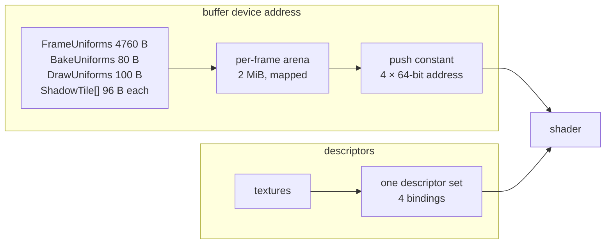

# Renderer — the backend contract

> **Scope** the `renderer` interfaces, how uniforms and textures reach a shader, images and the backbuffer, pipelines, buffers, and who owns what in the Vulkan backend.
>
> **Not here** the frame order and code map → `OVERVIEW.md`. Barriers, fences, semaphores → `SYNCHRONIZATION.md`. The descriptor set in depth → `cheatsheets/DESCRIPTORS.md`. General Vulkan → `cheatsheets/VULKAN.md`.

---

## 1. The interface

**25 methods across four interfaces**: `Backend` 17, `Frame` 5, `Pass` 2, `Compute` 1. The nesting is the ordering rule: a `Pass` cannot exist outside `Frame.Pass`, so a copy or a dispatch inside a render pass does not compile.

```go
Backend.Frame(func(f Frame) {
    f.Pass(spec, func(p Pass) { p.Draw(...) })
    f.Copy(...)                       // legal here, not inside the closure above
    f.Compute(spec, func(c Compute) { c.Dispatch(...) })
})
```

| When | Methods |
| --- | --- |
| startup | `Init(window, Request)`, `Capacities()`, `Shutdown()` |
| load time | `CreateImage`, `CreateView`, `UpdateImage`, `CreateBuffer`, `CreateMesh`, `CreateSampler`, `CreatePipeline` |
| once per image | `Slot(Handle)`: allocates the shader-visible index and writes the descriptor |
| rarely | `UpdateBuffer`, `ReadBuffer` (stalls), `Destroy`, `ReloadPipelines`, `BackbufferSize` |
| per frame | `Frame(record)` |
| inside a frame | `Upload`, `Pass`, `Compute`, `Copy`, `Clear` |
| inside a pass | `Pass.Viewport` (per shadow tile), `Pass.Draw`, `Compute.Dispatch` |

What this shape means:

- **The backend never says "shadow".** It knows images, buffers, pipelines, passes and dispatches; the atlas is two images and passes `core` opens.
- **State is baked into pipelines.** Cull, winding, depth compare/write, blend and formats are `PipelineSpec` fields. Only viewport and scissor stay dynamic.
- **Barriers are not in the interface.** Each operation declares what it does with a resource and the backend emits the transition (`SYNCHRONIZATION.md` §3).
- **`Request` / `Capacities`.** `Init` takes the wanted features and sample count; `Capacities()` reports what was granted, the backbuffer sample count, `MaxAnisotropy` and `Formats(Format) bool`.

### Passes

`Frame.Pass(PassSpec, func(Pass))` transitions everything the spec names, opens `CmdBeginRendering`, sets the full-target viewport, runs the closure and closes it.

- `Color []Attachment`, `Depth *Attachment`: an attachment **clears when `Clear` is non-nil and loads otherwise**. `Store` keeps the result; `Resolve` names where a multisampled attachment resolves to.
- `Reads []Handle`: the images and buffers the pass samples. Forgetting one is a missing barrier.
- `FlipY`: the negative-height viewport of the screen passes (`OVERVIEW.md` §5).
- `Name`: a `VK_EXT_debug_utils` label, which is what groups a RenderDoc capture by pass. The extension is optional; without it every label is a no-op. Object names are not set.

`Frame.Compute` is the asymmetry: a dispatch reaches resources through descriptors and addresses the backend cannot inspect, so `ComputeSpec.Reads` / `.Writes` must name them.

## 2. How data reaches a shader

Two separate paths, and the split is forced:



A buffer is plain memory, so a shader can read it through a pointer. An image is retiled and possibly compressed, and sampling needs format and sampler state, so it needs a descriptor.

### Uniforms, by pointer

`Frame.Upload(data any) Address` memcpys a value or slice into this frame's arena and returns its GPU address. The backend never reads a field.

```
FrameUniforms   4760 bytes   camera + 64 lights + the skybox slot   once per frame
BakeUniforms      80 bytes   the one tile a depth pass is baking    once per tile
ShadowTile        96 bytes   one shadow tile                        an array, once per frame
DrawUniforms     100 bytes   model matrix + PBR material            once per draw
```

- **Split by update frequency**, so a draw costs one 100-byte memcpy plus a 32-byte push.
- **Scalar layout is Go's packing.** Slang compiles with `-fvk-use-scalar-layout`, so `renderer/uniforms.go` and `common.slang` agree with no marshalling as long as the **field order** matches. Use only `float32`, `int32`, arrays of those and `mgl32` matrices.
- **The guard** is an `init()` size panic in `renderer/uniforms.go`. It catches a field added or removed, not two fields swapped. Check by hand:

```sh
spirv-dis shaders/vk/forward.frag.spv | grep OpMemberDecorate
```

- **The arena is frame-scoped.** It resets every frame, blocks are 64-byte aligned, and an overflow panics. An address kept across frames points at another frame's data.

### The push constant

One 32-byte range, four addresses, positional:

```
0  frame     FrameUniforms*     1  draw   DrawUniforms*
2  records   ShadowRecord*      3  bake   BakeUniforms*
```

`scene`'s `pushBlocks` names them and `toAddressArray()` lays them out in this order; a shader reads only the ones it declares. `ShadowRecord` is the shader's name for `renderer.ShadowTile`.

### Textures, by descriptor

One set, four bindings, bound once per frame:

| Binding | Contents |
| --- | --- |
| 0 | bindless sampled 2D, 256. Slot 0 is the white pixel an unset texture falls back to |
| 1 | bindless cubemaps, 64. Slot 0 is a black dummy |
| 2 | bindless storage images, 64. No shader reads it yet |
| 3 | 4 dedicated "hot" 2D descriptors, indexed by a **literal**: the two shadow atlases |

**The shader never receives a descriptor, it receives an int.** `Slot(handle)` returns the index, the caller writes it into its uniform block, and the shader indexes `textures2D[pushConstants.draw.texDiffuse]`. Hot images skip that hop: `ImageSpec.Hot` and `HotSlot` fix the index in advance, because a dynamically indexed descriptor re-fetched on every PCF tap cost ~1.7× the frame.

A combined image-sampler descriptor is a triple:

```
(image view, sampler, image layout)
```

| Part | Answers | Comes from |
| --- | --- | --- |
| image view | which pixels, read as what type | view creation |
| sampler | how to filter them | sampler creation, no image involved |
| layout | how the pixels are arranged when read | a **promise**, kept by a barrier elsewhere |

Slots come back only through the retire queue (§5): handing one back at `Destroy` would let a frame in flight sample whatever replaced it.

## 3. Images, views and the backbuffer

`CreateImage(ImageSpec)` describes an image by what it is (size, layers, format, usage, kind, samples), never by what it is for. `CreateView` narrows it to one mip, slice and aspect.

**The sample count is fixed at creation** because it is a storage property: an MSAA image holds N values per pixel. Only the two screen images in `core/targets.go` are multisampled.

**The backbuffer is split across two owners.** The swapchain is a ring of 2–3 images the window system allocates; each frame acquires one (`backend.imageIndex`), draws, presents. `renderer.Backbuffer` is the fixed name for this frame's image.

|                   | `backend.swapchainImages[i]`                | `screenTargets.color`                                |
| ----------------- | ------------------------------------------- | ---------------------------------------------------- |
| How many          | 2–3, rotating                               | one, reused every frame, only when MSAA is on        |
| Per pixel         | 1 colour: the finished frame                | N colours: the raw samples, before averaging         |
| Contents live     | until presented                             | the main pass only (`StoreOp = DontCare`, transient) |
| Allocated by      | the window system (`vk.CreateSwapchainKHR`) | the engine (`CreateImage`, `core/targets.go`)        |
| Seen by `core` as | `renderer.Backbuffer`, never directly       | a `renderer.ImageHandle` it owns                     |

The main pass draws into `screenTargets.color` with `Resolve: renderer.Backbuffer`; `buildColorAttachment` in `vulkan/frame.go` looks up `swapchainImages[imageIndex]` as the resolve target when the pass opens. The draw target is fixed, the resolve destination rotates. Without MSAA there is no `color` image and the main pass draws into `renderer.Backbuffer` directly.

The window-sized depth and MSAA images are `core`'s, so `screenTargets.rebuildOnResize` polls `BackbufferSize()` at the top of every frame; only the backend sees a resize.

## 4. Pipelines and buffers

- **`CreatePipeline(PipelineSpec)`** bakes shaders, vertex layout, cull, winding, depth, blend, attachment formats and sample count. `FormatBackbuffer` names the swapchain's format without knowing it. A screen pipeline takes `Capacities().BackbufferSamples`, everything else 1. `ReloadPipelines` rebuilds every live pipeline from its stored spec (hot reload, no caller yet).
- **`CreateBuffer`** returns the handle and its device address together. Every buffer is address-capable and host-visible today: nothing sets `LocationDevice`, so the staging branches are written but never taken.
- **`CreateMesh`** shares vertex buffers: a multi-material OBJ is several meshes over one buffer, each owning only its index buffer.
- **`ReadBuffer` stalls** on every frame in flight. Right for `-screenshot` (`Frame.Copy` from `BackbufferImage` into a host buffer, then a PNG), wrong in a frame loop.

## 5. Who owns what

Indentation is containment; the right column tears each level down.

```
Instance                                          DestroyInstance
├── SurfaceKHR                                     DestroySurfaceKHR
└── Device                                         DestroyDevice
    ├── VmaAllocator                                VmaDestroyAllocator
    │
    ├── SwapchainKHR ─────────── sized to the window
    │   ├── swapImages[]          owned by the swapchain, never destroyed
    │   ├── swapViews[]           DestroyImageView          ┐
    │   └── renderSems[]          DestroySemaphore          ┘ destroySwapchain
    │
    ├── CommandPool                                 DestroyCommandPool
    │   └── frames[2].cb          freed with the pool
    │
    ├── frames[2]  ───────────── one set per frame in flight
    │   ├── fence                 DestroyFence
    │   ├── acquireSem            DestroySemaphore
    │   └── arena (2 MiB, mapped) VmaDestroyBuffer
    │
    ├── DescriptorPool                              DestroyDescriptorPool
    │   └── descriptorSet         freed with the pool
    ├── DescriptorSetLayout                         DestroyDescriptorSetLayout
    ├── PipelineLayout                              DestroyPipelineLayout
    │
    └── resource tables ──────── grow at load time, indexed by handle
        ├── images[]    image + whole-image view (+ staging, when the CPU rewrites it)
        ├── views[]     one mip/slice/aspect of an image
        ├── buffers[]   VmaCreateBuffer, host or device
        ├── meshes[]    index buffer (the vertex buffer is shared, not owned)
        ├── pipelines[] one VkPipeline plus the spec it was built from
        ├── samplers[]  DestroySampler; index 0 is the default repeat sampler
        └── modules{}   shader modules, cached by "<set>.<stage>"
```

`renderer.Backbuffer` and `BackbufferImage` are not in the tables: they name whichever swapchain image the frame acquired. The screen depth and MSAA images are ordinary `images[]` entries.

| Lifetime | Objects | Created | Destroyed |
| --- | --- | --- | --- |
| **Permanent** | instance, surface, device, allocator, command pool, descriptor pool/set/layout, pipeline layout | `Init` | `Shutdown`, reverse order |
| **Swapchain-sized** | swapchain, its views, render semaphores | `createSwapchain` | `destroySwapchain`, **also on every resize** |
| **Per frame in flight** (×2) | command buffer, fence, acquire semaphore, arena | `createFrameData` | `Shutdown` |
| **Per resource** | shader modules, pipelines, images, views, buffers, meshes, samplers | load time, on demand | `Destroy` (retires) or `Shutdown` |
| **Retired** | anything `Destroy` touched, staging buffers replaced mid-frame | `retire` | `drainRetired`, once `framesInFlight + 1` frames have passed |

The rules that make destruction safe are in `SYNCHRONIZATION.md` §4.
