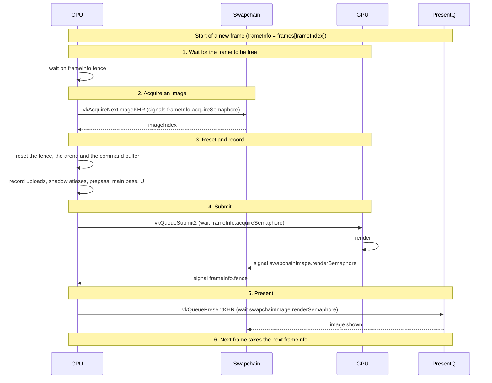

# Synchronization in Overdrive

## Overview

In a Vulkan application the engine must keep two different kinds of objects in sync:

| Object | Purpose | Where it lives | How it is used |
|--------|---------|---------------|----------------|
| **Frame** (`frameInfo`) | A frame the CPU builds and the GPU executes; `framesInFlight` of them exist and are reused in turn. | `backend.frames[i]` | Holds a command buffer, a **fence**, an **acquire semaphore** and a per‑frame upload arena. |
| **Swapchain image** | The GPU surface that will be presented on screen. | `backend.swapchainImages[i]` | Holds pixel data. Each image owns a **render‑complete semaphore** (`renderSems[i]`). |


## The sync primitives

Four are in play, and each guards a different pair of actors:

| Primitive | Who it syncs | Owner | What it means |
|-----------|--------------|-------|---------------|
| **Fence** (`frameInfo.fence`) | GPU → CPU | frame | The GPU is done with this frame, so its command buffer and arena can be overwritten. The only thing the CPU ever blocks on. |
| **Acquire semaphore** (`frameInfo.acquireSemaphore`) | GPU → GPU | frame | The image just acquired is actually free to render into. The CPU only touches it by passing it to `vkAcquireNextImageKHR`. |
| **Render semaphore** (`swapchainImage.renderSemaphore`) | GPU → GPU | swapchain image | Rendering into this image is finished, so present may scan it out. |
| **Pipeline barrier** | GPU → GPU | nobody, it is a command | One resource's writes are visible to what reads it next. Orders work *inside* one command buffer rather than between submissions, so it is the only one that never appears in the frame diagram below. |

Barriers are never hand-written here: `vulkan/barrier.go` emits every one of them
from the resource-use table, driven by what each pass and dispatch declares it
reads and writes.

The one Vulkan primitive the engine never creates is the **event**
(`VkEvent`): a barrier split in two, set at one point in a command buffer
with `vkCmdSetEvent2` and waited on later with `vkCmdWaitEvents2`, so the GPU
can keep working on the instructions in between. It pays off only when there
is real work to fill that gap; every transition here is immediate, so a plain
barrier is both simpler and no slower.


## Why a separate acquire semaphore per frame?

1. **Concurrent acquisition** – Two frames in flight can call `vkAcquireNextImageKHR` at the same time.  With a single semaphore these calls would serialize, creating a hard stall.
2. **Re‑use** – Each frame has its own semaphore that is reset after it finishes, avoiding extra bookkeeping.
3. **GPU‑GPU only** – The acquire semaphore is a GPU‑GPU primitive; the CPU only interacts with it via `vkAcquireNextImageKHR`.


## Why render‑complete semaphores per image?

The presentation queue needs to know *exactly* which image has finished rendering.  A semaphore attached to the image guarantees that the presentation queue waits on the right image and never presents one that is still being written.


## Frame vs. Swapchain image

| Concept | What it represents | How they interact |
|---------|--------------------|--------------------|
| **Frame** | Work unit (command buffer + resources). | It **acquires** a swapchain image, renders into it, then signals that image’s render‑complete semaphore. |
| **Swapchain image** | GPU surface that holds pixel data. | It owns a render‑complete semaphore and is handed to the presentation queue. |


## Complete workflow

```
1. Wait on the frame's fence           the GPU is done with this frame
2. Acquire a swapchain image           signals the acquire semaphore
3. Reset the frame                     fence, arena, command buffer
4. Record the frame                    uploads, shadow atlases, passes
5. Submit                              wait acquire, signal render + fence
6. Present                             waits on the render semaphore
7. Move to the next frame              no blocking
```


## Mermaid diagram



One pass of the loop for one `frameInfo`. `framesInFlight` of them run
staggered: while one records, another is on the GPU and another is presenting.
The fence in step 1 is the only CPU block, and it is per frame, not per image.

Note the owners: it is `frameInfo.acquireSemaphore` and
`swapchainImage.renderSemaphore`. The submit waits on the first and signals the
second, and the two indices are not interchangeable.

---

## Pipeline barriers, intuitively

The three primitives above order work *between* submissions. The barrier is the
one that orders work *inside* a single command buffer, and it is the only one
the engine emits automatically — `vulkan/barrier.go` derives every one of them
from `useTable`, driven by what each pass and dispatch declared it reads and
writes.

### The workshop

The GPU is a big workshop. Many stations run at once — a vertex station, a
fragment station, a transfer station. Orders arrive in order. The stations do
**not** wait for each other.

Each station has its own private workbench. Work finished there sits on that
bench, not in the shared warehouse.

The engine's real case: one pass bakes the shadow atlas (the depth station
writes it), the next pass samples it (the fragment station reads it). Without a
barrier, three separate things go wrong.

**1. Too early.** The fragment station starts reading while the depth station is
still writing. Half-baked shadows.
→ The barrier says: *depth station, finish. Fragment station, wait.*
That is `SrcStageMask` / `DstStageMask`.

**2. Wrong bench.** The depth station is done, but the result is still on its own
bench. The fragment station looks in the warehouse and finds yesterday's copy.
→ The barrier says: *depth station, carry your work to the warehouse. Fragment
station, throw out your old copy and fetch a fresh one.*
That is `SrcAccessMask` (push out — "availability") and `DstAccessMask` (pull in
— "visibility").

**3. Wrong packaging.** The depth station stores things in depth-crates:
compressed, with hierarchical-Z metadata, shaped for depth testing. The fragment
station's sampler cannot open a depth-crate.
→ The barrier says: *repack into texture-crates.*
That is `OldLayout` → `NewLayout`. Real data movement, not a label change.

One `vkCmdPipelineBarrier2` call does all three.

### The remaining two parameters

**`SrcQueueFamilyIndex` / `DstQueueFamilyIndex` — which building.**

Queue families are separate buildings with separate warehouses: a graphics
family, sometimes a dedicated transfer or async-compute family. Moving a
resource between them is a handover that has to be written down twice — a
release barrier recorded on the source queue and a matching acquire barrier on
the destination — or the receiving building never learns the crate is theirs.

Both are `vk.QueueFamilyIgnored` here, which means "no handover, it stays in the
same building". That is honest rather than lazy: `createSurfaceAndDevice` takes
the first family with `QueueGraphics` and never looks for a second
(`vulkan/backend.go`), so the engine has exactly one queue and the case cannot
arise. It becomes real the day an upload moves to a transfer queue.

**`SubresourceRange` — which shelves.**

An image is not one object. It is a grid of mip levels × array layers, each with
one or more aspects (colour, or depth, or stencil). A barrier applies to a
rectangle of that grid, not to the whole thing, so half a cubemap can be in one
layout while the other half is in another.

`useImage` always names the whole image:

```go
SubresourceRange: vk.ImageSubresourceRange{
    AspectMask: image.vkAspect, BaseMipLevel: 0, LevelCount: 1,
    BaseArrayLayer: 0, LayerCount: image.layerCount,
},
```

- `AspectMask` is the image's own, decided once at creation — `ImageAspectColor`
  unless the format is a depth one, in which case `ImageAspectDepth`.
- `BaseArrayLayer: 0` with the full `layerCount` transitions a cubemap's six
  faces together. Correct here, since a point light's six faces are baked in one
  pass and never in isolation.
- `LevelCount: 1` covers mip 0 only. Nothing in the tree creates mips — the view
  built in `makeView` hardcodes the same — so it is consistent today. Generating
  mips is the change that would break it, and the default sampler's `MaxLod: 16`
  is the misleading part: it promises mips nothing currently produces.

The granularity is also why a barrier on `staticAtlas` orders against all 337
slots rather than the one tile a pass touched. Correct, and conservative.

### Two consequences that fall out

**`Undefined` as the old layout means "bin it, do not repack".** If the contents
are worthless the driver can skip the unpacking work entirely. That is what
`Frame` does by assigning `use = useNone` to the acquired swapchain image
directly instead of calling `useImage`: no barrier is recorded there, it just
arranges for the frame's *first* real transition to start from `Undefined`, so
the repacking is free.

**Two reads in a row need nothing.** Nobody's bench holds unpublished work and
the packaging is already right. Only a write on one side creates a problem,
which is the whole reason `useInfo` carries a `write` column — the layout
comparison alone would wrongly skip a write-after-write, where two
`useCopyDst` in a row share a layout but still need the first copy's bytes
flushed before the second runs.

### The cost

A barrier is a traffic stop. "Nobody shades until all depth writing lands" means
the workshop briefly empties out and refills. That is unavoidable when the
dependency is real; naming stages rather than reaching for `AllCommands` is what
keeps it from stopping every station instead of the two that matter — with
`Src: EarlyFragmentTests | LateFragmentTests` and `Dst: FragmentShader`, later
draws' vertex work continues across the barrier.

### Why `Synchronization2`

The feature is enabled in `createSurfaceAndDevice` for this. Version 2 pairs a
stage mask with an access mask *per barrier* instead of one global src/dst pair
for the whole call, adds `PipelineStage2None`, and splits the old `AllCommands`
sledgehammer into usable pieces. Without it `useTable` could not be a table: the
masks would have to be merged by hand across every barrier in one call.

---

*File updated by the Zed agent.*