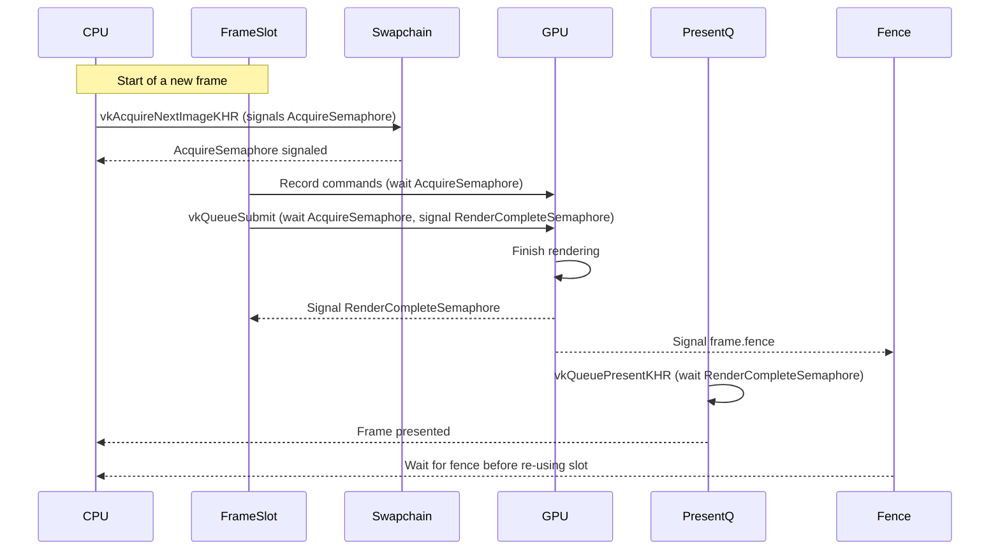

# Synchronization in Overdrive

## Overview

In a Vulkan application the engine must keep three different kinds of objects in sync:

| Object | Purpose | Where it lives | How it is used |
|--------|---------|---------------|----------------|
| **Frame slot** | A logical *frame* the CPU builds and the GPU executes. | `backend.frames[i]` | Holds a command buffer, a **fence** (`frame.fence`), an **acquire semaphore** (`frame.acquireSemaphore`), a per‑frame arena, etc. |
| **Swapchain image** | The GPU surface that will be presented on screen. | `backend.swapchainImages[i]` | Holds pixel data. Each image owns a **render‑complete semaphore** (`renderSems[i]`). |
| **Semaphores / fences** | Synchronisation primitives. | – | *Acquire* semaphore (per frame slot) – *Render‑complete* semaphore (per image) – *Fence* (per frame slot) |


## Why a separate acquire semaphore per frame slot?

1. **Concurrent acquisition** – Two frame slots can call `vkAcquireNextImageKHR` at the same time.  With a single semaphore these calls would serialize, creating a hard stall.
2. **Re‑use** – Each slot has its own semaphore that is reset after the frame finishes, avoiding extra bookkeeping.
3. **GPU‑GPU only** – The acquire semaphore is a GPU‑GPU primitive; the CPU only interacts with it via `vkAcquireNextImageKHR`.


## Why render‑complete semaphores per image?

The presentation queue needs to know *exactly* which image has finished rendering.  A semaphore attached to the image guarantees that the presentation queue waits on the right image and never presents one that is still being written.


## Frame slot vs. Swapchain image

| Concept | What it represents | How they interact |
|---------|--------------------|--------------------|
| **Frame slot** | Work unit (command buffer + resources). | It **acquires** a swapchain image, renders into it, then signals that image’s render‑complete semaphore. |
| **Swapchain image** | GPU surface that holds pixel data. | It owns a render‑complete semaphore and is handed to the presentation queue. |


## Complete workflow

```
1.  CPU –> acquireSemaphore (per slot)
2.  GPU –> vkAcquireNextImageKHR signals acquireSemaphore
3.  GPU –> vkQueueSubmit (wait on acquireSemaphore, signal renderSems[image])
4.  GPU –> rendering finishes, signals renderSems[image] and frame.fence
5.  Presentation queue waits on renderSems[image] then presents
6.  CPU waits on frame.fence before re‑using the slot
``` 


## Mermaid diagram



The diagram shows two frame slots acquiring two images, submitting work, and signaling their own render‑complete semaphores, while the CPU waits on the fences before re‑using the slots.

---

*File updated by the Zed agent.*