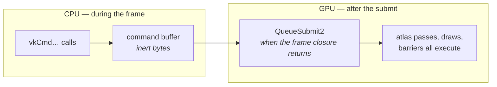
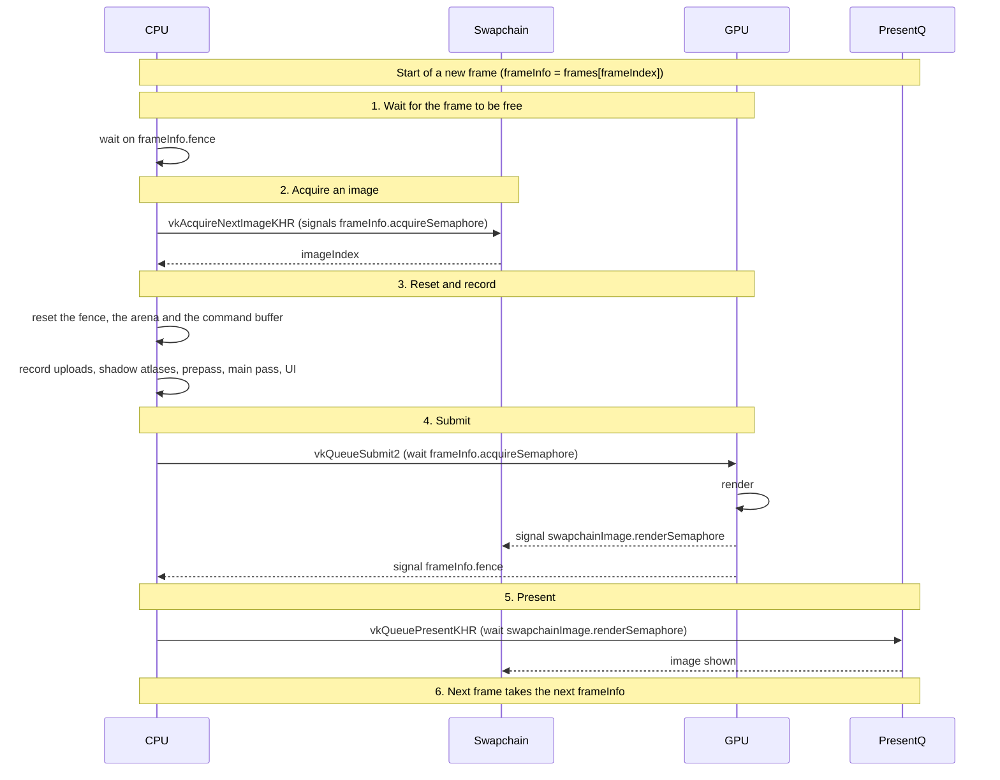

# Synchronization — CPU, GPU and the screen in step

> **Scope** recording vs executing, frames in flight, fences and semaphores, pipeline barriers, and when a resource may be destroyed.
>
> **Not here** the frame's pass order → `OVERVIEW.md` §4. General Vulkan sync → `cheatsheets/VULKAN.md`.

---

## 1. Recording is not executing


```mermaid
graph LR
    subgraph CPU["CPU — during the frame"]
        R1["vkCmd… calls"] --> R2["command buffer<br/><i>inert bytes</i>"]
    end
    R2 --> SUB["QueueSubmit2<br/><i>when the frame closure returns</i>"]
    subgraph GPU["GPU — after the submit"]
        SUB --> EX["atlas passes, draws,<br/>barriers all execute"]
    end
```

Every `vkCmd*` call only records. The queue is touched in three places:

| Where | What |
| --- | --- |
| frame close | `QueueSubmit2`: **one submit carries the whole frame** |
| frame close | `QueuePresentKHR` |
| `immediateSubmit` | load-time uploads and `ReadBuffer`, which block the CPU until done |

Host-side work is immediate, not recorded: a memcpy into mapped memory, `vkUpdateDescriptorSets`, pipeline creation. That is why the fence exists: it protects the **memory the commands point at**, not the commands.

## 2. Frames in flight and swapchain images

Two rotations of possibly different lengths, never indexed by each other:

| Rotation | Count | Index | Owns |
| --- | --- | --- | --- |
| **Frame** (`backend.frames[i]`) | `framesInFlight` = 2 | `frameIndex` | command buffer, **fence**, **acquire semaphore**, upload arena |
| **Swapchain image** (`backend.swapchainImages[i]`) | 2–3, the driver's choice | `imageIndex`, from acquire | pixels, **render semaphore** |

While the GPU renders frame N, the CPU records N+1.

| Primitive | Syncs | Owner | Meaning |
| --- | --- | --- | --- |
| **Fence** | GPU → CPU | frame | the GPU is done with this frame, so its command buffer and arena can be reused. The only thing the CPU blocks on |
| **Acquire semaphore** | GPU → GPU | frame | the acquired image is free to render into. Per frame, because acquire does not know the image index yet |
| **Render semaphore** | GPU → GPU | image | rendering into this image is done, present may show it. Per image, because present must wait on exactly that image |
| **Pipeline barrier** | GPU → GPU | nobody, a command | one resource's writes are visible to its next reader, inside one command buffer (§3) |

The engine never creates a `VkEvent` (a split barrier): every transition here is immediate, so a plain barrier is as fast and simpler.

```
1. Wait on the frame's fence           the GPU is done with this frame
2. Acquire a swapchain image           signals the acquire semaphore
3. Reset the frame                     fence, arena, command buffer
4. Record the frame                    uploads, shadow atlases, passes
5. Submit                              wait acquire, signal render + fence
6. Present                             waits on the render semaphore
7. Move to the next frame              no blocking
```


```mermaid
sequenceDiagram
    participant CPU
    participant Swapchain
    participant GPU
    participant PresentQ

    Note over CPU,PresentQ: Start of a new frame (frameInfo = frames[frameIndex])

    Note over CPU,GPU: 1. Wait for the frame to be free
    CPU->>CPU: wait on frameInfo.fence

    Note over CPU,Swapchain: 2. Acquire an image
    CPU->>Swapchain: vkAcquireNextImageKHR (signals frameInfo.acquireSemaphore)
    Swapchain-->>CPU: imageIndex

    Note over CPU,GPU: 3. Reset and record
    CPU->>CPU: reset the fence, the arena and the command buffer
    CPU->>CPU: record uploads, shadow atlases, prepass, main pass, UI

    Note over CPU,GPU: 4. Submit
    CPU->>GPU: vkQueueSubmit2 (wait frameInfo.acquireSemaphore)
    GPU->>GPU: render
    GPU-->>Swapchain: signal swapchainImage.renderSemaphore
    GPU-->>CPU: signal frameInfo.fence

    Note over CPU,PresentQ: 5. Present
    CPU->>PresentQ: vkQueuePresentKHR (wait swapchainImage.renderSemaphore)
    PresentQ-->>Swapchain: image shown

    Note over CPU,PresentQ: 6. Next frame takes the next frameInfo
```

The submit's wait on the acquire semaphore is scoped to `ColorAttachmentOutput`, so the shadow passes start at once and only the swapchain colour writes wait for the image.

## 3. Pipeline barriers

### Three jobs in one call

The GPU is a workshop of stations (vertex, fragment, transfer) that run at once and do not wait for each other, each with its own bench. One pass bakes the shadow atlas (the depth station writes), the next samples it (the fragment station reads). Without a barrier, three things go wrong:

| Problem | The barrier says | Fields |
| --- | --- | --- |
| **Too early**: the reader starts while the writer is still writing | writer finishes, reader waits | `SrcStageMask` / `DstStageMask` |
| **Wrong bench**: the result sits in the writer's cache | push it out (*available*), pull it in (*visible*) | `SrcAccessMask` / `DstAccessMask` |
| **Wrong packaging**: depth is stored compressed for depth testing, a sampler cannot read that | repack it | `OldLayout` → `NewLayout` |

"The write finished" and "the reader can see it" are different claims; right layouts with sloppy stage masks still render garbage.

### The use table

No barrier is hand-written. `vulkan/barrier.go` tracks one `use` per image and buffer, every operation declares its next use, and a change emits the barrier from this table:

| Use | Layout | Stage | Access |
| --- | --- | --- | --- |
| `useNone` | UNDEFINED | NONE | 0 |
| `useSampled` | SHADER_READ_ONLY | FRAGMENT\|COMPUTE | SHADER_SAMPLED_READ |
| `useShaderRead` | — | VERTEX\|FRAGMENT\|COMPUTE | SHADER_READ\|STORAGE_READ |
| `useColorAttach` | COLOR_ATTACHMENT | COLOR_ATTACHMENT_OUTPUT | COLOR_ATTACHMENT_WRITE |
| `useDepthAttach` | DEPTH_ATTACHMENT | EARLY\|LATE_FRAGMENT_TESTS | DEPTH_STENCIL_ATTACHMENT_WRITE |
| `useCopySrc` / `useCopyDst` | TRANSFER_SRC/DST | ALL_TRANSFER | TRANSFER_READ/WRITE |
| `useStorage` | GENERAL | COMPUTE | SHADER_STORAGE_READ\|WRITE |
| `useIndirect` | — | DRAW_INDIRECT | INDIRECT_COMMAND_READ |
| `usePresent` | PRESENT_SRC | NONE | 0 |

- **Layouts apply to images only**; a buffer barrier carries stage and access masks alone.
- **Two reads in a row need nothing; two writes do.** Same layout, but the first write must land first. That puts a barrier between the depth prepass and the main pass, which both leave the depth in `useDepthAttach`.
- **`UNDEFINED` means "discard, do not repack".** `Frame` sets the acquired swapchain image to `useNone` directly, so its first real transition starts from `UNDEFINED` for free.
- **Conservative by design:** one barrier per transition, no batching, roughly ten a frame.

### The other two fields

- **Queue families** are separate buildings; moving a resource between them needs a release and an acquire barrier. Both are `vk.QueueFamilyIgnored` here because the engine uses one graphics queue. It becomes real the day uploads move to a transfer queue.
- **`SubresourceRange`** picks which mips, layers and aspect a barrier covers. `useImage` always names the whole image:

```go
SubresourceRange: vk.ImageSubresourceRange{
    AspectMask: image.vkAspect, BaseMipLevel: 0, LevelCount: 1,
    BaseArrayLayer: 0, LayerCount: image.layerCount,
},
```

`LevelCount: 1` is correct while no image has mips; generating mips is the change that would break it. Whole-image barriers also mean a barrier on an atlas covers all its tiles, not just the one a pass touched.

### Cost, and why synchronization2

A barrier briefly drains the stations it names. Naming exact stages instead of `AllCommands` keeps the others running: with `Src: Early|LateFragmentTests` and `Dst: FragmentShader`, later vertex work crosses the barrier freely.

`Synchronization2` (enabled in `createSurfaceAndDevice`) pairs stage and access masks **per barrier** instead of one pair per call, and adds `PipelineStage2None`. Without it `useTable` could not be a table.

## 4. When a resource may be destroyed

1. **Nothing is destroyed while the GPU might read it.** `Shutdown` starts with `DeviceWaitIdle`. `Destroy` never waits, it retires. `UpdateBuffer` on a mapped buffer and `ReadBuffer` call `waitAllFrames`, which skips the frame being recorded (its fence can only signal at its end).
2. **`Destroy` defers, and the descriptor slot goes back with it.** Retired objects are tagged with `frameCounter`; `drainRetired` frees them and returns the bindless slot once no frame in flight can reference them. Returning the slot earlier is silent wrong pixels, not a validation error.
3. **Resize is a partial teardown.** `ErrOutOfDateKHR` from acquire or present triggers `recreateSwapchain`: block while minimised, wait idle, rebuild only the swapchain-sized objects (`RENDERER.md` §5). `core/targets.go` rebuilds its own screen images when `BackbufferSize` changes.
