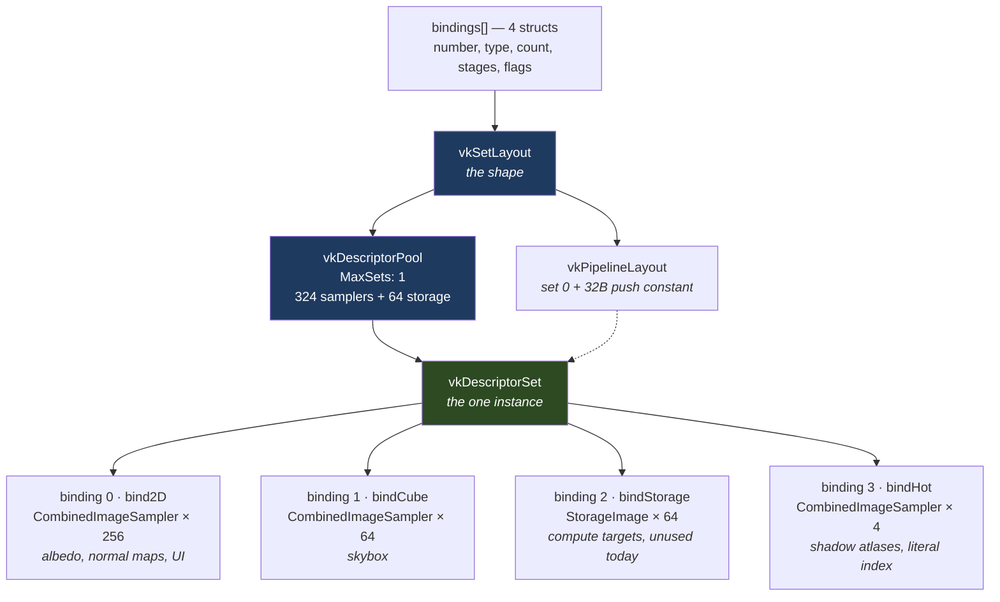
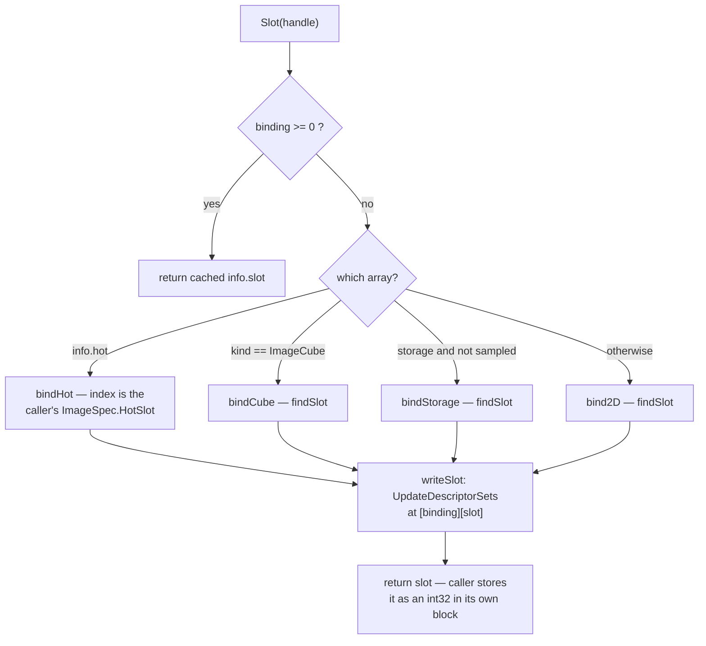

# Descriptors — how an image becomes an index

> **Scope** the engine's one descriptor set: its objects, what a descriptor holds, how `Slot` hands out indices, and the rules that bite. Everything lives in `src/vulkan/slots.go`.
>
> **Not here** uniforms and the push constant → `../RENDERER.md` §2. Layout transitions → `../SYNCHRONIZATION.md` §3. Descriptors in general Vulkan → `VULKAN.md` §11.
>
> **Careful** *slot* means two unrelated things: here an index into a descriptor array, in `scene/shadowatlas.go` a rectangle of the shadow atlas.

---

## 1. The objects

| Object | What it is | Lives in |
| --- | --- | --- |
| `vk.DescriptorSetLayoutBinding` | one binding: number, type, count, stages | nothing, discarded after creation |
| `vkSetLayout` | the **shape** of a set, built from the bindings | `backend.vkSetLayout` |
| `vkDescriptorPool` | the memory descriptors are allocated **from** | `backend.vkDescriptorPool` |
| `vkDescriptorSet` | the one **instance**, 388 descriptors | `backend.vkDescriptorSet` |

Binding is a field declaration, layout is the struct type, set is the instance. A descriptor itself is never a Go value: `writeSlot` hands a `vk.DescriptorImageInfo` (view + sampler + layout) to `vk.UpdateDescriptorSets`, and the driver copies it into the set.

## 2. What a descriptor holds

An opaque, hardware-specific blob of 32–64 bytes, roughly:

```c
struct Descriptor {          // combined image sampler
    uint64 baseAddress;      // the pixels in VRAM
    uint32 format;
    uint32 width, height, mipLevels, arrayLayers;
    uint32 swizzle, tilingMode, viewType;

    uint32 minFilter, magFilter, mipFilter;   // the sampler half,
    uint32 addressU, addressV, addressW;      // present only because
    float  minLod, maxLod, maxAnisotropy;     // the type is COMBINED
};
```

**No handles in it.** The view's and sampler's fields are baked in, so a write is a copy, not a pointer. Replacing a view means writing again; destroying one leaves its descriptor pointing at freed memory, which is why `drainRetired` holds a slot for `framesInFlight` frames.

The set is a range of the pool and holds one address:

```c
// what the VkDescriptorSet handle points at — CPU-side driver bookkeeping
struct DescriptorSet {
    VkDescriptorPool      pool;
    VkDescriptorSetLayout layout;   // where each binding starts, and its stride
    uint64                gpuBase;  // ONE address: the range below
    uint32                size;
};

// that range, in the pool's GPU arena — blobs back to back, no headers
[ binding 0: 256 ][ binding 1: 64 ][ binding 2: 64 ][ binding 3: 4 ]
```

Descriptor *i* of binding *b* is at `gpuBase + offsetOf(b) + i*strideOf(b)`: one fetch, no indirection. That is why writes take indices, and why a set cannot be resized. None of this layout is in the spec (drivers differ); the contract is a handle, index-based writes, and contiguity within a binding.

## 3. Structure



- **The pool** is sized per descriptor *type*, so the three sampler arrays add into one entry of 324. `MaxSets: 1`.
- **The set** is allocated once and bound twice per frame (graphics and compute) at the top of `Frame`. Only its contents change, which `UpdateAfterBind` makes legal.
- **Bindings 0–2** are unsized in the shader (`Sampler2D textures2D[]`), so the layout's count sizes them. Binding 3 is `Sampler2D hotTextures[4]`, a literal `maxHotTextures` must match.

## 4. Getting a slot

`Slot(handle)` is lazy: an image has no descriptor until someone asks. Callers are the material textures (`scene/mesh.go`), the skybox, the two atlases, the UI canvas and the two defaults in `createDefaultImages`. The depth, MSAA and swapchain images are never slotted.



`findSlot` pops `slotFree[binding]` if it can, otherwise bumps `slotNext[binding]`, and panics at `bindingCapacity`. `drainRetired` returns a slot to `slotFree` only once `framesInFlight` frames have passed; hot slots are never recycled.

## 5. Rules that bite

- **One image, one descriptor, one array.** The first `Slot` call decides.
- **`ImageSampled | ImageStorage` lands in `bind2D` only**, so a compute shader could not write it. Nothing does this today.
- **Precedence is hot → cube → storage → 2D**, so a hot cubemap is impossible.
- **`PartiallyBound` makes a hole legal, not safe.** Sampling an unwritten slot reads undefined data, which is why `createDefaultImages` fills all four hot slots with the white pixel.
- **The layout's counts and `common.slang` are matched by hand.** A mismatch is a validation error at best, a wrong tap at worst.
