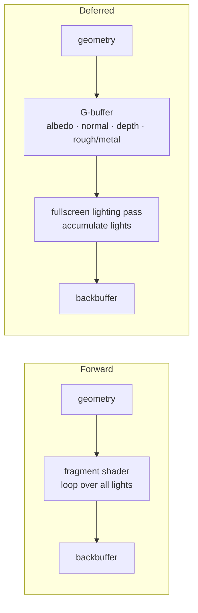
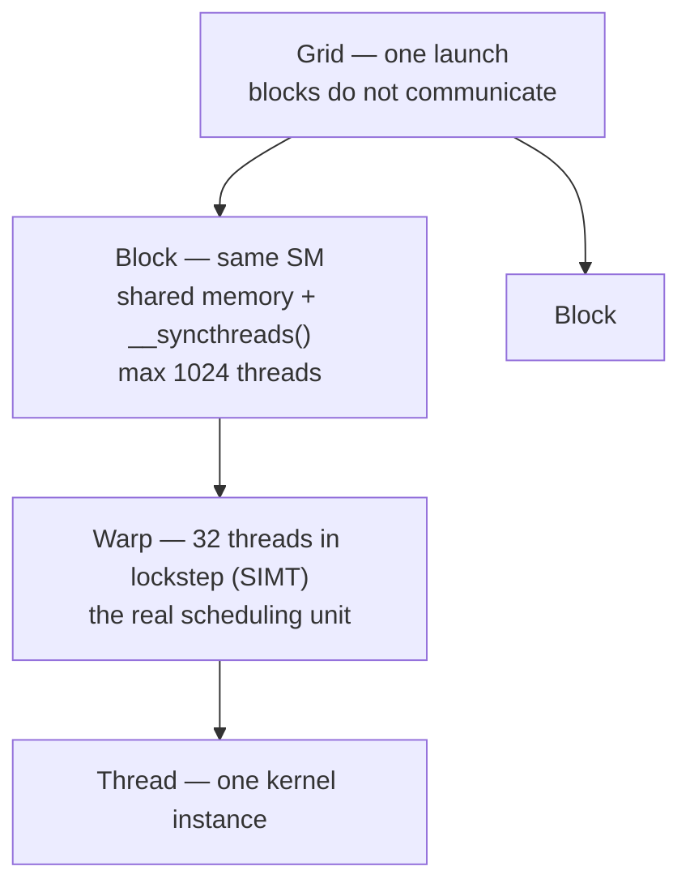

# Graphics — real-time techniques, simulation, GPGPU

> **Scope** the breadth layer: rendering techniques a modern engine ships, procedural generation, physics simulation, agent AI, compression, high-performance optimisation, GPGPU, emulation. Each entry is the idea plus the one detail that shows you understand *why*, not a full derivation.
>
> **Not here** the deep dives live in their own files — BRDF and material theory in `PBR.md`, ray vs path tracing in `RAYTRACING.md`, the OpenGL API in `OPENGL.md`, the Vulkan object model in `VULKAN.md`, matrices and quaternions in `ALGEBRA.md`. §11 is the one-screen recall index into them.
>
> **Source** merged from the two revision passes (`REV.md`, `REV2.md`), plus the Shadertoy heat-equation exercise in §9.

---

## Contents

1. [Real-time rendering techniques](#1-real-time-rendering-techniques)
2. [Procedural generation](#2-procedural-generation)
3. [Physics simulation](#3-physics-simulation)
4. [Agent AI](#4-agent-ai)
5. [Compression](#5-compression)
6. [High-performance optimisation](#6-high-performance-optimisation)
7. [GPGPU and CUDA](#7-gpgpu-and-cuda)
8. [How an emulator works](#8-how-an-emulator-works)
9. [Exercise — heat equation on a surface](#9-exercise--heat-equation-on-a-surface)
10. [C++ refresher](#10-c-refresher)
11. [Recall index](#11-recall-index)

---

## 1. Real-time rendering techniques

### Shadow mapping

Render depth from the light's point of view, then in the main pass a fragment is in shadow if its distance to the light exceeds the stored depth.

`Acne` self-shadowing from depth-map quantisation → bias. A **normal-offset bias** (push the sample point along the surface normal in world space before projecting) beats a depth bias: it escapes acne geometrically, so contact shadows stay attached

`Peter-panning` too much bias detaches the shadow from the object's base

`PCF` percentage-closer filtering, average several taps → soft edges. The kernel is the expensive part: 9 taps for a 2D map, 20 for a cube

`CSM` cascaded shadow maps, one map per view-distance slice → large outdoor scenes

`Omnidirectional` a point light needs all six directions: render into a cubemap, store linear distance / farPlane

> Overdrive uses exactly this: 2D map for the sun, cube for the point light, normal-offset bias, PCF with an early-bail on the first 4 taps. See `../FEATURES.md`

### Forward vs deferred — the classic question

| | Forward | Deferred |
|---|---|---|
| Shading happens | per object, in the fragment shader, looping over lights | per screen pixel, in a second pass |
| Cost | #objects × #lights × **overdraw** | #pixels × #lights |
| Scales with | badly in light count | badly in memory bandwidth |
| MSAA | native | hard (screen-space AA → TAA instead) |
| Transparency | easy | broken, needs a separate forward pass |
| Material variety | free | one lighting model for the whole scene |
| Memory | low | a fat G-buffer |

**Forward.** A pixel covered five times is shaded five times, four of which the depth test throws away. That is the overdraw term, and it is why forward collapses with many lights.

**Deferred.** Pass 1 (*geometry*) writes surface *properties* of the visible fragment into the **G-buffer** — several render targets: albedo, normal, depth, roughness/metallic. Pass 2 (*lighting*) shades in screen space, one fragment per pixel because the depth test already sorted it, accumulating lights. The cost is decoupled from object count and from overdraw → hundreds of lights.



**Deferred's real problem is bandwidth.** The G-buffer is written once and read once per pixel per frame; on consoles and handhelds that is usually *the* wall. Mitigations: octahedral normal encoding, packing channels, fewer targets.

`Forward+ / clustered` the modern compromise. Split the screen into tiles (or the frustum into 3D clusters), run a compute pass listing which lights touch each tile, then a forward pass shades only those lights. Keeps MSAA, transparency and material variety with deferred's light scaling. This is where the industry sits today

### Ambient occlusion

Approximates how much a point is *hidden* from ambient light by nearby geometry → darkens crevices, corners and contacts. Without it, ambient is flat.

`SSAO` (Crytek) sample N random points in a hemisphere around the pixel, compare their depth against the G-buffer → the fraction "buried" is the occlusion. Cheap, noisy (needs a blur), limited to what is on screen

`HBAO` march along directions from the pixel, find the horizon angle that blocks it → more physical

`GTAO` ground-truth AO, integrates the horizon correctly and converges to true cosine-weighted AO. The current quality standard

`Baked AO` precomputed into a texture, static geometry only

`RTAO` ray-traced, exact, expensive

### Anti-aliasing

`MSAA` depth/stencil tested at N points per pixel, fragment shader runs once → smooth edges only. Expensive, and awkward in deferred

`FXAA` pure post-process edge detection. Cheap, blurry

`TAA` temporal: reuse previous frames with motion vectors to reproject. The current standard; ghosting is the failure mode

`DLSS / FSR` render at lower resolution and upscale, temporally. Effectively TAA plus a learned or heuristic upsampler

### Culling and LOD

Do not draw the invisible.

`Frustum culling` outside the camera volume
`Occlusion culling` hidden behind something else
`Backface culling` triangles facing away, ~50% of fragments for a closed mesh
`LOD` simplified mesh at distance

### GPU-driven rendering

Move the *what to draw* decision from CPU to GPU.

**Problem.** The classic loop is "for each object: cull, bind, draw" on the CPU → thousands of draw calls, driver overhead, CPU becomes the bottleneck.

**Idea.** The whole scene (matrices, bounding boxes, material indices) lives in GPU buffers. A compute shader does the culling and *writes the draw list itself* into a buffer. The CPU issues one `vkCmdDrawIndirectCount` that reads it.


`Building blocks` draw-indirect, bindless resources, multi-draw indirect
`Mesh shaders` push it further: cull at meshlet granularity on the GPU
`Payoff` hundreds of thousands of objects, CPU freed. Nanite is an extreme form of this

### HDR pipeline

Render into a float linear target (`RGBA16F`) → **tone map** (ACES, Reinhard) down to [0,1] → gamma / sRGB encode. `Bloom` blurs the bright-pass of that HDR target back over the image. Without an HDR target, light intensities above 1 are clipped at write time and bloom has nothing to work with.

---

## 2. Procedural generation

### Noise — the base primitive

`Perlin / Simplex` gradient noise: smooth, no preferred direction. Simplex scales better in high dimensions
`Value noise` interpolate random values on a lattice. Cheaper, blockier
`fBm` fractal Brownian motion = sum of octaves at rising frequency and falling amplitude → detail at every scale
`Domain warping` feed one noise's output into another's input coordinates → organic, swirling structure

### Terrain

`Heightmap` 2D fBm, the default
`Diamond-square` recursive grid subdivision, classic and cheap
`Hydraulic erosion` simulate water carving the heightfield — what actually makes terrain read as real
`Marching cubes` volumetric terrain (caves, overhangs) from a 3D density field

### Vegetation and grass

`Grass` GPU instancing (one mesh, N copies, one draw), placement by compute shader from a density texture, wind as vertex animation (sine + noise). Billboards and LOD at distance
`Trees` **L-systems**: a rewriting grammar, `F → F[+F]F[-F]` applied recursively, produces branching structure
`Distribution` **Poisson-disk sampling** — random but minimum-spaced, so no clumps

### Levels

`BSP` recursive binary partition into rooms → structured dungeons
`Cellular automata` iterate a birth/death rule over a random grid → organic caves
`WFC` Wave Function Collapse: assemble tiles under neighbour constraints, collapsing the lowest-entropy cell first and propagating. Currently fashionable, and the algorithm `src/algorithms/wfc.go` is a stub for

---

## 3. Physics simulation

### Integration

| | Idea | Property |
|---|---|---|
| **Euler** | `pos += vel·dt; vel += a·dt` | simplest, drifts and blows up |
| **Verlet** | store current + previous position, `pos += (pos - prevPos) + a·dt²` | stable, no explicit velocity, trivially constrainable |
| **RK4** | four weighted derivative samples per step | accurate, four times the cost |

> Overdrive's `src/physics/verlet.go` is the middle row: unconditional stability, no built-in damping.

### Particles

Each point is position + velocity + lifetime; update, spawn, kill. The base of fire, sparks, smoke. Naturally SoA and SIMD-friendly (see §6).

### Cloth and soft bodies

`Mass-spring` masses linked by springs, integrated in Verlet
`PBD / XPBD` position-based dynamics: correct *positions* directly to satisfy distance constraints instead of integrating forces. Stable at large time steps, and the game-industry standard

### Rigid bodies


`Broad phase` find pairs that *might* touch, cheaply
`Narrow phase` exact test: **SAT** for convex shapes, **GJK/EPA** for distance and penetration depth
`Resolution` apply impulses at the contact point, then correct the position

**Cube vs cube, in detail (SAT — separating axis theorem).**

- **Theorem** two convex shapes do *not* intersect iff there exists an axis on which their 1D projections do not overlap. That axis defines a separating plane
- **Which axes** for boxes: the 3 face normals of A, the 3 of B, and the 9 cross products edge_A × edge_B → 15 axes for oriented boxes. Axis-aligned boxes need only the 3 world axes
- **Per axis** project all 8 corners of each box → intervals `[minA,maxA]`, `[minB,maxB]`. No overlap → separated, stop early. All axes overlap → collision
- **Penetration depth** the *smallest* overlap across all axes; its axis is the collision normal (the direction to push along). The contact manifold comes from clipping the two facing faces
- **Resolution** apply an impulse along the normal to both bodies (momentum exchange weighted by mass, scaled by restitution for bounce), then a positional correction to remove residual overlap

### Fluids

`SPH` smoothed particle hydrodynamics: the fluid is particles, each averaging its neighbours for pressure and viscosity. Free surfaces, splashes
`Shallow water` a 2D heightfield solving the shallow-water equations. Lakes and rivers, no breaking waves, fast
`FFT ocean (Tessendorf)` sum waves in the frequency domain, inverse FFT → a tiling heightmap. The standard for oceans in film and games
`Gerstner / sine waves` a handful of analytic waves added together, points tracing circles → sharp crests. Cheap
`Stable Fluids (Stam)` grid-based Navier-Stokes, unconditionally stable → smoke and fire

---

## 4. Agent AI

`FSM` states (patrol, chase, attack) plus event-driven transitions. Simple, readable, the historical default; transition count explodes with state count
`Behavior tree` a tree of sequence / selector / condition / action nodes walked each tick → modular, reusable subtrees. The modern standard
`A*` Dijkstra guided by a distance-to-goal heuristic, on a grid or graph
`NavMesh` a mesh of walkable surface instead of a grid — fewer nodes, smoother paths
`Flow field` one shared direction field computed once, followed by an entire crowd
`Steering / boids` (Reynolds) group behaviour emerging from three local rules: **separation**, **alignment**, **cohesion**
`GOAP` goal-oriented action planning: search a sequence of actions with preconditions and effects to reach a goal — A* over actions (F.E.A.R.)
`Utility AI` score every action against needs (hunger, danger…) and pick the best → nuanced, tunable
`Influence maps` a grid accumulating threat and control → tactical decisions about where to attack or flee
`Turn-based` **minimax with alpha-beta pruning** (chess), **MCTS** — Monte Carlo tree search, simulate random playouts (Go, AlphaGo)

---

## 5. Compression

`BCn / DXT, ASTC` block compression decoded *by the GPU* → less VRAM and less bandwidth, permanently, not just on disk
`Basis Universal` one intermediate format transcoded to whatever the target GPU supports
`Mesh quantisation` positions as int16 instead of float32; `meshoptimizer`, `Draco`
`Entropy coding` Huffman, arithmetic/range — short codes for frequent symbols
`LZ` back-references to already-seen patterns
`Delta encoding` store differences rather than values

### Huffman coding, in detail

**Idea.** Fixed-length encoding (8 bits per character) wastes bits: rare and frequent symbols cost the same. Huffman gives short codes to frequent symbols, long codes to rare ones → total size approaches the **entropy** of the data, Shannon's limit.

**Construction (binary tree).**
1. Count each symbol's frequency
2. Put every symbol as a leaf node in a priority queue
3. Repeatedly remove the **two** lowest-frequency nodes, create a parent whose frequency is their sum, reinsert it
4. Until one tree remains. The root→leaf path (left = 0, right = 1) is each symbol's code

**Example.** `AAAABBC` → A is frequent → `0` (1 bit), B → `10`, C → `11`. 4×1 + 2×2 + 1×2 = 10 bits instead of 7×8 = 56.

**Prefix-free.** No code is a prefix of another (a property of the tree) → decoding is unambiguous without separators: walk the tree bit by bit, emit at each leaf, restart from the root.

**Limit.** Optimal only for whole-bit code lengths. Arithmetic/range coding does better (fractional bits) and is what modern codecs use. Huffman survives everywhere (DEFLATE/zlib, JPEG) because it is simple and fast.

---

## 6. High-performance optimisation

> **The wall is memory, not arithmetic.** A RAM access costs ~200-300 cycles, an L1 hit ~4. The CPU spends its time *waiting*. Every modern optimisation is about feeding the machine without starving it.

`Data-oriented design` organise data for the cache, not for the logic. **AoS** (`struct{pos,vel,hp}[]`): summing all positions also drags `vel` and `hp` into cache. **SoA** (one array per field): the loop pulls only positions, so every cache line is fully useful *and* the compiler can vectorise. This is the reason ECS and particle systems are shaped the way they are

`Locality` *spatial* — neighbouring data used together, so linear traversal beats pointer chasing; *temporal* — reuse what is already hot. Prefer contiguous arrays to linked structures

`SIMD` one instruction over 4/8/16 lanes (SSE/AVX on x86, NEON on ARM and Switch). Ideal for vector math, particles, image processing. Requires packed data → SoA

`Multithreading` a **job system**: a thread pool pulling small tasks from a queue (work-stealing) beats one fixed thread per subsystem. Watch for **false sharing** — two threads writing the same cache line ping-pongs it between cores

`GPU side` fewer draw calls (instancing, GPU-driven), less bandwidth (compressed G-buffer and textures), fewer state changes (sort by pipeline then material). Occupancy = enough warps in flight to hide memory latency

`Profile first` measure the real bottleneck — usually memory or bandwidth, rarely the ALU. Amdahl's law: optimising what is not the bottleneck buys nothing. Tools: `perf`, VTune, Nsight, RenderDoc

`Algorithm first` O(n²) → O(n log n) beats any micro-tuning. Good algorithm + good layout > clever assembly

> Measuring frame rate by subtraction is not profiling. Under vsync, a frame that crosses 16.6 ms drops cleanly to the next interval, so FPS deltas hide the real cost. Use GPU timestamp queries.

---

## 7. GPGPU and CUDA

CPU = few latency-optimised, branch-friendly cores. GPU = thousands of throughput cores for **data-parallel** work (the same operation over many elements).

### Model

`Kernel` a `__global__` function launched from the host (CPU), executed by many threads on the device (GPU): `kernel<<<gridDim, blockDim>>>(args)`



Global thread index: `int i = blockIdx.x * blockDim.x + threadIdx.x;`. Block size should be a multiple of 32 or you waste lanes.

### Memory

| Memory | Scope | Speed |
|---|---|---|
| Registers | thread | fastest |
| Shared (`__shared__`) | block | very fast, on-chip |
| Global (`cudaMalloc`) | device | slow, DRAM |
| Constant / texture | device, cached | fast when reused |

Host and device are **separate address spaces**; copy explicitly with `cudaMemcpy(dst, src, bytes, dir)`. That PCIe transfer is usually *the* bottleneck → CUDA pays off on large, reused data, never on small one-off arrays.

Cycle: `cudaMalloc` → memcpy H→D → kernel → memcpy D→H → `cudaFree`.

### Vector add, end to end

```cuda
// KERNEL: runs on the GPU, one thread per element (grid-stride loop)
__global__ void vecAdd(const float* A, const float* B, float* C, int n) {
    int i = blockIdx.x * blockDim.x + threadIdx.x;   // global thread index
    for (; i < n; i += blockDim.x * gridDim.x)       // stride: covers n even if threads < n
        C[i] = A[i] + B[i];
}

int main() {
    int n = 1 << 20;  size_t bytes = n * sizeof(float);
    float *hA = ..., *hB = ..., *hC = malloc(bytes);   // host buffers

    float *dA, *dB, *dC;                               // 1. allocate on the device
    cudaMalloc(&dA, bytes); cudaMalloc(&dB, bytes); cudaMalloc(&dC, bytes);

    cudaMemcpy(dA, hA, bytes, cudaMemcpyHostToDevice); // 2. copy H->D
    cudaMemcpy(dB, hB, bytes, cudaMemcpyHostToDevice);

    int threads = 256;                                 // multiple of 32 (warp)
    int blocks  = (n + threads - 1) / threads;         // ceil(n/threads)
    vecAdd<<<blocks, threads>>>(dA, dB, dC, n);        // 3. launch
    cudaDeviceSynchronize();                           //    launches are async otherwise

    cudaMemcpy(hC, dC, bytes, cudaMemcpyDeviceToHost); // 4. copy D->H
    cudaFree(dA); cudaFree(dB); cudaFree(dC);          // 5. free
}
```

### Reduction tree (per-block sum in shared memory)

```cuda
__global__ void reduce(const float* in, float* out, int n) {
    __shared__ float s[256];                           // one copy per block
    int tid = threadIdx.x;
    int i   = blockIdx.x * blockDim.x + tid;
    s[tid] = (i < n) ? in[i] : 0.0f;
    __syncthreads();                                   // all writes land before any read

    for (int stride = blockDim.x / 2; stride > 0; stride >>= 1) {
        if (tid < stride) s[tid] += s[tid + stride];   // tree: half the threads active per level
        __syncthreads();                               // barrier between levels, or it races
    }
    if (tid == 0) atomicAdd(out, s[0]);                // thread 0 contributes the block partial
}
```

`log2(blockDim)` levels. The `__syncthreads()` between levels is mandatory — without it a thread reads a slot another has not written. This is the building block of reductions, histograms and dot products.

---

## 8. How an emulator works

An emulator makes a console program believe it runs on its original machine while it executes on a PC.

**The problem.** The game is machine code compiled for the *console's* CPU (e.g. ARM) talking to *specific* hardware (GPU, audio, controllers, memory map). The PC has a different CPU and a different GPU → everything must be translated.

**CPU, two approaches.**

`Interpretation` read one console instruction, decode it, execute the equivalent, advance. Simple and exact, but slow — per-instruction overhead
`Dynamic recompilation (JIT)` translate *blocks* of console instructions into native x86 on the fly and cache the result → a hot block is translated once, then re-executed natively. What every performance-oriented emulator does

**Memory.** Emulate the console's address space, usually one large host allocation plus address translation. Handle endianness if it differs.

**GPU — the hard part.** The game submits commands to a console GPU; the emulator translates them into Vulkan/DX12 calls and **recompiles the shaders** from the console format into SPIR-V/DXIL. On-the-fly shader compilation is the source of the classic stutter, hence shader caches.

**The rest of the system.** Emulate or reimplement the console's syscalls and BIOS/OS: `HLE` (high-level emulation — replace an OS function with a native implementation, fast) vs `LLE` (low-level — emulate the real firmware, exact but slow). Plus audio, timers, I/O.

**Synchronisation.** CPU, GPU and audio must advance at the right relative rate or everything glitches — all of it at ≥ real speed, which is the whole performance challenge.

---

## 9. Exercise — heat equation on a surface

Steady-state heat equation `Δu = 0` (Laplace) solved in real time on Shadertoy, on a sphere and a torus. Constraints are hot (`u=1`) and cold (`u=0`) regions. Three shaders: `Common` (types), `BufferA` (solver), `Image` (ray tracing + colour).

### Laplace-Beltrami

The Laplacian on a curved surface — a second derivative asking "is this point above or below its neighbours?". At `Δu = 0`, every point is the weighted average of its neighbours.

A surface is described by a **parameterisation** `X(φ,θ)` (2 coordinates → a 3D point). The metric `g` measures how distances deform: `g_ab = ∂_a X · ∂_b X`, the dot products of the tangent vectors. The Laplacian generalised to any metric is

$$\Delta u = \frac{1}{\sqrt{|g|}}\,\partial_a\!\left(\sqrt{|g|}\;g^{ab}\,\partial_b u\right)$$

the divergence of the gradient, weighted by the area element `√|g|` so it stays correct where the surface stretches or pinches.

**Sphere.** `X(φ,θ) = (sinθ cosφ, sinθ sinφ, cosθ)`. Tangents are orthogonal → diagonal metric: `g_φφ = sin²θ`, `g_θθ = 1`, so `√|g| = sinθ`. Substituting:

$$\Delta u = \frac{1}{\sin^2\theta}\frac{\partial^2 u}{\partial\phi^2} + \frac{1}{\sin\theta}\frac{\partial}{\partial\theta}\!\left(\sin\theta\frac{\partial u}{\partial\theta}\right)$$

The `1/sin²θ` in front of `∂²_φ` is `g^φφ` — meridians crowd together at the poles. The `sinθ` *inside* the θ derivative is the area element that keeps the operator conservative; that form discretises with positive weights everywhere and handles the poles cleanly.

**Torus.** Same formula with `sinθ` replaced by `D(θ) = R + r cosθ` (distance to the axis). The metric is bounded, so it is better conditioned than the sphere, and periodic on both axes.

### Solver — Jacobi iteration

A 256×128 grid in `(φ,θ)`. Each frame runs one pass where every cell becomes the weighted average of its 4 neighbours; constrained cells stay pinned. `BufferA` feeds back into itself, so relaxation accumulates over frames. Five-point stencil:

$$u_{i,j} = \frac{w_\phi(u_E+u_W) + w_N u_N + w_S u_S}{2w_\phi + w_N + w_S}$$

Derivation in four steps: multiply through by the metric factor to clear the `1/sinθ` → central differences in φ → finite-volume flux divergence in θ → assemble, set to zero, solve for the centre cell.

### Ray-surface intersection

`Sphere` closed form. `‖P-C‖² = r²` → quadratic in `t`, `t = -b ± √(b²-c)` (half-b form), take the smallest positive root. Normal = `(P-C)/r`

`Torus` SDF + sphere tracing — the exact quartic is fragile in float and produces grey artefacts

$$\text{SDF}(P) = \sqrt{\bigl(\sqrt{P_x^2+P_y^2}-R\bigr)^2 + P_z^2} - r$$

Sphere tracing advances by `SDF(P)` each step (it cannot overshoot). Bounding sphere of radius `R+r` for the early-out.

### Alternatives considered

`Manual bilinear` in `Image`, needing per-axis wrapping — φ wraps, θ clamps at the poles

`Walk on Spheres (WoS)` a Monte Carlo method giving the harmonic value at **one point**, with no grid and no PDE discretisation
- **Principle** for Laplace, `u(P)` is the expected value of the constraint hit by a random walk started at `P` (the mean-value property: a harmonic function at a point equals its average over any sphere centred there)
- **The walk** at each step compute the distance to the nearest constraint — the radius of the largest empty circle around the point. Jump *exactly* that radius in a uniformly random tangent direction (landing on the circle's boundary). Repeat. Close enough to a constraint, record its value (0 or 1)
- **Estimate** run many independent walks from `P` and average. On a curved surface the jumps are geodesic distances
- **Upside** no discretisation error, only Monte Carlo variance; handles arbitrary constraint geometry; parallelises trivially (one fragment = one walk)
- **Why it was dropped here** too slow to converge for real time (16 samples × 64 steps was still very noisy, and temporal accumulation was not enough). Good for the value at *one* point; to visualise the *whole* surface, grid Jacobi is sharper and does not flicker

`Multigrid` would accelerate convergence by solving coarse-to-fine, skipped for complexity

---

## 10. C++ refresher

### `.hpp` (declaration) vs `.cpp` (definition)

The header says **what exists** (the interface, included by other files); the `.cpp` says **how it works** (compiled once). Separating them means editing a `.cpp` does not recompile its dependents, and the linker sees one definition.

```cpp
// mesh.hpp — the interface
#pragma once                 // prevents double inclusion
#include <vector>

class Mesh {
public:
    Mesh(std::vector<float> verts);  // declared only
    void draw() const;
    int  vertexCount() const { return count_; }  // small inline body is fine in the header
private:
    std::vector<float> verts_;
    int count_;
};
```
```cpp
// mesh.cpp — the implementation
#include "mesh.hpp"

Mesh::Mesh(std::vector<float> verts)   // Mesh:: = "this member of class Mesh"
    : verts_(std::move(verts)),        // initialiser list (constructs the members)
      count_(verts_.size() / 3) {}

void Mesh::draw() const { /* ... */ }
```

### Available structures

`struct` members **public** by default. Convention: plain data (POD), no logic
`class` members **private** by default. Convention: invariants plus methods. (The default access is the only real difference from `struct`)
`enum class` typed, scoped enumeration — `Backend::Vulkan`, no name collisions
`union` one active field at a time. Rare, low-level
`namespace` groups names (`overdrive::Mesh`) to avoid collisions

```cpp
struct Vertex { glm::vec3 pos, normal; glm::vec2 uv; };  // POD, all public
enum class Backend { OpenGL, Vulkan };
```

### Memory and ownership

`Stack` `Mesh m(...)` — destroyed at scope exit (RAII). Prefer this
`Heap` never raw `new`/`delete` → smart pointers:
- `std::unique_ptr<T>` **sole** ownership, freed automatically. `auto b = std::make_unique<VKBackend>();`
- `std::shared_ptr<T>` **shared** ownership via a reference count

`RAII` the resource (memory, file, GPU handle) is released by the destructor → no leak even when an exception unwinds
`References T&` non-null alias, no copy. `const T&` passes a large object read-only without copying

### Polymorphism (the abstract-renderer pattern)

```cpp
class Backend {                          // abstract interface (.hpp)
public:
    virtual ~Backend() = default;
    virtual void beginFrame() = 0;       // = 0 -> pure virtual, no implementation
};
class VKBackend : public Backend {       // concrete implementation
    void beginFrame() override { /* Vulkan */ }
};
std::unique_ptr<Backend> b = std::make_unique<VKBackend>();
b->beginFrame();                          // resolved at runtime through the vtable
```

Exactly the engine's pattern — `scene/` talks to an abstract `Backend`, `opengl/` and `vulkan/` implement it. Go spells the same thing as an interface value with no vtable syntax; see `../ENGINE_FLOW.md` §4.

---

## 11. Recall index

The one-screen version of each deep-dive file — enough to start an answer, then the file for the rest.

### BRDF and PBR → `PBR.md`

$$L_o(\omega_o) = \int_{\mathcal{H}^2} f(\omega_o, \omega_i)\, L_i(\omega_i)\, |\cos\theta_i|\, d\omega_i$$

All rendering — raster, ray tracing, path tracing — is a way of approximating that integral. `Radiance` W/(m²·sr), constant along a ray in vacuum, which is what makes ray tracing possible.

- **BRDF must be** positive, Helmholtz-reciprocal, energy conserving
- **Diffuse** `f = ρ/π`; the π comes from conservation
- **Cook-Torrance** `f = DFG / (4 (n·ωo)(n·ωi))` — **D** (GGX) is the highlight's shape, **F** (Fresnel-Schlick) its colour and strength, **G** (Smith) the energy lost to masking/shadowing
- **Fresnel-Schlick** `F = F0 + (1-F0)(1-cosθ)⁵`, evaluated on the **micronormal**, not `n`
- **Metallic-roughness** `F0 = lerp(0.04, baseColor, metallic)`, `albedo = baseColor·(1-metallic)` — metals have no diffuse
- **Traps** Fresnel on the micronormal; the π that appears and disappears with conventions; perceptual roughness vs `α = roughness²`

### Ray vs path tracing → `RAYTRACING.md`

Whitted (1980) bounces deterministically (mirror, refraction) → clean but no global illumination. Path tracing (1986) bounces randomly according to the BRDF → full GI, noise falling as `1/√N`. Path tracing *is* ray tracing; the reverse is not true. "Ray tracing" in games means partial path tracing plus aggressive denoising.

### OpenGL → `OPENGL.md`

A giant state machine with a driver hiding memory, sync and state. `VBO` vertices, `EBO` indices, `VAO` the attribute configuration. MVP: `clip = P · V · M · local`, matrices read right to left, and there is no camera — the view matrix moves the world the other way. Normals need `mat3(transpose(inverse(model)))`.

### Vulkan → `VULKAN.md`

Everywhere Vulkan is verbose it is exposing what OpenGL did in secret. 1.3 baseline: `dynamicRendering`, `bufferDeviceAddress`, `descriptorIndexing`, `synchronization2`. Hierarchy: Instance → PhysicalDevice → Device → Queue, Swapchain, CommandPool, Pipeline, sync objects. Three sync primitives: **fence** (GPU→CPU), **semaphore** (GPU→GPU), **barrier** (ordering and layout transitions inside a command buffer). `vkCmd*` records, it does not execute.

### Linear algebra → `ALGEBRA.md`

A matrix is a transformation, its **columns are where the basis vectors land**. Product = composition, applied right to left. Determinant = area/volume scale factor; 0 means collapsed and non-invertible. Eigenvector stays on its own line. Quaternions encode axis + angle as `(cos(θ/2), â sin(θ/2))`, rotate by the sandwich `q v q⁻¹`, and avoid gimbal lock.
