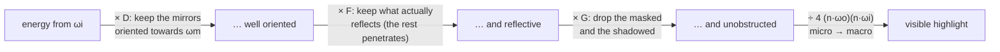

# PBR — physically based rendering, the essentials

> **Scope** radiometry, the BRDF, Cook-Torrance and the metallic-roughness workflow, IBL, importance sampling. The theory behind `src/shaders/slang/forward.slang`.
>
> **Not here** the OpenGL and Vulkan APIs → `OPENGL.md`, `VULKAN.md`. Ray vs path tracing → `RAYTRACING.md`. Shadow mapping, AO, deferred and the rest of the real-time toolbox → `GRAPHICS.md`.
>
> **Source** *Physically Based Rendering, 4th ed.* (Pharr, Jakob, Humphreys) — [pbr-book.org/4ed](https://www.pbr-book.org/4ed/). Figures are from chapter 9, *Reflection Models*.
>
> **Reading convention** PBRT is a rigorous *offline* renderer. Wherever real time (UE4, Frostbite, LearnOpenGL) takes a shortcut, it is tagged **⚡ real time**. Knowing both is exactly what shows you understand *why* the approximations exist.

---

## Contents

1. [Radiometric foundations](#1-radiometric-foundations)
2. [The BRDF](#2-the-brdf)
3. [The reflection equation](#3-the-reflection-equation)
4. [Diffuse reflection (Lambert)](#4-diffuse-reflection-lambert)
5. [Fresnel](#5-fresnel)
6. [Microfacet theory](#6-microfacet-theory)
7. [The full specular BRDF (Cook-Torrance)](#7-the-full-specular-brdf-cook-torrance)
8. [The metallic-roughness workflow](#8-the-metallic-roughness-workflow)
9. [Image-based lighting and split-sum](#9-image-based-lighting-and-split-sum)
10. [Importance sampling](#10-importance-sampling)
11. [Formula recap](#11-formula-recap)
12. [Interview checklist](#12-interview-checklist)

---

## 1. Radiometric foundations

Before BRDFs come the physical quantities. All of PBR rests on **radiance**.

### Solid angle

The 2D analogue of an angle, measured in steradians (sr). A hemisphere covers $2\pi$ sr, a sphere $4\pi$ sr. In spherical coordinates:

$$d\omega = \sin\theta \, d\theta \, d\phi$$

### The four quantities

| Quantity | Symbol | Unit | Definition |
|---|---|---|---|
| Flux (power) | $\Phi$ | W | Energy per unit time |
| Irradiance | $E$ | W/m² | Flux received per unit area |
| Intensity | $I$ | W/sr | Flux per unit solid angle |
| **Radiance** | $L$ | W/(m²·sr) | Flux per unit *projected* area **and** solid angle |

### Radiance — the central quantity

$$L = \frac{d^2\Phi}{dA \, \cos\theta \, d\omega}$$

Why everything is expressed in it:

- **It is constant along a ray in vacuum.** That is what makes ray tracing possible: `L` at the camera = `L` at the hit point
- It is what a sensor (eye, photosite) actually measures
- The $\cos\theta$ in the denominator accounts for the **projected** area (foreshortening)

### Irradiance and Lambert's cosine law

Irradiance at a point is the incident radiance integrated over the hemisphere, cosine-weighted:

$$E = \int_{\mathcal{H}^2} L_i(\omega) \, \cos\theta \, d\omega$$

The $\cos\theta$ (Lambert's law) is there because a beam arriving at an angle spreads its energy over a larger area. **This cosine reappears everywhere** — it is the origin of the `NdotL` in every shader.

---

## 2. The BRDF

The **bidirectional reflectance distribution function** describes how light is reflected at a point, for a pair (incoming direction, outgoing direction).

### The shading frame

Everything is computed in a local frame where the normal $\mathbf{n}$ is the $z$ axis and the tangents $\mathbf{s}, \mathbf{t}$ are $x, y$.


*Figure 9.2 (PBRT) — the shading frame $(\mathbf{s}, \mathbf{t}, \mathbf{n})$ aligned with $(x, y, z)$. Every direction $\omega$ is transformed into this frame before any BxDF call.*

Practical consequence: $\cos\theta = \mathbf{n} \cdot \omega = \omega_z$. It is just the vector's $z$ component — hence the classic shader optimisation of reading `.z` instead of taking a dot product.

> **⚠️ PBRT convention** — $\omega_o$ and $\omega_i$ both point **away** from the surface (they do not follow physical light propagation). Convenient for bidirectional algorithms.

### Formal definition

$$f(\omega_o, \omega_i) = \frac{dL_o(\omega_o)}{dE(\omega_i)} = \frac{dL_o(\omega_o)}{L_i(\omega_i) \, \cos\theta_i \, d\omega_i}$$

In plain terms: "how much radiance leaves along $\omega_o$ per unit irradiance arriving from $\omega_i$". Unit: sr⁻¹.

### The three properties of a physically plausible BRDF

1. **Positivity** $f(\omega_o, \omega_i) \geq 0$

2. **Helmholtz reciprocity** $f(\omega_o, \omega_i) = f(\omega_i, \omega_o)$ — source and camera can be swapped. *Essential for bidirectional algorithms: a non-reciprocal BRDF breaks reverse path tracing*

3. **Energy conservation** a surface never reflects more energy than it receives

$$\int_{\mathcal{H}^2} f(\omega_o, \omega_i) \, \cos\theta_i \, d\omega_i \leq 1 \quad \forall \, \omega_o$$

> **Classic trap question** — "why is a diffuse BRDF $\rho/\pi$ and not $\rho$?" → precisely this conservation constraint. See §4.

---

## 3. The reflection equation

The core of everything. Outgoing radiance in one direction = the integral of all incident light, filtered by the BRDF and cosine-weighted:

$$L_o(\omega_o) = \int_{\mathcal{H}^2} f(\omega_o, \omega_i) \, L_i(\omega_i) \, |\cos\theta_i| \, d\omega_i$$

This is the building block of the **rendering equation** (Kajiya 1986), which only adds an emission term $L_e$ and makes $L_i$ recursive (incident light itself comes from other surfaces):

$$L_o(\omega_o) = L_e(\omega_o) + \int_{\mathcal{H}^2} f(\omega_o, \omega_i) \, L_i(\omega_i) \, |\cos\theta_i| \, d\omega_i$$

All rendering — raster, ray tracing, path tracing — is a different way of **approximating that integral**.

---

## 4. Diffuse reflection (Lambert)

The simplest model: light is reflected **uniformly** in every hemisphere direction, so the BRDF is a constant.

$$f_\text{diff} = \frac{\rho}{\pi}$$

where $\rho$ (albedo) ∈ [0, 1] is the fraction of light reflected.

### Where the $\pi$ comes from

Impose energy conservation. If $f = k$ (constant), then:

$$\int_{\mathcal{H}^2} k \, \cos\theta_i \, d\omega_i = k \int_0^{2\pi}\!\!\int_0^{\pi/2} \cos\theta \sin\theta \, d\theta \, d\phi = k \cdot \pi$$

For the surface to reflect exactly the fraction $\rho$, we need $k\pi = \rho$, so $k = \rho/\pi$. **The $\pi$ is the integral of the cosine over the hemisphere.**

> ⚡ **real time** — this is why direct shading is often written `diffuse = albedo * NdotL` with no $\pi$: by convention it has been absorbed into the light intensity. Worth knowing so a stray factor of $\pi$ does not catch you out.

---

## 5. Fresnel

The **Fresnel** equations give the fraction of light reflected (vs refracted/absorbed) at an interface, as a function of incidence angle. **Every surface becomes a perfect mirror at grazing incidence** — the Fresnel effect, visible on a lake seen from far away.

### The exact equations (dielectrics)

For an interface between indices $\eta_i$ and $\eta_t$, reflectance depends on polarisation (parallel $r_\parallel$, perpendicular $r_\perp$):

$$r_\parallel = \frac{\eta_t \cos\theta_i - \eta_i \cos\theta_t}{\eta_t \cos\theta_i + \eta_i \cos\theta_t}, \qquad r_\perp = \frac{\eta_i \cos\theta_i - \eta_t \cos\theta_t}{\eta_i \cos\theta_i + \eta_t \cos\theta_t}$$

For unpolarised light (the usual case in graphics):

$$F_r = \frac{1}{2}\left(r_\parallel^2 + r_\perp^2\right)$$

The angles are linked by **Snell's law**: $\eta_i \sin\theta_i = \eta_t \sin\theta_t$.

### ⚡ Schlick's approximation (1993) — the one you will use

Evaluating Fresnel exactly per pixel is expensive. Schlick approximates it with a single fifth power:

$$F(\theta) = F_0 + (1 - F_0)(1 - \cos\theta)^5$$

where $F_0$ is the reflectance at normal incidence ($\theta = 0$). This is **the** formula to know by heart. PBRT implementation (chapter 9):

```cpp
SampledSpectrum SchlickFresnel(Float cosTheta) {
    auto pow5 = [](Float v) { return (v * v) * (v * v) * v; };
    return F0 + pow5(1 - cosTheta) * (SampledSpectrum(1.f) - F0);
}
```

> **The detail that matters** — in a microfacet model the Fresnel angle is between $\omega_o$ and the **micronormal** $\omega_m$ (the half-vector), **not** the macronormal $\mathbf{n}$. Common mistake.

### $F_0$ and the metal insight

$F_0$ encodes what the material is. This is where **conductor (metal) vs dielectric (non-metal)** is decided:

| Material | $F_0$ | Diffuse? |
|---|---|---|
| Water | 0.02 | yes |
| Plastic / glass | **0.04** (dielectric default) | yes |
| Diamond | 0.17 | yes |
| Iron | (0.56, 0.57, 0.58) | **no** |
| Gold | (1.00, 0.71, 0.29) | **no** |
| Copper | (0.95, 0.64, 0.54) | **no** |
| Aluminium | (0.91, 0.92, 0.92) | **no** |

The two foundational facts of modern PBR:

- **Dielectrics** — $F_0 ≈ 0.04$, achromatic (grey), **plus** a coloured diffuse component. Light that is not reflected penetrates, scatters and comes back out diffusely
- **Metals** — $F_0$ is **coloured** (it *is* their reflection colour) and there is **no diffuse at all**: refracted light is immediately absorbed by the free-electron cloud

That is exactly what the metallic-roughness workflow exploits (§8).

---

## 6. Microfacet theory

Real surfaces are rough at microscopic scale. Rather than model every bump geometrically (impossible to store or trace), treat them **statistically**: the surface is a cloud of micro-mirrors (microfacets), and only their aggregate distribution matters.


*Figure 9.20 (PBRT) — (a) the more the micronormals $\omega_m$ vary, the rougher the surface. (b) a smooth surface varies little.*

Three geometric effects come into play:


*Figure 9.21 (PBRT) — (a) **masking**: the microfacet is hidden from the viewer. (b) **shadowing**: light does not reach the microfacet. (c) **interreflection**: light bounces between microfacets. Standard BSDFs model masking + shadowing and **ignore** interreflection, which is why energy is lost at high roughness.*

A microfacet BRDF is built from **three terms**: the distribution $D$, masking-shadowing $G$, and Fresnel $F$.

### The whole intuition, before any formula

Picture the surface as a **crowd of micro-mirrors** at random orientations. You send a pencil of light from $\omega_i$ and look from $\omega_o$. Three questions, and only three, decide how much energy comes back:

| Term | Question | What it controls |
|---|---|---|
| **$D$** | How many micro-mirrors are tilted *exactly* right to send $\omega_i$ towards $\omega_o$? | the highlight's **shape and size** |
| **$F$** | Of those mirrors, what **fraction** of the light do they actually reflect (the rest penetrates)? | its **strength** and **tint**, the bright rim |
| **$G$** | Of the well-oriented mirrors, how many are actually **clear** (neither hidden from the viewer nor in shadow)? | the **energy** lost at grazing angles |

A photon contributes only if **all three** hold: it hits a *well-oriented* mirror **and** that mirror *reflects* **and** it is *unobstructed*. Hence the three terms **multiply** (§7). Keep this story — every subsection below only makes it quantitative.

### 6.1 — Normal distribution: $D$ (GGX / Trowbridge-Reitz)

$D(\omega_m)$ gives the density of microfacets oriented along $\omega_m$. It controls the **shape of the specular highlight**. The dominant model is **GGX** (= Trowbridge-Reitz 1975, renamed by Walter et al. 2007).

> **Intuition** — only micro-mirrors whose normal is *exactly* the micronormal $\omega_m$ (the half-vector between $\omega_i$ and $\omega_o$) can send light to the eye. $D$ counts their density. A **smooth** surface has almost every normal clustered around $\mathbf{n}$ → a small, **intense** highlight (the peak of $D$ is tall and narrow). A **rough** surface has scattered normals → the same energy **spread** over a large dull halo (low, wide peak). It is a **probability density** (sr⁻¹), not a fraction: its value can far exceed 1, only its cosine-weighted integral is 1.

**⚡ Isotropic form (the one you will implement):**

$$D(\omega_m) = \frac{\alpha^2}{\pi \left( (\mathbf{n} \cdot \omega_m)^2 (\alpha^2 - 1) + 1 \right)^2}$$

**General anisotropic form (PBRT eq. 9.16)**, with $\alpha_x \neq \alpha_y$ for brushed metal:

$$D(\omega_m) = \frac{1}{\pi \, \alpha_x \alpha_y \cos^4\theta_m \left( 1 + \tan^2\theta_m \left( \frac{\cos^2\phi_m}{\alpha_x^2} + \frac{\sin^2\phi_m}{\alpha_y^2} \right) \right)^2}$$

GGX's signature is its **long tails**: density falls off slowly towards grazing angles → highlights with a bright core and a wide soft halo, which matches reality. Compared against Beckmann:


*Figure 9.23 (PBRT) — Beckmann-Spizzichino vs Trowbridge-Reitz at $\alpha = 0.5$. GGX (Trowbridge-Reitz) has far taller tails at large $\theta$.*

**Normalisation condition** — what makes $D$ physically valid: the projected area of the microfacets must cover exactly the macrosurface

$$\int_{\mathcal{H}^2} D(\omega_m) \cos\theta_m \, d\omega_m = 1$$


*Figure 9.22 (PBRT) — the projected area of the microfacets above $dA$ must equal $dA$.*

**⚠️ Roughness → $\alpha$: mind the convention.**
- **⚡ Disney / UE4 (the real-time standard)** $\alpha = \text{roughness}^2$ — perceptual roughness squared, which varies more linearly to the eye
- **PBRT-v4** `RoughnessToAlpha` returns $\alpha = \sqrt{\text{roughness}}$

These are **not** the same. Know which one your engine uses.

### 6.2 — Masking-shadowing: $G$ (Smith)

$G$ corrects the energy: from a given direction only some microfacets are visible, the rest are masked. Without $G$ you get non-physical energy gain at grazing angles.

> **Intuition** — micro-mirrors sit in valleys. A well-oriented mirror is useless if it is **hidden from the viewer** (masking, the $\omega_o$ side) or **in the shadow of a neighbouring bump** (shadowing, the $\omega_i$ side). $G \in [0,1]$ is the fraction surviving both. The effect is negligible head-on ($G \approx 1$) and bites at **grazing angles**, where valleys occlude each other. That is exactly where $D$ alone would blow up — Cook-Torrance's $\frac{1}{4(\mathbf{n}\cdot\omega_o)(\mathbf{n}\cdot\omega_i)}$ tends to infinity as either cosine → 0 — and $G$ pulls it back to zero, **stopping the highlight from exceeding the energy received**. The *height-correlated* refinement (Heitz 2014) recognises that a mirror hidden from the viewer is often *also* the one in shadow (the two events are correlated); the naive product $G_1(\omega_o)\,G_1(\omega_i)$ treats them as independent and **darkens roughly twice too much**.


*Figure 9.24 (PBRT) — the projected area of the visible microfacets must equal $dA \cos\theta$. The masking function $G_1$ gives the visible fraction.*

**Smith's approximation** assumes a point's height and normal are statistically independent. $G_1$ is expressed through an auxiliary function $\Lambda$:

$$G_1(\omega) = \frac{1}{1 + \Lambda(\omega)}$$

For GGX, $\Lambda$ has a closed form (PBRT eq. 9.20):

$$\Lambda(\omega) = \frac{\sqrt{1 + \alpha^2 \tan^2\theta} \; - \; 1}{2}$$

There are then **two ways** to combine masking ($\omega_o$) with shadowing ($\omega_i$):

**Separable Smith** (simplest, $G = G_1(\omega_o) \, G_1(\omega_i)$):

$$G(\omega_o, \omega_i) = \frac{1}{1 + \Lambda(\omega_o)} \cdot \frac{1}{1 + \Lambda(\omega_i)}$$

**Height-correlated Smith** (more correct — accounts for height correlation; what PBRT-v4 and modern engines like Frostbite use):

$$G(\omega_o, \omega_i) = \frac{1}{1 + \Lambda(\omega_o) + \Lambda(\omega_i)}$$

> **Good interview point** — knowing that height-correlated Smith (Heitz 2014) replaced the separable form in AAA engines, *and* being able to explain why (correlation between who masks and who shadows), shows you follow the state of the art rather than the LearnOpenGL tutorial.

> ⚡ **Real-time variant** — UE4 often uses the **Schlick-GGX** approximation with a $k$ remapping of $\alpha$: $G_1(\omega) = \frac{\mathbf{n}\cdot\omega}{(\mathbf{n}\cdot\omega)(1-k)+k}$, with $k = \alpha/2$ (IBL) or $k = (\text{roughness}+1)^2/8$ (direct light). It approximates the Smith formula above, and it is what `forward.slang` implements.

---

## 7. The full specular BRDF (Cook-Torrance)

Assemble the three terms. This is the **Torrance-Sparrow / Cook-Torrance** BRDF (PBRT eq. 9.33):

$$f_\text{spec}(\omega_o, \omega_i) = \frac{D(\omega_m) \, F(\omega_o, \omega_m) \, G(\omega_o, \omega_i)}{4 \, |\mathbf{n} \cdot \omega_o| \, |\mathbf{n} \cdot \omega_i|}$$

where the **micronormal** (half-vector) is:

$$\omega_m = \frac{\omega_o + \omega_i}{\lVert \omega_o + \omega_i \rVert}$$

### Intuitive decomposition

Back to the crowd of micro-mirrors (§6). The numerator $D \cdot F \cdot G$ is a **chain of filters** on the incoming energy: each term removes what does not contribute.



- **$D$ — the shape.** How many microfacets are oriented exactly to reflect $\omega_i$ into $\omega_o$. Sets the highlight's **size**: small and sharp when smooth, wide and dull when rough
- **$F$ — the strength and tint.** What fraction those facets actually reflect (Fresnel on the micronormal $\omega_m$). Gives the reflection its **colour** — neutral for a dielectric, coloured for a metal — and the **rim that lights up** at grazing incidence
- **$G$ — the energy.** What fraction is neither masked nor shadowed. **Darkens grazing angles** and prevents non-physical energy gain
- **$4 (\mathbf{n}\cdot\omega_o)(\mathbf{n}\cdot\omega_i)$ — the denominator.** Not a physical effect: the **Jacobian** of the change of variables from micronormal to outgoing direction, plus the two foreshortening cosines. It converts "density in micro-mirror space" into "radiance in macroscopic space"

### What the three say *together*

Why a **product** and not a sum? Because the three conditions are **independent and all necessary**: a photon comes back only if it hits a *well-oriented* mirror ($D$) **and** that mirror *reflects* rather than transmits ($F$) **and** nothing *blocks* the round trip ($G$). It is a chain of fractions, so they compose by multiplication.

The elegance is that the three **divide the roles without overlapping**:

- $D$ depends only on **roughness** and **geometry** ($\omega_m$ vs $\mathbf{n}$) → *where* and *how big*
- $F$ depends only on the **material** ($F_0$) and the **angle** → *what colour* and *how strong*
- $G$ depends only on **roughness** and **grazing angles** → *how much is lost*

Concretely you can **predict** a render without computing it: a highlight that is *small, sharp, white, and grows and whitens at the rim as the surface turns away* = low roughness (narrow $D$), dielectric (neutral $F_0$, Fresnel rise at the rim), $G \approx 1$ except at the rim. A *wide, diffuse, golden* highlight = high roughness (spread $D$) + metal (coloured $F_0$). **Each artist parameter pulls exactly one of the three levers** — that is the whole point of the model.

### And with diffuse: $F$ is the bridge

At the scale of the **complete** BRDF (§8), $F$ is what links the two halves. Energy is a budget: what Fresnel **reflects** specularly is no longer available to penetrate and re-emerge as **diffuse**. Hence the $(1 - F)$ in front of the diffuse term (§8). So:

- $D$ and $G$ live **only** in the specular lobe — they are microscopic surface properties
- $F$ is the **splitter** between specular and diffuse, the only shared term

The unified view: **$D$ and $G$ sculpt the reflection, $F$ decides how much energy goes to the reflection rather than to the body colour.**

### The PBRT code (exact form, worth recognising)

```cpp
Float cosTheta_o = AbsCosTheta(wo), cosTheta_i = AbsCosTheta(wi);
if (cosTheta_i == 0 || cosTheta_o == 0) return {};   // grazing angles -> NaN guard
Vector3f wm = wi + wo;
if (LengthSquared(wm) == 0) return {};
wm = Normalize(wm);
SampledSpectrum F = FrComplex(AbsDot(wo, wm), eta, k);   // Fresnel on the micronormal
return mfDistrib.D(wm) * F * mfDistrib.G(wo, wi) / (4 * cosTheta_i * cosTheta_o);
```

> **The model's elegance** (worth saying out loud in an interview) — the Torrance-Sparrow derivation depends on **neither the choice of $D$ nor the Fresnel function**. Plug in GGX or Beckmann, conductor or dielectric: the structure is unchanged.

---

## 8. The metallic-roughness workflow

⚡ **The standard real-time convention** (glTF, UE4, Unity). Instead of exposing $F_0$ and albedo separately, the artist gets three intuitive parameters: **base color**, **metallic** ($m$ ∈ [0,1]), **roughness**.

The physical parameters are reconstructed as:

```
F0      = lerp(vec3(0.04), baseColor, metallic)
albedo  = baseColor * (1.0 - metallic)   // metals have no diffuse
```

- **metallic = 0** (dielectric) — $F_0 = 0.04$ grey, albedo = base color → coloured diffuse plus neutral specular
- **metallic = 1** (metal) — $F_0$ = base color (coloured specular), albedo = 0 → no diffuse

### The complete BRDF, assembled

$$f(\omega_o, \omega_i) = \underbrace{(1 - F) \, (1 - m) \, \frac{\rho}{\pi}}_{\text{diffuse}} \; + \; \underbrace{\frac{D \, F \, G}{4 (\mathbf{n}\cdot\omega_o)(\mathbf{n}\cdot\omega_i)}}_{\text{specular}}$$

The $(1 - F)$ on the diffuse term is energy conservation: what Fresnel reflects specularly is not available to the diffuse lobe. The $(1 - m)$ removes diffuse for metals.

Direct shading for a punctual light then becomes:

$$L_o = f(\omega_o, \omega_i) \cdot L_i \cdot (\mathbf{n} \cdot \omega_i)$$

That trailing `NdotL` is the $\cos\theta_i$ of Lambert's law (§1).

> This is what `src/shaders/slang/forward.slang` evaluates per light, with `metallic` and `roughness` loaded from the `.mtl` PBR extension keys `Pm` and `Pr`.

---

## 9. Image-based lighting and split-sum

⚡ **The critical real-time part**: how to light from a full environment (an HDRI) without integrating thousands of samples per pixel per frame. The answer is Karis's **split-sum approximation** (Epic, UE4, 2013).

We want the reflection integral with $L_i$ coming from an env-map. Karis **splits it into two precomputed integrals**:

$$\int_{\mathcal{H}^2} L_i(\omega_i) \, f(\omega_o, \omega_i) \cos\theta_i \, d\omega_i \;\approx\; \underbrace{\left( \frac{1}{N} \sum_{k=1}^{N} L_i(\omega_k) \right)}_{\text{(1) prefiltered env-map}} \cdot \underbrace{\int_{\mathcal{H}^2} f(\omega_o, \omega_i) \cos\theta_i \, d\omega_i}_{\text{(2) BRDF integration map}}$$

**(1) Prefiltered environment map** — convolve the HDRI with GGX at several roughness values, stored in the **mips** of a cubemap. Low roughness → sharp mip (mirror reflection). High roughness → blurry mip.

**(2) BRDF LUT** — the second factor depends only on $(\cos\theta_o, \text{roughness})$ and precomputes into a **2D texture**. Substituting Schlick, it collapses to a *scale* and a *bias* on $F_0$:

$$\int_{\mathcal{H}^2} f \cos\theta_i \, d\omega_i = F_0 \cdot A + B$$

where $(A, B)$ are the two channels read from the LUT. The final specular IBL:

```
prefiltered = textureLod(envMap, R, roughness * MAX_MIP).rgb
envBRDF     = texture(brdfLUT, vec2(NdotV, roughness)).rg
specular    = prefiltered * (F0 * envBRDF.x + envBRDF.y)
```

> **Known limitation** (worth mentioning) — split-sum assumes $\omega_o = \omega_i = \mathbf{n}$ for the prefiltering step, which introduces error at grazing angles. Modern fixes (multi-scattering compensation, Fdez-Agüera 2019) recover the energy lost at high roughness to the interreflection Smith ignores (cf. Fig. 9.21c).

> **Where the engine stands** — Overdrive does *not* do this yet. It samples the raw skybox cubemap twice (along $\mathbf{n}$ for irradiance, along `reflect(-V, N)` for specular) and weights the mix with `fresnelSchlickRoughness`. Real prefiltering plus a BRDF LUT is on the roadmap in `../FEATURES.md`.

---

## 10. Importance sampling

For path tracing (and for IBL prefiltering) the hemisphere cannot be sampled uniformly — far too noisy. Sample from a distribution that **follows the shape of the BRDF**.

The Monte Carlo estimator of the reflection integral:

$$L_o(\omega_o) \approx \frac{1}{N} \sum_{k=1}^{N} \frac{f(\omega_o, \omega_k) \, L_i(\omega_k) \, |\cos\theta_k|}{p(\omega_k)}$$

The trick is choosing $p(\omega_k)$ close to $f \cdot \cos\theta$ to minimise variance. For GGX you sample the micronormal distribution, and the state of the art is **VNDF sampling** (visible normal distribution function, Heitz 2018), which samples only the *visible* microfacets and is far less noisy than sampling $D$ naively. PBRT-v4 implements it in `Sample_wm`.

Noise falls as $O(1/\sqrt{N})$ — hence the importance of **denoising** on constrained hardware (few samples per pixel).

> **Practical link** — this is exactly the mobile/console trade-off: few samples plus an aggressive denoiser, often driven by tensor cores. Good importance sampling reduces the noise *before* the denoiser sees it.

---

## 11. Formula recap

**Radiometry**
$$d\omega = \sin\theta \, d\theta \, d\phi \qquad E = \int_{\mathcal{H}^2} L_i \cos\theta \, d\omega$$

**Reflection equation**
$$L_o(\omega_o) = \int_{\mathcal{H}^2} f(\omega_o, \omega_i) \, L_i(\omega_i) \, |\cos\theta_i| \, d\omega_i$$

**Diffuse (Lambert)**
$$f_\text{diff} = \frac{\rho}{\pi}$$

**Fresnel-Schlick**
$$F(\theta) = F_0 + (1 - F_0)(1 - \cos\theta)^5$$

**GGX / Trowbridge-Reitz (isotropic)**
$$D(\omega_m) = \frac{\alpha^2}{\pi \left( (\mathbf{n}\cdot\omega_m)^2(\alpha^2-1)+1 \right)^2}$$

**Smith masking (GGX)**
$$\Lambda(\omega) = \frac{\sqrt{1+\alpha^2\tan^2\theta}-1}{2} \qquad G = \frac{1}{1+\Lambda(\omega_o)+\Lambda(\omega_i)}$$

**Cook-Torrance specular**
$$f_\text{spec} = \frac{D \, F \, G}{4(\mathbf{n}\cdot\omega_o)(\mathbf{n}\cdot\omega_i)} \qquad \omega_m = \frac{\omega_o+\omega_i}{\lVert\omega_o+\omega_i\rVert}$$

**Metallic-roughness**
$$F_0 = \text{lerp}(0.04, \text{baseColor}, m) \qquad \rho = \text{baseColor}\cdot(1-m)$$

**Split-sum IBL**
$$\int L_i f \cos\theta_i \, d\omega_i \approx \left(\tfrac{1}{N}\textstyle\sum L_i\right)\left(F_0 \cdot A + B\right)$$

---

## 12. Interview checklist

**Be able to derive or explain at the whiteboard**
- Why diffuse is $\rho/\pi$ (the cosine integral)
- The 3 properties of a plausible BRDF (positivity, reciprocity, conservation)
- Cook-Torrance term by term (D = shape, F = strength/tint, G = energy)
- Fresnel-Schlick from memory
- The metal vs dielectric insight (coloured $F_0$ and no diffuse / $F_0 \approx 0.04$ and diffuse)

**What shows you follow the state of the art**
- Height-correlated vs separable Smith (Heitz 2014)
- VNDF sampling (Heitz 2018)
- Multi-scattering and the energy lost to ignored interreflection
- The two roughness→$\alpha$ conventions ($r^2$ vs $\sqrt{r}$)

**Traps**
- Fresnel on the **micronormal** $\omega_m$, not the macronormal $\mathbf{n}$
- The factor $\pi$ that appears and disappears with light conventions
- Confusing perceptual roughness with $\alpha$

**To go deeper** — PBRT 4ed chapter 9 (*Reflection Models*) in full, plus the SIGGRAPH "Physically Based Shading" course notes (Karis 2013 for UE4, Lagarde/de Rousiers 2014 for Frostbite). That is where the whole real-time vocabulary comes from.
