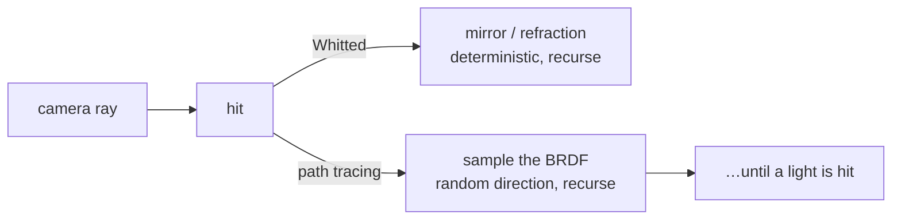

# Ray tracing — terminology, acceleration, hardware

> **Scope** what "ray tracing" actually means, how it differs from path tracing, the acceleration structures underneath, and how it is exposed on Vulkan. The vocabulary distinction in §1-§3 is the one interviewers check.
>
> **Not here** the BRDF being sampled and the Monte Carlo estimator → `PBR.md` §3, §10. Rasterisation-era techniques (shadow maps, AO, deferred) → `GRAPHICS.md` §1. Vulkan's object model → `VULKAN.md`.

---

## Contents

1. [Ray tracing — the general term](#1-ray-tracing--the-general-term)
2. [Path tracing — one form of ray tracing](#2-path-tracing--one-form-of-ray-tracing)
3. [Summary and the trap](#3-summary-and-the-trap)
4. [Acceleration structures](#4-acceleration-structures)
5. [Hardware ray tracing on Vulkan](#5-hardware-ray-tracing-on-vulkan)
6. [Denoising](#6-denoising)

---

## 1. Ray tracing — the general term

The base idea: cast rays from the camera into the scene, find what they hit, compute a colour. Broadly, "ray tracing" covers every technique built on rays.

In the **historical, strict** sense, ray tracing (or *Whitted ray tracing*, 1980) means one specific method:

- Cast a ray, it hits a surface
- Compute direct lighting (lights visible from that point)
- Cast **deterministic secondary rays**: perfect reflection (mirror), refraction
- Recurse on those

Result: hard shadows, perfect mirrors and glass. But **no realistic global illumination** — no rough surfaces bouncing diffuse light, no natural soft shadows, no colour bleeding.

## 2. Path tracing — one form of ray tracing

Also ray tracing, but it solves the full **rendering equation** (Kajiya 1986) by Monte Carlo.

The key difference: at each bounce, instead of following a deterministic direction, **sample a random direction** according to the surface's BRDF.

- A diffuse surface bounces the ray in a random hemisphere direction
- Follow that *path* through several bounces until it reaches a light
- Do this hundreds or thousands of times per pixel and average

Result: full global illumination — colour bleeding, soft shadows, caustics, ambient occlusion, all emerging for free. The price is **noise**, falling as $1/\sqrt{N}$ in the sample count. Reducing it for a given $N$ is what importance sampling is for (`PBR.md` §10).

## 3. Summary and the trap

| | Whitted ray tracing | Path tracing |
|---|---|---|
| Year | 1980 | 1986 |
| Bounces | deterministic (mirror/refraction) | random (Monte Carlo) |
| Global illumination | no | yes |
| Diffuse surfaces | direct lighting only | full indirect bounces |
| Image | clean but incomplete | realistic but noisy |
| Cost | low | high |

**The trap.** "Ray tracing" as used today (RTX, games) is marketing shorthand. Games actually do partial, heavily undersampled path tracing plus aggressive denoising. So:

- **Ray tracing** = the whole family, *and* the historical Whitted method
- **Path tracing** = the Monte Carlo technique that solves GI

Path tracing **is** ray tracing; not all ray tracing is path tracing.

---

## 4. Acceleration structures

Testing every ray against every triangle is $O(\text{rays} \times \text{triangles})$ and hopeless. Every ray tracer is really a spatial data structure plus a traversal loop.

`BVH` bounding volume hierarchy — a tree of nested bounding boxes over *objects*. Traversal descends only into boxes the ray hits, giving roughly $O(\log n)$ per ray. The universal choice, and what the hardware implements
`kd-tree / BSP` splits *space* rather than objects. Better for static scenes, worse to rebuild
`Uniform grid` cheap to build, degrades badly on non-uniform scene density

**Build quality matters more than traversal speed.** The **SAH** (surface area heuristic) picks each split by estimating the expected traversal cost — an SAH BVH can be several times faster to trace than a median-split one of identical shape.

**Two levels, and this is what the API exposes.**

`BLAS` bottom-level acceleration structure: the BVH over one mesh's triangles, in object space. Built once, reused
`TLAS` top-level: a BVH over *instances*, each holding a transform and a BLAS pointer. Rebuilt or refitted per frame as objects move

That split is why moving an object costs a cheap TLAS rebuild rather than re-BVHing its geometry.

## 5. Hardware ray tracing on Vulkan

Two entry points, and picking between them is a design decision:

| | Ray query (`VK_KHR_ray_query`) | Ray tracing pipeline (`VK_KHR_ray_tracing_pipeline`) |
|---|---|---|
| Where rays are cast | inside an existing fragment or compute shader | a dedicated pipeline with its own stages |
| Shader stages | none new | raygen, miss, closest-hit, any-hit, intersection |
| Shading of the hit | you write it inline | dispatched through the **shader binding table** |
| Best for | replacing one effect (shadows, AO) in a raster pipeline | full path tracers, recursive rays, many material types |
| Cost to adopt | small | a second pipeline and a whole binding table |

> **The engine's plan** — Overdrive's roadmap takes the ray-query route: drop a ray query into `forward.slang`'s shadow test, replacing the shadow-map passes, reusing the existing forward pass and light loop. Hardware ray tracing is not universal, so a compute BVH is the baseline and `Backend.Supports(FeatureRayTracing)` is the fork between them. See `../FEATURES.md` and `../BACKEND_DECISION.md` §8.

The natural adoption order, cheapest and most convincing first: **shadows → ambient occlusion → reflections → one-bounce GI**. Each removes a screen-space approximation (`GRAPHICS.md` §1) and its artefacts.

## 6. Denoising

At 1-2 samples per pixel the raw image is unusable. The denoiser is not optional — it is part of the algorithm.

`Spatial` edge-aware blur (à-trous wavelet) guided by G-buffer normals and depth so it does not blur across geometric edges
`Temporal` reproject the previous frame with motion vectors and accumulate — effectively raising the sample count over time. Ghosting on disocclusion is the failure mode
`SVGF` spatiotemporal variance-guided filtering: the standard combination, using the estimated variance to decide how hard to blur
`ML denoisers` OptiX, OIDN, and the DLSS ray reconstruction family

The lever that matters upstream: better importance sampling means less variance reaching the denoiser, which is what actually keeps the image sharp.
